# Magy Progress Report

**Project title:** Magy: Designing an Immersive, Interactive Platform for Gamified Instruction and Discovery  
**Mentor:** Kenneth Wong  
**Team:** Zhang Zijing, Zhan Huang, Jia Fanbo, Li Zhilin  
**Report date:** 4 May 2026

## 1. Executive Summary

Magy has moved from the original proposal stage into a working prototype with two concrete subsystems:

1. A course generation system that transforms source course materials into structured learning assets.
2. A learner-facing course learning system that renders those assets as an interactive, gamified study experience.

The current implementation is built around a real sample course, COMP7415A Algorithmic Trading. The system now contains a ready course catalog, generated lesson routes, step-level question banks, textbook-style MDX materials, relevance reports, validation commands, and two browser-based frontends for learner delivery and creator review.

The prototype is not yet a production deployment, but it already demonstrates the main technical direction of the project: generated educational content is not kept as loose text. It is converted into structured, validated, reviewable, and playable learning units.

## 2. Current System Status

The current repository contains one indexed course package:

| Item | Current status |
|---|---:|
| Ready courses in catalog | 1 |
| Course chapters | 11 |
| Plain-text lesson conversions | 11 |
| Generated guided-story steps | 75 |
| Step-local question banks | 75 |
| Question families | 686 |
| Question variants | 1,445 |
| Generated textbook MDX files | 11 |
| Catalog validation result | ready=1, blocked=0 |

The generated course covers the full lecture sequence from course introduction to machine learning in algorithmic trading. Each lecture is represented as a chapter with a guided story route, practice assets, and a textbook file.

## 3. Course Generation System

The generation pipeline has been implemented as a Rust CLI called `coursegen`. It currently supports the following workflow:

1. Convert raw lecture PDFs into reusable plain text.
2. Generate guided-story lesson steps from the plain text and course context.
3. Store each generated step as a self-contained `step.json`.
4. Generate a colocated `question_bank.json` for each step.
5. Generate a lesson-level textbook in MDX.
6. Score generated assets against course and exam signals where available.
7. Validate the catalog before exposing generated courses to the player.

This staged design is important because a course package contains several related artifact families. A single prompt-response output would be hard to inspect, validate, or resume. The current layout instead gives each step its own content and question bank, while the course index remains the single catalog source for the frontend.

The backend also now includes:

- reusable stage execution, so existing valid assets can be reused instead of regenerated;
- targeted regeneration controls through `--force-stage`;
- a DeepSeek API provider option for large-context model calls;
- cached exam text conversion for relevance scoring;
- backend-owned catalog validation that marks a course as `ready` or `blocked`.

This directly supports the project objective of making AI-assisted content generation more controllable and auditable.

## 4. Learner-Facing Course Learning System

The learner app is a React/Vite prototype that reads the generated course catalog and pipeline assets directly. It presents the generated course as a learning game rather than as a file browser.

Current learner-facing functions include:

- course library and course home views;
- chapter route selection;
- immersive guided-story playback;
- interactive checkpoint questions inside story screens;
- local progress tracking;
- textbook reading mode from generated MDX;
- flashcard-style recall session;
- practice vault separated into flashcards, quizzes, and longform items;
- backend validation awareness, so invalid courses can be blocked before students enter them.

This implements the core learner-delivery part of the proposal. The current interaction model is not just static reading: the student enters a route, advances through scenes, answers checkpoints, reviews cards, and explores a practice bank.

### Learner System Screenshots

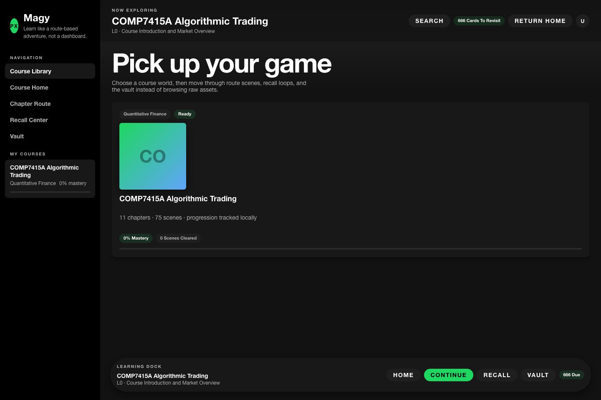

*Figure 1. Magy learner library showing a ready generated course package.*

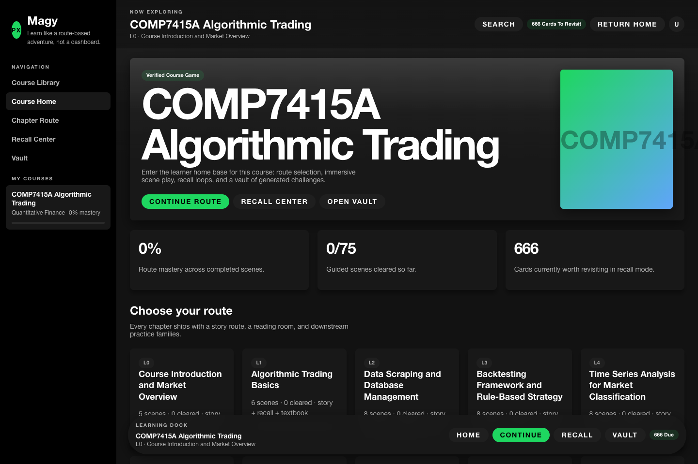

*Figure 2. Course home with route progress, recall entry, and vault entry.*

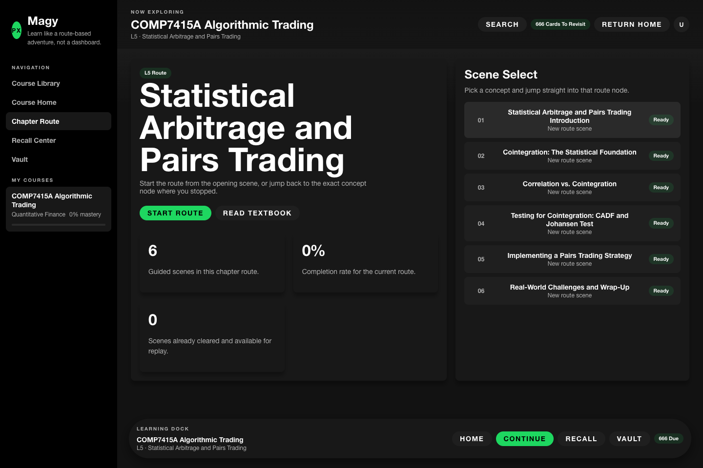

*Figure 3. A generated chapter represented as a route with multiple concept scenes.*

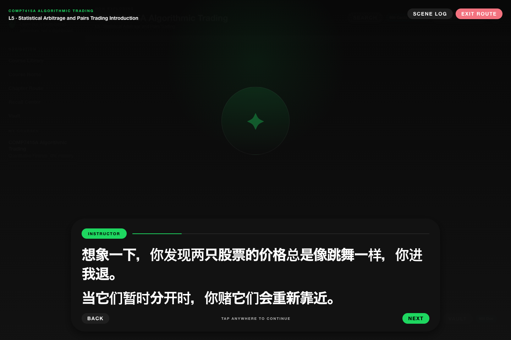

*Figure 4. Guided-story playback with a full-screen learning overlay.*

*Figure 5. Textbook reading mode using generated MDX content.*

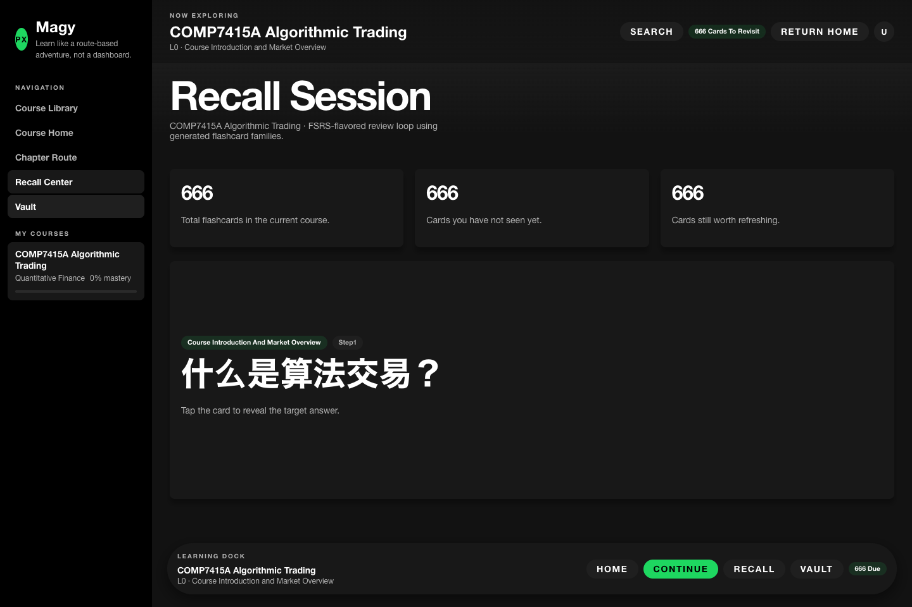

*Figure 6. Flashcard-based recall loop using generated practice assets.*

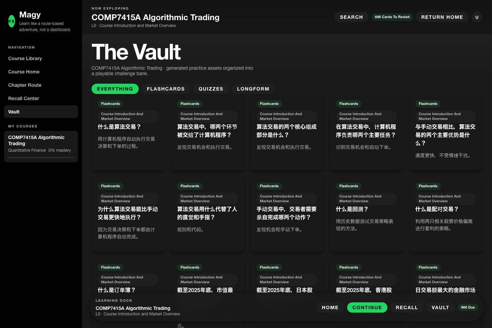

*Figure 7. Practice vault separating flashcards, quizzes, and longform questions.*

## 5. Creator Review and Debugging Workspace

In addition to the learner app, the project includes a browser-based creator workspace for inspecting generated artifacts. This workspace is intended for content review and debugging. It is not a full authoring studio yet, but it provides a practical foundation for human-in-the-loop review.

Current creator-side functions include:

- course and lecture selection from the generated catalog;
- overview of primary artifact paths;
- MDX textbook preview;
- guided-story screen inspection;
- step-local question bank inspection;
- separate display of flashcards, quiz items, and longform questions;
- relevance report viewing when sidecar scoring output is available.

This helps address a central risk in AI-generated education: outputs must be reviewable. The creator workspace makes it possible to inspect exactly what the model generated and how it is stored.

### Creator Workspace Screenshots

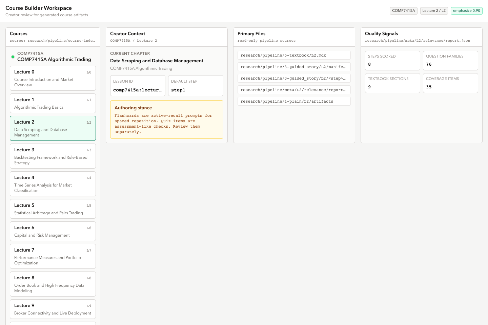

*Figure 8. Creator overview for a generated lecture package.*

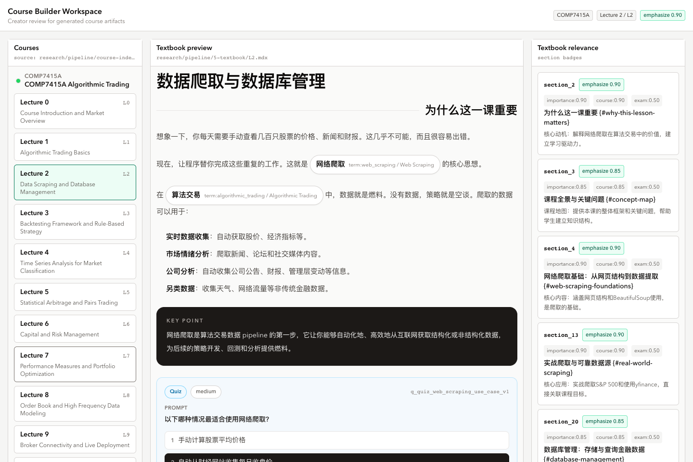

*Figure 9. Generated textbook preview with custom course components.*

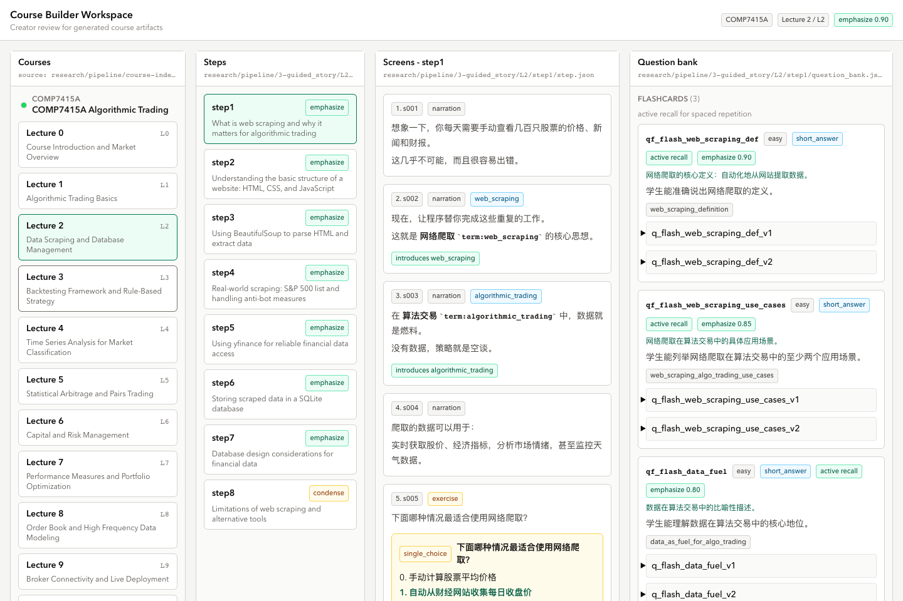

*Figure 10. Guided-story review surface showing step screens and question bank context.*

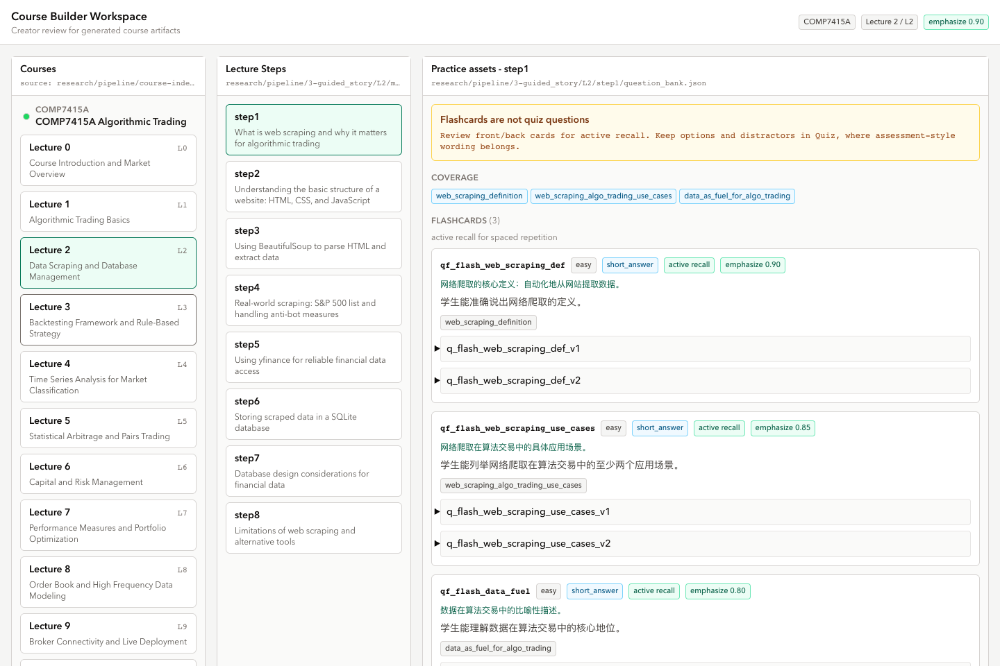

*Figure 11. Practice review surface separating flashcards, quiz, and longform items.*

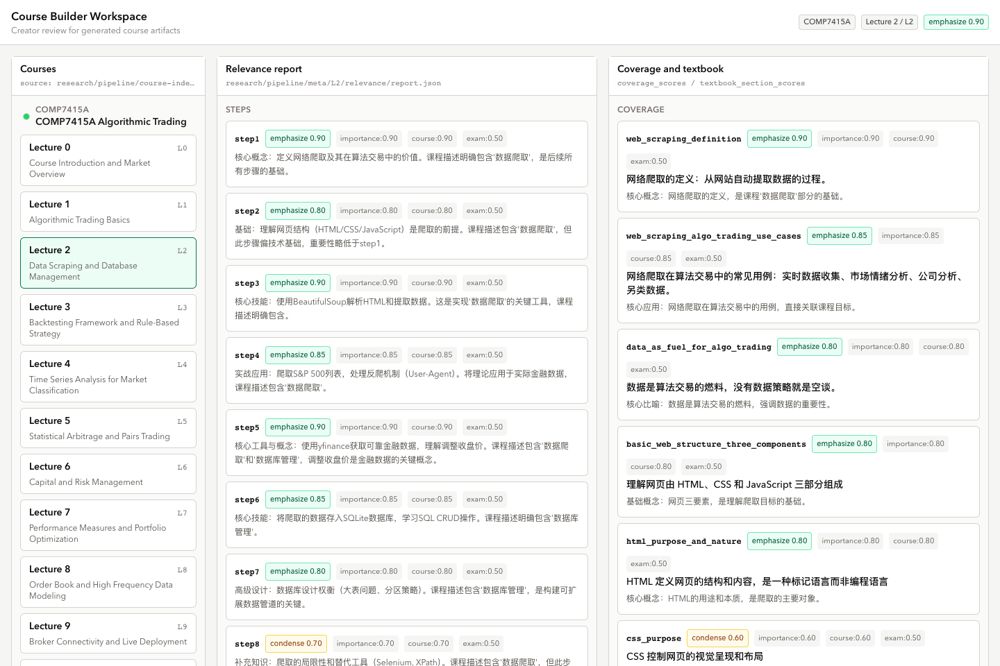

*Figure 12. Relevance sidecar report for generated steps, question families, coverage, and textbook sections.*

## 6. Progress Against the Proposal

The original proposal described four major components: an AI-assisted generation pipeline, a web-based authoring and review environment, a structured course editor, and a learner-facing mobile application.

The current implementation has achieved the first and fourth components as working prototypes, and has partially achieved the second and third components through the creator workspace.

| Original objective | Current progress |
|---|---|
| Structured representation for modular learning content | Implemented through course index, guided-story manifests, step-local `step.json`, step-local `question_bank.json`, and MDX textbooks |
| AI-assisted pipeline | Implemented through `coursegen run`, conversion, generation, relevance scoring, and provider configuration |
| Review and validation workflow | Partially implemented through creator workspace, relevance reports, and backend catalog validation |
| Learner-facing gamified delivery | Implemented as a React player with library, routes, story mode, recall, vault, and textbook mode |
| Evaluation of feasibility | Initial feasibility demonstrated through one complete 11-chapter generated course package |

The implementation has therefore progressed beyond a single isolated AI prompt. It now has an end-to-end path from course material to structured assets to learner-facing interaction.

## 7. Technical Highlights

The most important technical progress so far is the decision to make generated content structured and validated.

Key engineering decisions include:

- Step-local ownership: each concept step owns its own guided-story content and question bank.
- Single course catalog: the player reads from `course-index.json` instead of inventing a second frontend-only catalog.
- Backend validation: catalog readiness is determined by the backend and then consumed by the frontend.
- Resume-friendly generation: existing generated assets are reused unless explicitly forced.
- Auditability: prompts, requests, raw responses, and content outputs are saved under pipeline metadata.
- Provider abstraction: DeepSeek is treated as an explicit API provider for large-context generation use cases.

These decisions reduce duplicated state, lower AI regeneration cost, and make generated output easier to inspect.

## 8. Limitations

Several limitations remain:

- The system currently demonstrates one course domain, algorithmic trading, rather than many unrelated subjects.
- The creator workspace is still primarily a review and debugging surface, not a complete authoring studio.
- Some quality checks are implemented, but deeper pedagogical validation still needs to be expanded.
- The learner app currently runs as a web prototype. Mobile packaging and device-level testing remain future work.
- Generated content still requires review for correctness, phrasing quality, and exam alignment.

These limitations are expected at the current stage. The main prototype risk has shifted from basic feasibility to quality control, authoring workflow, and evaluation.

## 9. Next Steps

The next stage will focus on strengthening the system from a working prototype into a more complete project demonstration.

Planned work:

1. Expand deterministic validation for generated guided stories, question banks, textbook references, term catalogs, and coverage traces.
2. Improve the creator workflow so reviewers can approve, reject, and edit generated content more directly.
3. Continue improving prompts and gates to reduce low-quality or meta-level questions.
4. Package the learner experience for mobile or mobile-like delivery and test responsive interaction.
5. Add more evaluation evidence, including build checks, validation reports, and sample learner walkthroughs.
6. Prepare the interim presentation around the completed end-to-end workflow.

The immediate target is to show that Magy can support the full workflow proposed at the start of the project: source material ingestion, AI-assisted course generation, structured validation, human review, and interactive learner delivery.

## 10. Conclusion

Magy currently has a working vertical slice of the proposed platform. The project now demonstrates both sides of the system: content can be generated into structured course assets, and those assets can be consumed by a learner-facing interactive application.

The next phase should focus less on proving that generation and rendering are possible, and more on improving reliability, reviewability, and evaluation quality. This is the right direction for turning the prototype into a strong final computing project.
