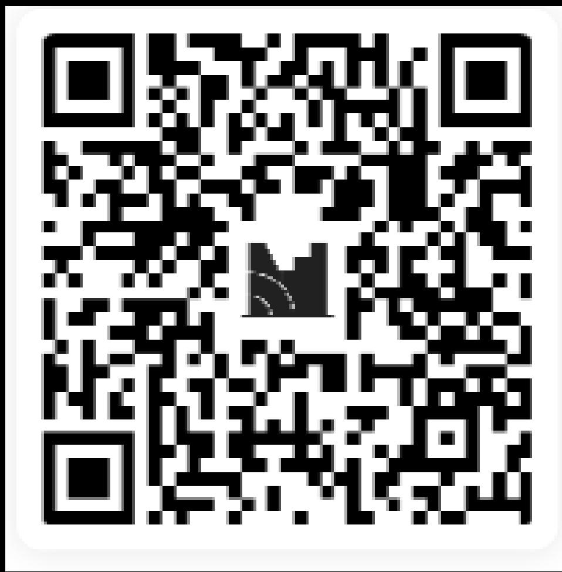

# Financial Analytics and

# Algorithmic Trading

Course Code: COMP7415

# Background of Lecturer

- Founder of AlgoGene (https://algogene.com)   
Vice Chairman of Algo Challenge Association (https://algochallenge.org)   
- Former algo developer, quant trader, risk manager, data analyst for hedge funds and banks.   
- BSc in Math, Risk Management, Actuarial Science (HKU); MSc in Computer Science (HKU)   
- Champion and awardee of several algo trading competitions, including

CCTV证券资讯频道《宽客天下·全球量化争霸赛》(2017/18)  
- Rotman International Trading Competition (2017)   
CASH Algo Trading Contest (2016)   
WorldQuant Challenge (2014, 2015)

# Let’s play a game!

# 1. What’s your study mode?

a) Full time   
b) Part time   
c) Just sit in

# 2. What is your main reason for taking this course?

a) I want to start a career in algo-trading   
b) I want to enhance my current job skills   
c) I am interested in the topic and want to learn more   
d) Just to fulfill graduation requirement

# 3. What do you expect to learn from this course?

a) Some skills for financial data analysis   
b) I want to develop an automated trading system   
c) Tell me some profitable trading strategies   
d) Not sure yet

# 4. Do you have any prior experience in algo-trading?

a) Yes, I have extensive experience   
b) Yes, I have some experience   
c) No, but I have experience in other forms of trading   
d) No, I am completely new to trading

# 5. Have you ever used any algo-trading platforms before?

a) Yes, I have used MetaTrader   
b) Yes, I have used TradingView   
c) Yes, I have used AlgoGene   
d) No, I have no idea what it is

# 6. Which of the following has the largest market capitalization?

a) China stock market   
b) Hong Kong stock market   
c) India stock market   
d) Japan stock market

# Answer

As of Dec-2025,

- China: $15 trillion   
- Hong Kong: $6 trillion   
- India: $5.3 trillion   
- Japan: $7.6 trillion

# 7. Which of the following market has the largest daily turnover/trading volume?

a) Commodity market   
b) Crypto market   
c) Global Equity market   
d) Forex

# Answer

Global equity market: $3.93 trillion   
• Forex: $6.6 trillion   
- Commodity: $126 billion   
- Crypto: $139 billion

# Reference:

- https://www.world-exchanges.org/our-work/statistics   
- https://www.bis.org/statistics/rpfx19 fx.htm   
- https://www.cftc.gov/MarketReports/CommitmentsofTraders/index.htm   
- https://www.coingecko.com/en/global charts

# 8. Which programming language is most widely used in algo-trading?

a) C++   
b) Java   
c) Python   
d) R

# 9. Which of the following market is the most popular for algo traders?

a) Commodities   
b) Cryptocurrency   
c) Equity   
d) Forex

# 10. What's the name of your teachers?

a) Tommy Lai   
b) Tony Lam   
c) Tim Leung   
d) Timothy Lau

# Course Objectives & Learning Outcomes

- Understand the trading process in financial market   
- Understand the fundamental of algorithmic trading framework for building a trading strategy   
- Able to formulate trading strategies, carry out backtesting, optimization, risk management and interpret investment performance   
- Develop practical skills in financial data analysis, trading strategy development, and deployment to real market and broker account

# Topics to be covered

1. Algorithmic trading basics and financial markets   
2. Data scraping and database management with Python   
3. Building backtest framework and rule-based trading strategy   
4. Statistical time series analysis for market classification   
5. Statistical arbitrage and pairs trading   
6. Capital and Risk Management   
7. Performance measures and portfolio optimization   
8. Order book and high frequency data modeling   
9. Market practice in strategy optimization, broker selection, and market tricks   
10. Machine learning use cases in algorithmic trading

# Assessment methods

- Group project - 50%   
• Written final exam covers all taught content in the course – 50%

# Contact

Lecturer

- Tony Lam: tonylamfm@hku.hk / tonylam@algogene.com

TA:

- Rex Tsang: trex@hku.hk