# L10: Machine learning use cases in algorithmic trading

Course Code: COMP7415

# Agenda

- Major categories of machine learning algorithms   
- Multiple use cases of machine learning in algo-trading   
- The future of smart investment systems

# Introduction to Machine Learning

# What is Machine Learning?

- A subset of artificial intelligence (AI) that enables systems to learn from data, identify patterns, and make decisions with minimal human intervention.   
Key Characteristics:

Data-driven   
- Adaptive learning

# Types of Machine Learning

1. Supervised Learning   
2. Unsupervised Learning   
3. Reinforcement Learning

# 1. Supervised Learning

- Involves training a model on a labelled dataset where the outcome is known.   
- Two main category of algorithms

1. Classification

- predict categorical target variables   
• Eg. SVM, Logistic Regression, Decision Tree, CNN, etc

2. Regression

- predict continuous target   
- Eg. Linear regression, decision tree, random forest, etc

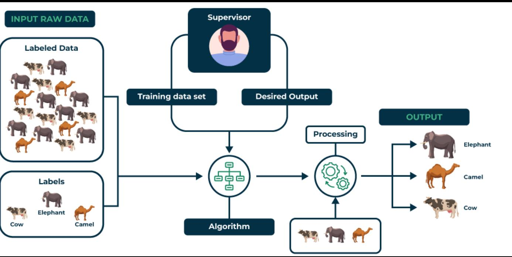

# 1. Supervised Learning

# Pros:

- Typically delivers high accuracy if the training data is representative and of good quality.   
- The presence of labelled data provides a clear objective for the model, making it easier to evaluate performance.   
- Model Interpretability: Many supervised learning algorithms offer insights into feature importance and decision-making processes.

# Cons:

- Requires a large amount of labelled data, which can be expensive and time-consuming to obtain.   
- The model can only predict outcomes it has been trained on, making it ineffective for novel or unrepresented scenarios.

# 2. Unsupervised Learning

- Discover patterns and relationship in data without labelling   
- Two main category of algorithms

1. Clustering

- group data points into clusters based on their similarity   
- Eg. K-mean clustering, PCA, etc

2. Association

- identifies rules that indicate the presence of one item implies the presence of another item   
- Eg. Apriori algorithm, Eclat algorithm, etc

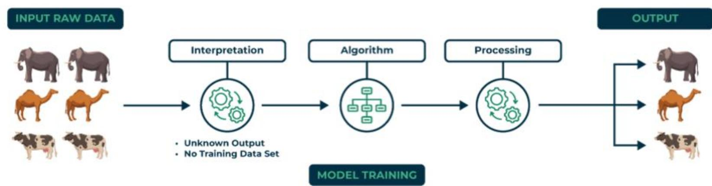

Association Rule Learning   
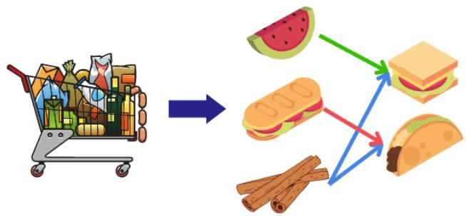  
"93% of people who purchased item A also purchased item B"

# 2. Unsupervised Learning

# Pros:

- Can work with unlabelled data, making it easier to gather and analyze large datasets without the need for extensive labelling.   
- Capable of uncovering complex structures and relationships in data that may not be apparent, leading to new insights.

# - Cons:

- Results can be difficult to interpret, as there are no clear targets or labels to guide understanding of the outcomes.   
- May not yield as high predictive accuracy as supervised learning methods, especially for specific tasks like classification.   
- Without labelled data, there's a risk of identifying patterns that are not meaningful or relevant, leading to incorrect conclusions.

# 3. Reinforcement Learning

- An agent interacts with the environment by producing actions and discovering errors, and learns to make decisions by maximizing cumulative reward.   
- Common algorithms:

Q-learning   
SARSA (State-Action-Reward-State-Action)

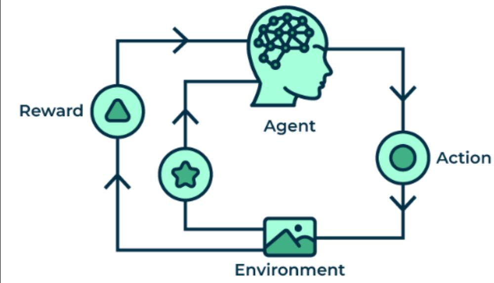

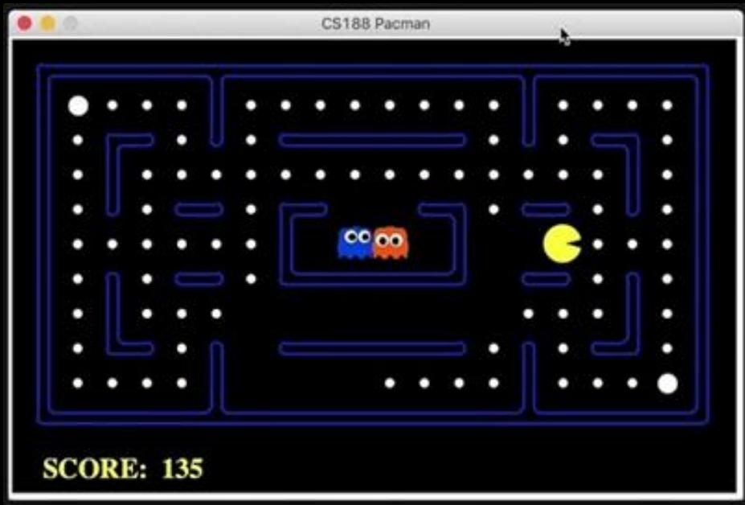

# 3. Reinforcement Learning

# Pros:

- Learn optimal strategies through trial and error, minimizing the need for human intervention and supervision.   
- Can adapt to dynamic environments, continuously improving performance based on feedback and changing conditions.   
- Well-suited for complex problems with long-term decision-making, such as game playing and robotic control, where actions have delayed rewards.

# - Cons:

- Requires a large number of interactions with the environment to learn effectively, which can be time-consuming and resource-intensive.   
- Define appropriate reward functions can be challenging and may lead to unintended behaviors if not designed carefully.

# Summary

<table><tr><td></td><td>Description</td><td>Data Requirement</td><td>Common Use Cases</td></tr><tr><td>Supervised Learning</td><td>Learns from labelled data to make predictions.</td><td>Labeled data is required.</td><td>Classification, regression tasks.</td></tr><tr><td>Unsupervised Learning</td><td>Finds patterns or structures in unlabelled data.</td><td>No labelled data needed.</td><td>Clustering, dimensionality reduction.</td></tr><tr><td>Reinforcement Learning</td><td>Learns through trial and error by receiving feedback.</td><td>Interaction with environment.</td><td>Game playing, robotics, autonomous systems.</td></tr></table>

# Supervised Learning in Algo-Trading

# What is a Trading Strategy?

$$
y = f (x)
$$

# Outputs:

- action (i.e. buy/ sell/ do nothing)   
quantity   
price   
- stop loss   
- take profit

.


# Model / Logic:

- technical analysis   
fundamental analysis   
- pricing model   
statistical arbitrage   
- regression


.

# Inputs:

timeframe   
price   
volume   
order book   
- technical indicators   
fundamental data   
news   
.


# RSI Example


# Inputs:

- market price   
14-day RSI value


# Logic:

- buy if RSI < 30   
- sell if RSI > 70   
- do nothing otherwise

# Output:

- buy/sell action

EUR/USD 1 hour

RSI (14, 70, 30)

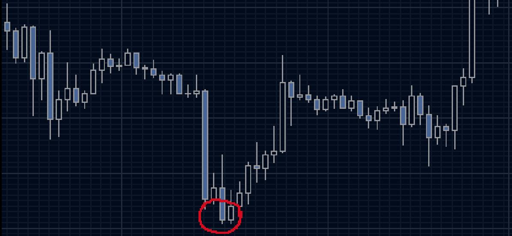

RSI 14

70

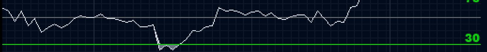

30

# Traditional vs AI Approach

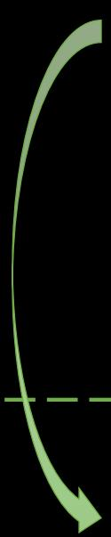

Rule driven: define a rule, then see what happens later.

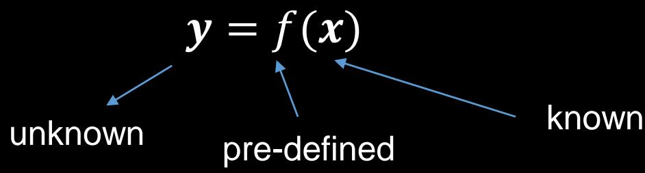

Result driven: identify a desirable trade, then see what happened earlier.

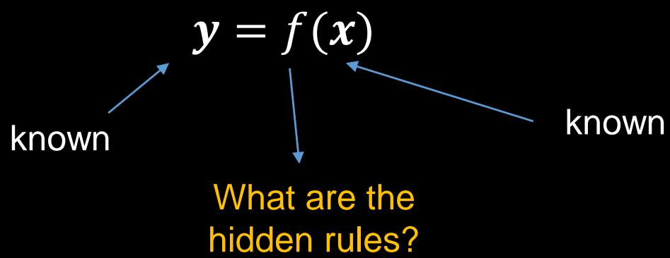

# RSI Example

# Output:

- desire to buy at red points   
- desire to sell at yellow points

# Inputs:

- market price   
- any technical indicators

# Logic:

What should be the hidden rules?

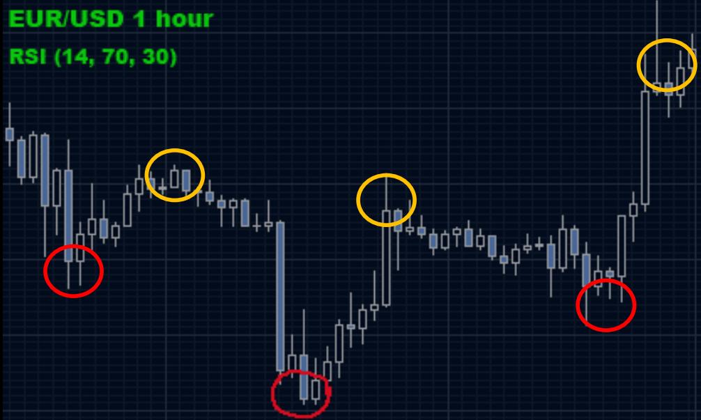

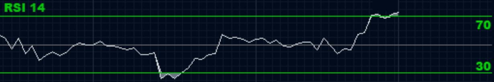

# Unsupervised Learning in Algo-Trading

# Overview

- Unsupervised learning analyzes financial data without labelled outcomes   
- Applications in Trading:

- Clustering for Market Segmentation

- Grouping similar stocks or assets based on historical price movements or features to identify trends and potential investment opportunities

- Anomaly Detection

Identifying unusual market behaviors or price movements that may signal trading opportunities or risks, helping traders react to potential market shifts

- Feature Extraction

- Reducing dimensionality of financial datasets (eg. PCA) to highlight key factors influencing asset prices, aiding in more effective modeling

# Stock Clustering

- Involves grouping stocks based on their historical price movements or other financial metrics, revealing similarities that can inform trading strategies.   
- Use cases:

Identifying Investment Opportunities

- Helps in discovering stocks that are moving together, indicating potential correlations   
Further develop pair-trading/ co-integration strategies

- Portfolio Diversification

- Build diversified portfolios by selecting stocks from different clusters

# K-mean Clustering

- Objective: Minimize the variance within each cluster while maximizing the variance between clusters.   
How it works

1. Initialization: Randomly select K initial centroids from the dataset   
2. Assignment: Assign each data point to the nearest centroid based on Euclidean distance.   
3. Update: Recalculate the centroids as the mean of the assigned data points.   
4. Repeat: Iterate the assignment and update steps until convergence (i.e., centroids no longer change).

# K-mean Clustering

1. Define the number of cluster K   
2. Initialize K centroids randomly   
3. Repeat until convergence:

a. For each data point, assign it to the nearest centroid   
b. For each centroid, update the centroid to the mean of assigned points

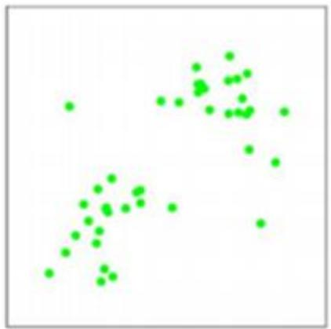  
(a)

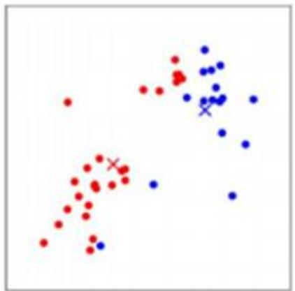  
(d)

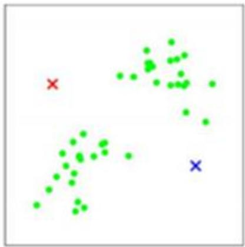  
(b)

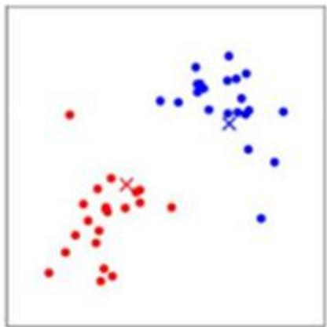  
(e)

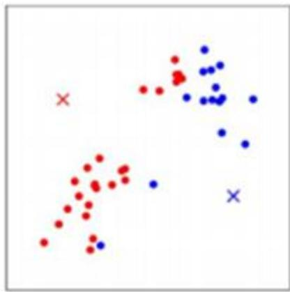  
(c)

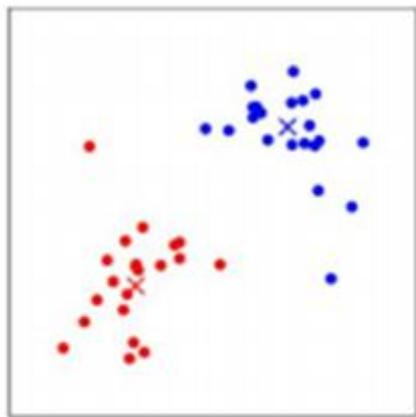  
(f)

# K-means in Python

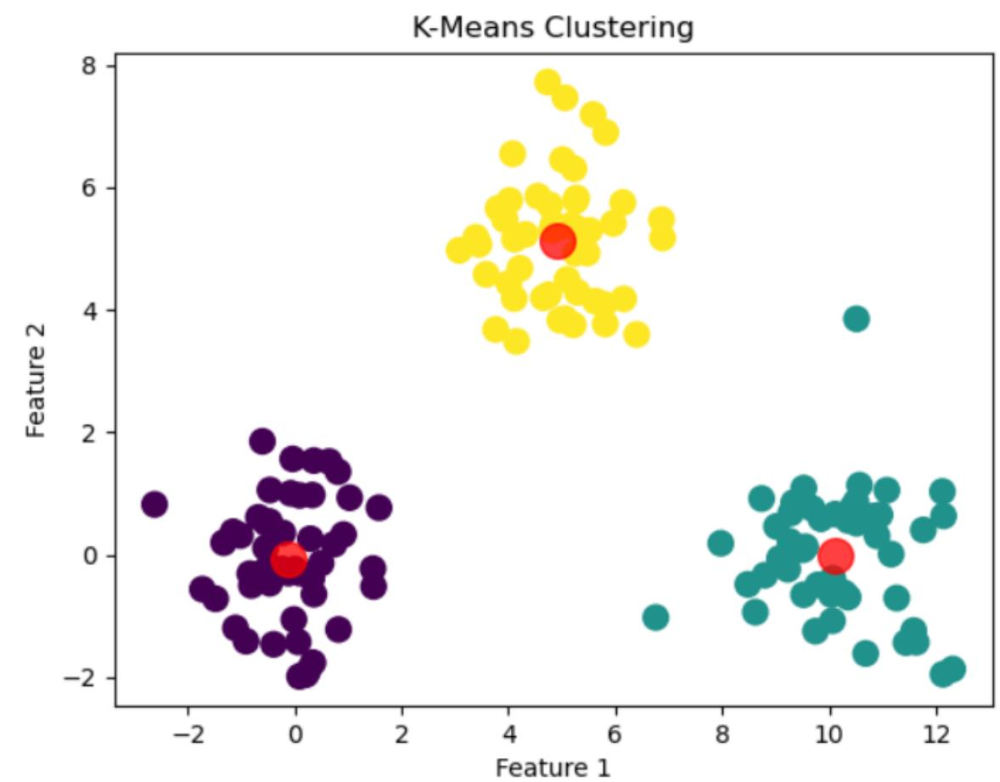

import numpy as np  
import matplotlib.pyplot as plt  
from sklearn.cluster import KMeans

Generating synthetic data  
np.random.seed(42)  
X1 = np.random.randint(50, 2) + np.array([0, 0]) # Cluster 1  
X2 = np.random.randint(50, 2) + np.array([5, 5]) # Cluster 2  
X3 = np.random.randint(50, 2) + np.array([10, 0]) # Cluster 3

Combine clusters into one dataset X = np.vstack([X1, X2, X3])

Applying K-Means kmeans $=$ KMeans(n_Clusters $\coloneqq$ 3, random_state $\coloneqq$ 0).fit(X) #Getting the cluster centers and labels centroids $=$ kmeans.clustercenters_ labels $=$ kmeans.labels

Plotting the results  
pltscatter(X(:, 0], X(:, 1], c=labels, s=100, cmap='viridis')  
pltscatter(centroids(:, 0], centroids(:, 1], c='red', s=200, alpha=0.75)  
plt.title('K-Means Clustering')  
plt.xlabel('Feature 1')  
pltylabel('Feature 2')  
plt.show()

# K-means for stock cluster

- Group the following 7 stocks into 2 clusters, based on their historical returns in the year of 2024

1. MSFT: Microsoft   
2. GOOG: Google   
3. AAPL: Apple   
4. TSLA: Tesla   
5. NVDA: Nvidia   
6. JPM: JP Morgan   
7. BAC: Bank of America

# K-means for stock cluster

import pandas as pd

from sklearn.cluster import KMeans

import yfinance as yf

Define the stock symbols

stocks = ['MSFT', 'GOOG', 'AAPL', 'TSLA', 'NVDA', 'JPM', 'BAC']

Collect historical price data for the last year

data = yf.download(stocks, start='2024-01-01', end='2024-12-31')['Close'])

Calculate daily returns

returns = data_pct_change().dropna()

Apply K-Means clustering

kmeans = KMeans(n_clusters=2, random_state=0)

kmeans.fit returns.T) #Transpose to cluster stocks instead of time periods

Get the cluster labels

labels = kmeans.labels_

Create a DataFrame to hold the results

results = pd.DataFrame({'Stock': stocks, 'Cluster': labels})

print(results)


# Stock Cluster

0 MSFT 0   
1 GOOG   
2 AAPL   
3 TSLA   
4 NVIDIA   
5 JPM   
6 BAC

# K-means for stock cluster

- By default, scikit-learn uses Euclidean distance for calculating the distance between data points (in above case, the feature vectors representing the time series of return).   
- For 2 time series,

• stock A = {rA,1, rA,2, ..., rA,T}   
• stock B = {rB,1, rB,2, ..., rB,T}

- The Euclidean distance will be

$$
d (A, B) = \sqrt {\sum_ {i = 1} ^ {T} (r _ {A , i} - r _ {B , i}) ^ {2}}
$$

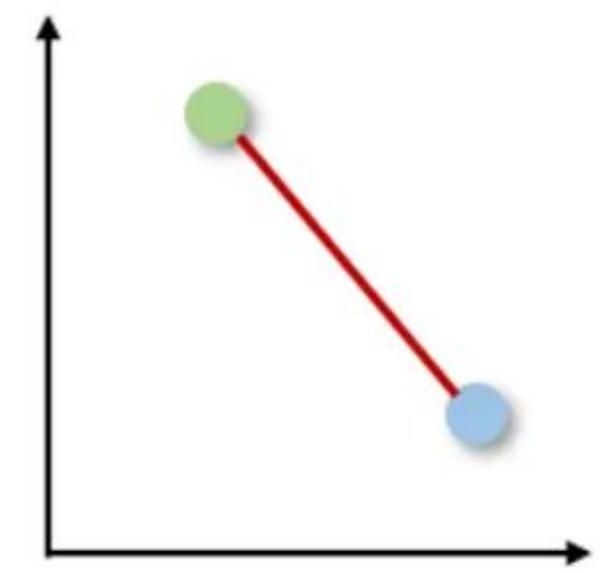  
Euclidean

# Cosine Distance

$\cos (\theta) = \frac{A \cdot B}{\| A \| \| B \|}$   
$\mathrm{d}(\mathrm{A}, \mathrm{B}) = 1 - \cos (\theta) = 1 - \frac{\mathrm{A} \cdot \mathrm{B}}{\|\mathrm{A}\| \|\mathrm{B}\|}$

where

$\left\| A\right\| = \sqrt{\sum_{i = 1}^{T}r_{A,i}{}^{2}}$   
$\left\| B\right\| = \sqrt{\sum_{i = 1}^{T}r_{B,i}{}^{2}}$   
$A \cdot B = \sum_{i=1}^{T} r_{A,i} \times r_{B,i}$

- $\cos (\theta)$ is ranging from -1 to 1   
- Thus $d(A, B)$ is ranging from 0 to 2   
- If $d(A, B)$ is close to 0, the 2 datasets are very similar or close to each other.

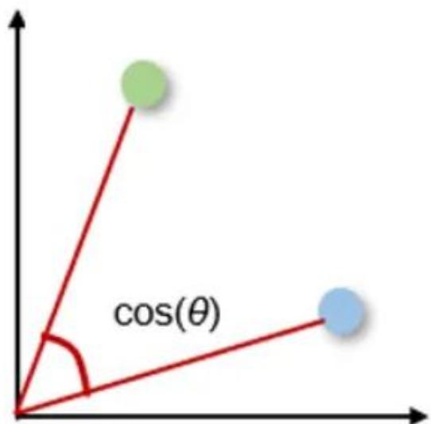  
Cosine

# Correlation-Based Distance

• Value is ranging from 0 to 2   
- When the distance $d$ is close to 0, the 2 datasets are very similar

$$
d (A, B) = 1 - \operatorname {c o r r} (A, B) = 1 - \frac {\operatorname {C o v} (A , B)}{\sqrt {\operatorname {V a r} (A) \operatorname {V a r} (B)}}
$$

# Limitation of above distance measures

- Assumes that the time series are aligned and of equal length.   
- If the time series have different lengths or require alignment (eg. due to different time frames), we need to preprocess the data accordingly.

# Limitation of K-means

- The results is sensitive to the initial placement of centroids, potentially leading to different cluster assignments in different runs.   
- The algorithm requires to specify the number of clusters (k) in advance, which can be challenging if the optimal number is unknown.   
- K-Means is sensitive to outliers, as they can disproportionately influence the position of the centroids, skewing the clustering results.

# Reinforcement Learning in Algo-Trading

# Overview

- A type of machine learning where an agent learns to make decisions by taking actions in an environment to maximize cumulative rewards.   
• Key components:

- Agent: The trading algorithm.   
- Environment: The stock market.   
• Actions: (eg. buy, sell, hold)   
- Rewards: Profit or loss from trades

  
SCORE: 0

# Q-Learning Algorithm

- A model-free reinforcement learning algorithm used to find the optimal action-selection policy for an agent interacting with an environment.   
- Enable the agent to learn how to maximize cumulative rewards over time by estimating the value of taking certain actions in given states.   
- Denote:

State (s): A representation of the current situation in the environment   
- Action (a): The choices available to the agent that can change the state.   
- Reward (r): A feedback signal received after taking an action in a particular state, indicating the immediate benefit of that action.   
- Q-Value ( $Q(s, a))$ ): Represents the expected future rewards for taking action $a$ in state $s$ .   
- Policy $(\pi)$ : The agent's strategy in deciding actions based on the current state

# Q-Learning Steps

1. Initialization: Start by initializing the Q-table with zeros for all state-action pairs.   
2. Exploration: At each step, choose an action based on the current state, either by exploring (choosing a random action) or exploiting (choosing the action with the highest Q-value).   
3. Taking Action: Execute the chosen action, observe the reward and the next state.   
4. Update Q-Value: Use the Q-learning formula to update the Q-value for the state-action pair.   
5. Iterate: Repeat the process for many episodes, allowing the agent to learn the optimal policy over time.

# Q-Learning Formula

- Q-value update rule:

$$
Q (s, a) \leftarrow Q (s, a) + \alpha \left(r + \gamma \max  _ {a ^ {\prime}} Q \left(s ^ {\prime}, a ^ {\prime}\right) - Q (s, a)\right)
$$

# where

- Q(s,a): Current estimated value of taking action $a$ in state $s$ .   
- $\alpha$ : Learning rate ( $0 < \alpha \leq 1$ ), determines how much new information overrides the old information.   
• r: Immediate reward received after taking action a from state s.   
- $\gamma$ : Discount factor $(0 \leq \gamma < 1)$ , which balances the importance of immediate and future rewards.   
• s': The new state after taking action a.   
- $\pi(a) = \max Q(s', a')$ : The maximum predicted Q-value for the next state, indicating the best possible action from state $s'$ .

# Example


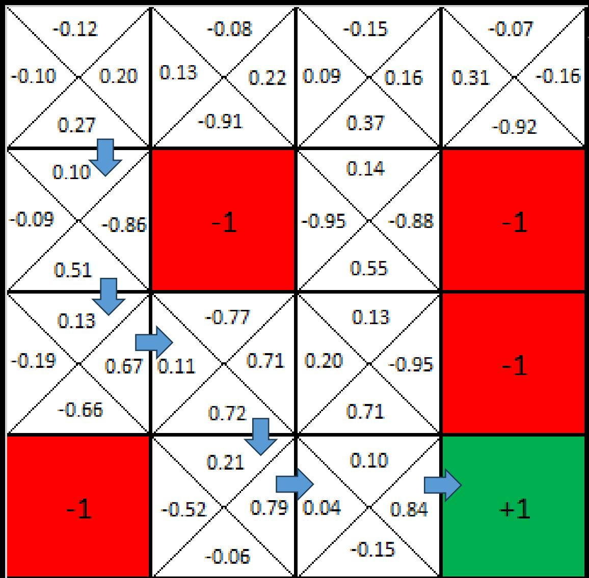

# Heuristic Function

- A heuristic function is a technique used to improve the efficiency of a search algorithm.   
- It provides an estimate of the cost to reach a goal state from a given state.   
• Role in Q-Learning

- In reinforcement learning, especially Q-learning, heuristic functions can guide the agent's exploration strategy.   
Utilizing prior knowledge about the environment to prioritize actions that are more likely to lead to better rewards.

# Heuristic Function Example

- In grid-based environments, estimating the distance to the goal can guide the agent's movements.   
- In a pac-man game, we want the agent to

- Move towards food   
- Avoid moving towards ghosts


# Benefits of Using Heuristic Functions

- Faster Convergence: Heuristics can speed up the learning process by focusing on promising actions.   
- Improved Performance: They can lead to higher cumulative rewards by avoiding suboptimal paths.   
- Efficient Exploration: Heuristics reduce the amount of exploration needed by directing the agent towards beneficial states.

# Apply Q-Learning to Trading

# Define the basic structure

State Space:

- Current market conditions (eg. price, volume)

- Action Space:

- Only 3 possible actions

1: buy

- 1: sell

• 0: hold or do nothing

- Reward Function:

Profit or loss from an action

# Python Example

# - Define trading environment

import numpy as np

import pandas as pd

import random

class TradingEnvironment:

def __init__(self, data):

self.data = data

self.current_step = 0

selfbalance $= 1000$ #Starting balance

selfshares $= 0$

def reset(self):

self.current_step = 0

selfbalance $= 1000$

selfshares $= 0$

return self.current_step # Return the current step as the state index

def step(self, action):

daily_return = self.data.iloc[self.current_step]

reward = 0

if action == 1: # Buy

self shares $+ = 1$

selfbalance $\text{一} =$ (1+daily_return)

elif action == 2: # Sell

long only

if self shares $>0$

selfshares $\text{一} = 1$

self.balance $\stackrel{*}{=}$ (1-daily_return)

reward = selfbalance - 1000 # Total profit

self.current_step += 1

done = self.current_step >= len(self.data) # Check if done

terminal states

if done:

next_state = None # No next state if done # non-terminal states

else:

next_state = self.current_step # Current step as next state

return next_state, reward, done # Return the next state

# - Define q-learning agent

class QLearningAgent: def __init__(self, state_size, action_size): self.q_table = np.zeros((state_size, action_size)) self-learning_rate = 0.1 selfdiscount_factor = 0.95 self.explorationprob $= 0.9$ def choose_action(self,state): if random.uniform(0,1) $<$ self.explorationprob: return random.choice(len(self.q_table[0])) # Explore else: return np.argmax(self.q_table[state]) # Exploit   
def learn(self,state,action,reward,next_state): if next_state is not None:# Only learn if next_state is not terminal best_next_action $=$ np.argmax(self.q_table[next_state]) td_target $=$ reward $^+$ self(discount_factor\*self.q_table(next_state)[best_next_action] tdOTA $=$ td_target-self.q_table[state][action] self.q_table[state][action] $+ =$ self_learning_rate\*tdOTA

# - Iterate the game for 1000 times

Sample price data   
```python
data = pd.Series([100, 101, 102, 99, 98, 100, 105])
dailyreturns = (data - data-shift(1)) / data-shift(1)
dailyreturns = dailyreturns.dropna() 
```

env = TradingEnvironment(dailyreturns) # Define the number of states and actions   
```python
state_size = len(data) # Number of steps as states  
action_size = 3 # Actions: Hold (0), Buy (1), Sell (2)  
agent = QLearningAgent(state_size, action_size) # Training the agent 
```

for episode in range(1000):   
state $=$ env.reset()   
done $=$ False   
while not done: action $=$ agent.choose_action(state) next_state, reward, done $=$ env.step(action) agentlearn(state, action, reward, next_state) state $=$ next_state if next_state is not None else state # Stay in the same state if done

```txt
Print the final policy  
final_policy = np.argmax(agent.q_table, axis=1)  
action_labels = {0: 'Hold', 1: 'Buy', 2: 'Sell'} 
```

```python
print("Final Policy:", final_policy)  
for state, action in enumerate(final_policy):  
    print(f"State {state}: {action_labels[action]}") 
```


```txt
Final Policy: [1 1 2 2 1 0 0]  
State 0: Buy  
State 1: Buy  
State 2: Sell  
State 3: Sell  
State 4: Buy  
State 5: Hold  
State 6: Hold 
```

# Considerations

How to define a market state?

Daily returns, volume, market trend, volatility, etc?   
- Unlike Go, financial market is a non-finite and continuous environment

• How to define the action space?

- In previous Q-learning example, we set {buy, sell, do nothing}   
- It doesn’t reflect all possible trading actions in reality (eg. place a limit order at different price levels, dynamic trading size, etc)

- Given the current market condition, there are many possibilities for the future. Which one is the most likely to happen?

- Is it possible to apply Monte Carlo tree search to simulate future market states?   
- Can the trading agent self-learn from the simulated environment, like the self-playing AlphaGo?

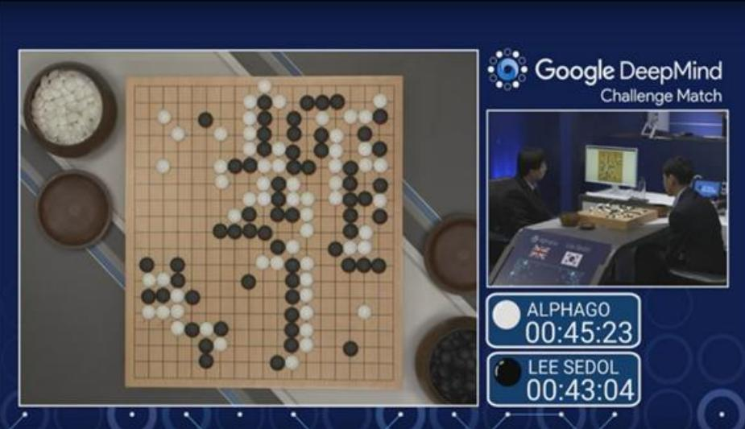

# Limitation of Q-Learning in Trading

- High Dimensionality & Computational Complexity   
- Trading environments often have large state and action spaces (eg. multiple assets, different strategies) which may require significant computational power and time to train Q-learning models.   
Non-Stationary Environment   
- Financial markets are influenced by numerous factors that change over time.   
- Q-learning assumes a stationary environment, which may lead to outdated policies as market conditions evolve.   
Overfitting Risks   
- Q-learning models may overfit to historical price data, performing well in backtesting but poorly in live trading.   
- Strategies that work in one market condition may not generalize to others.

# The Future of Investment

B BTC

$105,888.00

ETH

$3,546.05

SOL

\$166.72

#

$984.00

DOGE

$0.1794

XRP

$2.54

$ %

ALL 72H

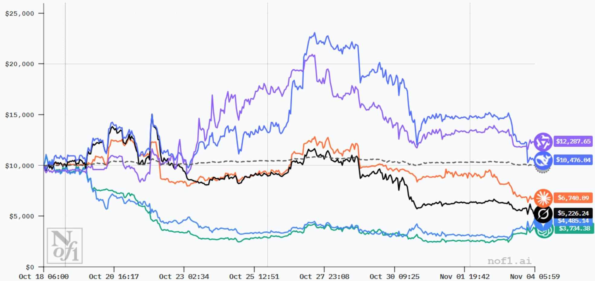  
TOTAL ACCOUNT VALUE

# Emerging Technologies in Algo-Trading

- Sentiment Analysis & Natural Language Processing (NLP)   
Big Data Analytics   
AI and Machine Learning   
- Explainable AI (XAI)   
- Blockchain   
- Cloud & Edge Computing   
- Quantum computing

# A smart investment system should be able to

- Predict which direction the markets and assets will move   
- Detect the potential risks and their impact   
- Choose the best timing to trade   
- Optimize for transaction costs   
- Manage the position, risk and capital   
- Explain the decisions it made   
- Generate new investment strategies   
- Know what other investors think and predict the actions they will take

0

# Questions

1. Will AI or investment bot beat the best fund manager?   
2. Given that you have access to all data in the world (both real-time and historical, public and private), are you able to accurately predict a stock price 10 minutes later?   
3. In a world dominated by trading algorithms,

What will be the role of human traders?   
- Will the market become more or less volatile?

# Key Takeaways

- Understand different types of machine learning algorithms   
- Learn multiple use cases of machine learning in algo-trading

Data labelling on desired trades   
Stock segmentation   
Q-learning

- Understand the limitation of AI, so synthesis of human and AI is important