# L6: Capital and Risk Management

Course Code: COMP7415

# Agenda

• Introduction to the risk management cycle

- Risk identification   
- Risk measurement

- Volatility modelling including ARCH, GARCH   
- Value-at-Risk (VaR)   
- Stress testing, Scenario analysis

- Position sizing strategy

- Fixed Size   
Balance Rescaling   
- Dollar Risk Approach   
- Kelly Criterion

# What is Risk?

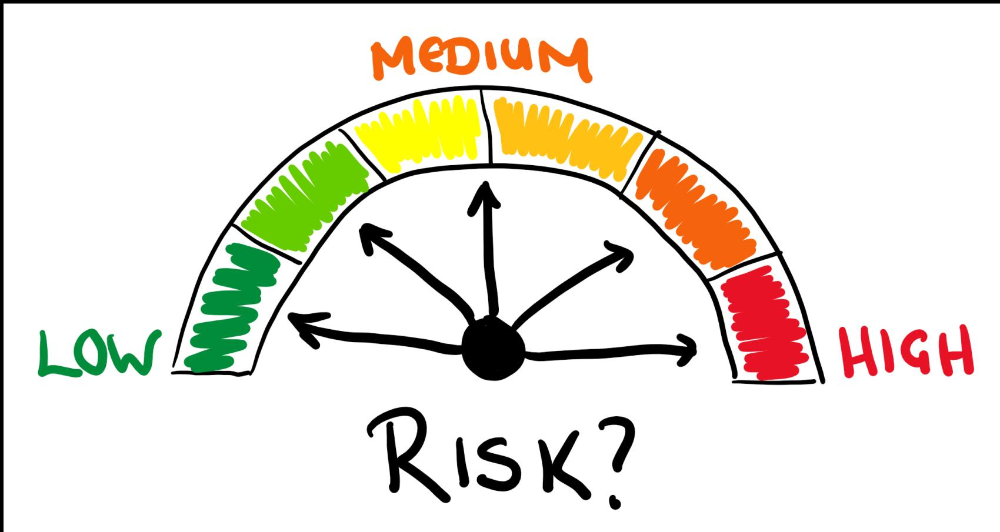

# What is Risk?

- Risk simply refers to uncertainty   
- In finance, risk refers to the uncertainty of the investment return.

- Up-side risk: the possibility of making money   
- Down-side risk: the possibility of losing money

# Risk Management Cycle

1. Risk Identification   
2. Risk Assessment / Measurement   
3. Risk Treatment   
4. Risk Monitoring

# Risk Identification

# Major Risk Types for a financial institution

1. Market Risk

Equity Risk   
- FX Risk   
Commodity Risk

2. Interest rate Risk   
3. Credit Risk   
4. Liquidity Risk   
5. Operational Risk   
6. Legal Risk   
7. Reputational Risk   
8. Strategic Risk

Investment related risks

# Market Risk

- Market Risk is the potential for financial losses due to changes in market prices. It affects assets such as stocks, bonds, currencies, and commodities.   
- Example: Suppose you own shares in a tech company. If the stock market experiences a downturn, the value of your shares may decrease regardless of the company's performance, due to overall market sentiment.   
- This type of risk is inherent to all investments and can be influenced by factors like economic changes, political events, and natural disasters.

# Interest Risk

- Interest Rate Risk is the potential for investment losses due to fluctuations in interest rates. It primarily affects the value of bonds and other fixed-income securities. When interest rates rise, bond prices typically fall, and vice versa.   
- Example: Imagine you own a bond with a fixed interest rate of $3\%$ . If the market interest rate rises to $4\%$ , new bonds offer better returns, making your bond less attractive. Consequently, the market value of your bond decreases.   
- This risk is crucial for investors and financial institutions managing portfolios sensitive to interest rate changes.

# Credit Risk

- Credit Risk is the possibility of a loss resulting from a borrower's failure to repay a loan or meet contractual obligations. It affects lenders and investors in bonds or loans.   
- Example: If a bank lends money to a business, and the business defaults on the loan, the bank faces credit risk. This risk can lead to financial loss for the bank due to the unpaid loan amount.   
- Credit risk is a key consideration in lending and investing, influencing interest rates and lending terms.

# Liquidity Risk

- Liquidity Risk is the risk that an entity may not be able to quickly convert assets into cash without significant loss in value. It affects individuals, businesses, and financial institutions.   
- Example: Imagine a company owns a large amount of real estate. If it suddenly needs cash to cover expenses, selling the properties quickly might force them to accept lower prices, resulting in a financial loss.   
- Liquidity risk is important for managing cash flow and ensuring that obligations can be met when they come due.

# What type of risk involved in these examples?

1. A company defaults on its loan payment.   
2. You need to sell a property quickly but can't find a buyer without reducing the price significantly.   
3. The value of your bond portfolio decreases due to rising interest rates.   
4. Stock prices drop due to a sudden economic downturn.   
5. A bank is unable to meet its short-term cash obligations.   
6. An investor worries about a borrower's ability to repay a loan.   
7. The price of a commodity fluctuates widely and affects your investment.   
8. You are a fresh graduate. You worry about the house price keeps increasing and unaffordable to buy.

# Risk Measurement

# Measuring Risk

1. Volatility Analysis

Historical estimates   
- Exponentially weighted moving average (EWMA)   
GARCH model

2. Value at Risk (VaR)   
3. Stress Testing and Scenario Analysis

# Standard Derivation

- Standard derivation is a statistical measure that quantifies the amount of variation or dispersion in a set of data values

$$
\sigma_ {t, n} = \sqrt {\frac {1}{n} \sum_ {i = 1} ^ {n} (x _ {t - i} - \mu) ^ {2}}
$$

where $\sigma_{t,n}$ is standard deviation at time $t$ , $n$ is the number of observations, $x_{t - i}$ is each value, and $\mu$ is the mean.

- Volatility is often measured using standard deviation.   
- High standard deviation indicates high volatility, meaning the asset's price can vary significantly.

# Standard Derivation

- Since $n$ is fixed and the last $n$ observations are used, we also call this a moving average (MA) estimate   
• Common values for $n$ : 30, 60, 120 days, etc   
- If one believes that the long term volatility is a constant, then a larger $n$ should be used.   
- If one wants to reflect more about the current situation, then a smaller $n$ should be considered.   
- Disadvantage: extreme observations can affect the estimate for a prolonged period of time (ghost features). A small n gives more pronounced ghost features but for a shorter period of time.

# EWMA

- To avoid the problem of equally weighted averages in the moving average estimates, we alternatively use the exponentially weighted moving averages (EWMA) by putting more weight on the recent data.   
- EWMA is defined as

$$
\sigma_ {t} ^ {2} = \frac {r _ {t - 1} ^ {2} + \lambda r _ {t - 2} ^ {2} + \lambda^ {2} r _ {t - 3} ^ {2} + \cdots + \lambda^ {n - 1} r _ {t - n} ^ {2}}{1 + \lambda + \lambda^ {2} + \cdots + \lambda^ {n - 1}}
$$

where $0 < \lambda < 1$ is the discounting factor.

- Here we assume $r_t$ are mean-corrected returns. Otherwise, we should subtract estimated mean from them.

# EWMA

• Since

$$
1 + \lambda + \lambda^ {2} + \dots + \lambda^ {n - 1} \approx \frac {1}{1 - \lambda}
$$

- So

$$
\begin{array}{l} \sigma_ {t} ^ {2} \approx (1 - \lambda) (r _ {t - 1} ^ {2} + \lambda r _ {t - 2} ^ {2} + \lambda^ {2} r _ {t - 3} ^ {2} + \dots + \lambda^ {n - 1} r _ {t - n} ^ {2}) \\ \approx (1 - \lambda) \sum_ {i = 1} ^ {n} \lambda^ {i - 1} r _ {t - i} ^ {2} \\ \approx (1 - \lambda) \sum_ {i = 1} ^ {\infty} \lambda^ {i - 1} r _ {t - i} ^ {2} \\ \end{array}
$$

# EWMA

- If $\lambda$ close to 0, $\sigma_t^2$ will be more reactive to current events   
- If $\lambda$ close to $1$ , $\sigma_t^2$ will depend more on past values   
- RiskMetrics (JP Morgan) has a default value of 0.94 for $\lambda$

# Volatility Clustering

- Volatility clustering refers to the observation that large changes in asset prices are often followed by large changes, and small changes tend to be followed by small changes. This suggests that volatility is not constant over time.   
- In financial market, volatility tends to increase during

Market crash   
- Natural disasters   
- Wars   
- Company earning release   
President election due to policy uncertainty

# Volatility Clustering - SP500

import yfinance as yf

import numpy as np

import pandas as pd

import matplotlib.pyplot as plt

Download S&P 500 (^GSPC) data

data = yf.download('^GSPC', start='2000-01-01', end='2024-12-31')

Calculate daily returns

data['Daily Return'] = data['Close'].pct_change()

Calculate rolling volatility with a 30-day lookback period

data['Volatility'] = data['Daily Return'].rollingwindow=30).std() * np.sqrt(252)

Annualized volatility # Plot the volatility

plt.figure(figsize=(12,6))

plt.plot(data index, data['Volatility'], label='30-Day Rolling Volatility')

plt title('S&P 500 Volatility Clustering (2000-2024)')

plt.xlabel('Date')

plt ylabel('Annualized Volatility')

pltlegend()

plt grid(True)

plt.show()

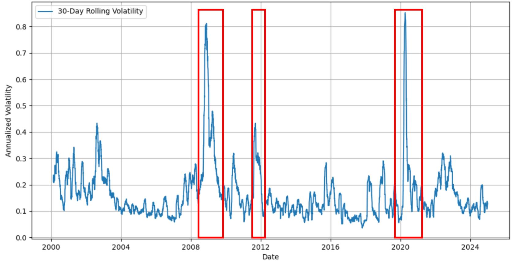  
S&P 500 Volatility Clustering (2000-2024)

# ARCH/ GARCH model

- The ARCH or GARCH (Generalized Autoregressive Conditional Heteroskedasticity) model are commonly used to model time-varying volatility, which take into account of volatility clustering.   
- When volatility is autoregressive, we call this the ARCH effect.   
- To check whether $\left\{r_{t}^{2}\right\}$ is correlated, we can look at the ACF terms

$$
| \widehat {\rho_ {1}} | > \frac {2}{\sqrt {T}}
$$

$$
| \widehat {\rho_ {2}} | > \frac {2}{\sqrt {T}}
$$

···

# ARCH/ GARCH model

- For overall checking, we can use McLeod-Li test (1983)

$$
Q _ {2} (m) = T (T + 2) \sum_ {i = 1} ^ {m} \frac {\widehat {\rho_ {i}} ^ {2}}{T - i} \quad \sim \quad \chi^ {2} (m)
$$

Hypothesis:

- $H_{0}$ : ARCH effect is not present   
- $H_{1}$ : ARCH effect is present (i.e. volatility clustering effect exists)

- In McLeod-Li test, commonly used $m$ are 6, 12, 18, and 24

# ARCH/ GARCH model

- Generally the conditional variance $R_{t}$ is defined as

$$
\sigma_ {t} ^ {2} = E \left[ \left(R _ {t} - \mu_ {t}\right) ^ {2} \mid F _ {t - 1} \right]
$$

where $F_{t-1}$ is the information up to time $t-1$

- If $R_{t} = \mu_{t} + a_{t},\sigma_{t}^{2} = E\left[a_{t}{}^{2}\mid F_{t - 1}\right]$   
- In the trivial case of $\mu_t = 0$ (i.e. $R_t = a_t$ ), $\sigma_t^2 = E[R_t^2 \mid F_{t-1}]$

# The ARCH(1) model

- Since volatility is autoregressive and dependent on past squared returns, it is natural to assume, say

$$
\sigma_ {t} ^ {2} = \alpha_ {0} + \alpha_ {1} r _ {t - 1} ^ {2} \qquad \mathrm {w h e r e} \alpha_ {0} > 0 \mathrm {a n d} 0 \leq \alpha_ {1} <   1 \mathrm {a r e c o n s t a n t s}
$$

It is the so called ARCH(1) model.   
- Here we assume $\{r_t\}$ is mean corrected and serially uncorrelated. If not, we replace $r_{t - 1}$ by $\varepsilon_{t - 1}$ , where its realization $\widehat{a_{t - 1}}$ are the residuals from an AR model fitted to $r_{t - 1}$

# The ARCH(1) model

- A more formal definition of ARCH(1) model for a return series $\{r_t\}$ is defined as

$$
\left\{ \begin{array}{l} r _ {t} = \varphi_ {0} + \varphi_ {1} r _ {t - 1} + \dots + \varphi_ {p} r _ {t - p} + a _ {t} \\ \qquad \qquad \qquad \qquad \qquad \qquad \qquad \qquad \qquad \qquad \qquad \qquad \qquad \qquad \qquad \qquad \qquad \qquad \qquad \qquad \qquad \qquad \qquad \qquad \qquad \qquad \qquad \qquad \qquad \qquad \qquad \qquad \qquad \qquad i. i. d. \\ a _ {t} = \sigma_ {t} \varepsilon_ {t} \qquad \mathrm {w h e r e} \{\varepsilon_ {t} \} \sim \mathrm {N} (0, 1) \\ \sigma_ {t} ^ {2} = E (\varepsilon_ {t} ^ {2} | F _ {t - 1}) = \alpha_ {0} + \alpha_ {1} a _ {t - 1} ^ {2} \end{array} \right.
$$

- The first AR(p) equation is used to estimate the conditional means, and the last one to estimate volatilities.   
- Therefore, they are usually referred to as the mean equation and the volatility equation respectively.

# Properties of the ARCH(1) model

- The AR residuals or mean-corrected returns $\{a_{t}\}$ are serially uncorrelated.

$E\left(a_{t}\right) = 0$   
$\operatorname{Var}\left(a_{t}\right) = \operatorname{E}\left(a_{t}^{2}\right) = \frac{\alpha_{0}}{1 - \alpha_{1}}$   
- The residuals $\left\{a_{t}\right\}$ are statistically independent.   
- Conditioning on previous information $F_{t - 1}, a_t$ is conditionally normal $N(0, \sigma_t^2)$

- The squared residual $\left\{a_{t}^{2}\right\}$ are serially correlated with

$$
\rho (k) = C o r r \bigl (a _ {t} ^ {2}, a _ {t - k} ^ {2} \bigr) = \alpha_ {1} ^ {k}
$$

# Properties of the ARCH(1) model

- $E\left(a_{t}^{4}\right)$ exists if and only if $\alpha_{1}< \frac{1}{\sqrt{3}}$ . Moreover, the kurtosis is $\kappa = \frac{3(1 - \alpha_{1}^{2})}{1 - 3\alpha_{1}^{2}} >3$   
- Define $\eta_{t} = a_{t}^{2} - \sigma_{t}^{2}$ . Substituting this into the volatility equation becomes

$$
a _ {t} ^ {2} = \alpha_ {0} + \alpha_ {1} a _ {t - 1} ^ {2} + \eta_ {t}
$$

which is in the form of an AR(1) model. This fact is usually used for specification of ARCH models

# The ARCH(m) model

A generalization $\mathrm{ARCH}(\mathfrak{m})$ model is

$$
\left\{ \begin{array}{l l} a _ {t} = \sigma_ {t} \varepsilon_ {t} & \{\varepsilon_ {t} \} \stackrel {\mathrm {i . i . d .}} {\sim} \mathrm {N} (0, 1) \\ \sigma_ {t} ^ {2} = \alpha_ {0} + \alpha_ {1} a _ {t - 1} ^ {2} + \dots + \alpha_ {m} a _ {t - m} ^ {2} \end{array} \right.
$$

- Here $\alpha_0 > 0$ and $\alpha_1, \ldots, \alpha_m \geq 0$ . Also, we assume for stationary that

$$
\alpha_ {1} + \dots + \alpha_ {m} <   1
$$

# Properties of ARCH(m) models

- The ARCH(m) model has similar properties as the ARCH(1). For example,

- $\{a_{t}\}$ is serially uncorrelated, conditional normal;   
• $\left\{a_{t}^{2}\right\}$ is serially correlated;   
- $a_{t}$ has a kurtosis (under more strict conditions) greater than 3

- We simple state here that

$$
V a r (a _ {t}) = \frac {\alpha_ {0}}{1 - \alpha_ {1} - \cdots - \alpha_ {m}}
$$

- Moreover, if we define $\eta_{t} = a_{t}^{2} - \sigma_{t}^{2}$ , then

$$
a _ {t} ^ {2} = \alpha_ {0} + \alpha_ {1} a _ {t - 1} ^ {2} + \dots + \alpha_ {m} a _ {t - m} ^ {2} + \eta_ {t}
$$

# Lagrange multiplier test for ARCH effects

- Lagrange multiplier test considers a multiple linear regression of $a_{t}^{2}$ on the lagged values

$$
a _ {t} ^ {2} = \beta_ {0} + \beta_ {1} a _ {t - 1} ^ {2} + \dots + \beta_ {m} a _ {t - m} ^ {2} + \varepsilon_ {t}, \qquad t = m + 1, \ldots , T
$$

where $\varepsilon_{t}$ denotes the error term, $m$ is a pre-specified positive integer, and $T$ is sample size

Hypotheses:

$$
H _ {0} \colon \beta_ {0} = \dots = \beta_ {m} = 0
$$

$H_{1}$ : Not all $\beta$ 's equal to zero

# Lagrange multiplier test

- The Lagrange multiplier test statistic is

$$
L M = (T - m) R ^ {2}
$$

where $R^2$ is the coefficient of determination of the regression

- Under $H_{0}$ , LM asymptotically follows $\chi^{2}(m)$   
- We reject $H_{0}$ if $LM > \chi_{\alpha}^{2}(m)$ at the $\alpha$ level of significance

# Model Building Steps

1. Specify a mean equation by testing for serial dependence in the data.

- For most asset return series, the serial correlations are weak.   
- If, necessary, build an economic model (simple AR or MA model) for the return series to remove any linear dependence.   
- Some explanatory variables may be employed.

2. Use the residuals of the mean equation to test for ARCH effects.   
3. Specify a volatility model if ARCH effects are statistically significant and perform a joint estimation of the mean and volatility equations   
4. Check the fitted model and refine.

# Estimating ARCH models

- Notice that the volatility equation in an ARCH(m) model is equivalent to an AR(m) model for the squared residuals from the mean equation.   
- We can separately estimate the mean equation and the volatility equation by either least-squares or maximum likelihood method.   
- As an alternative, we can jointly estimate the mean and volatility equations.

# ARCH library

- Official Doc: https://bashtage.github.io/arch/

# SPY Example

# - Let's consider the SPY daily closing price in 2010-2020

import yfinance as yf

import numpy as np

import pandas as pd

import matplotlib.pyplot as plt

from statsmodels.graphics.tsaplots import plot_acf, plot_pacf

Download data

data = yf.download('SPY', start='2010-01-01', end='2020-12-31')

Calculate daily returns

data['Daily Return'] = data['Close'].pct_change()

data['Squared Return'] = data['Daily Return'] **2

Plot the return

plt.figure(figsize=(12,6))

plt.plot(data.index, data['Daily Return'], label='Daily Return')

plt.title('SPY Daily Return')

pltxlabel('Date')

pltylabel('Daily Return')

plt.legend()

plt.grid(True)

plt show()

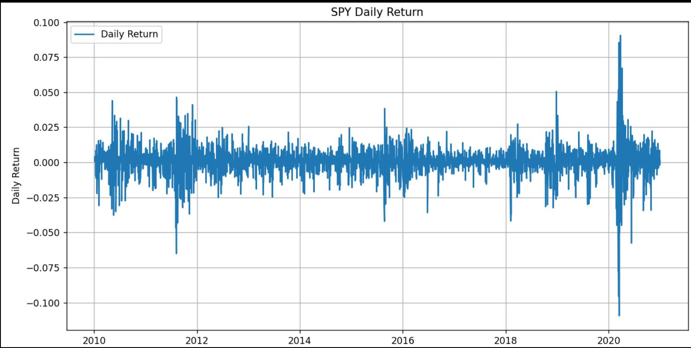

# SPY Example

- ACF for returns series shown to be serially uncorrelated   
- Thus, mean equation is set to $A R(0)$

$$
\left\{ \begin{array}{l l} r _ {t} = \varphi_ {0} + a _ {t} & \\ a _ {t} = \sigma_ {t} \varepsilon_ {t} & \{\varepsilon_ {t} \} \stackrel {\mathrm {i . i . d .}} {\sim} \mathrm {N} (0, 1) \end{array} \right.
$$

Plot ACF

data1 = data['Daily Return'])

data1 = data1.dropna()

plot_acf(data1)

plt.show()

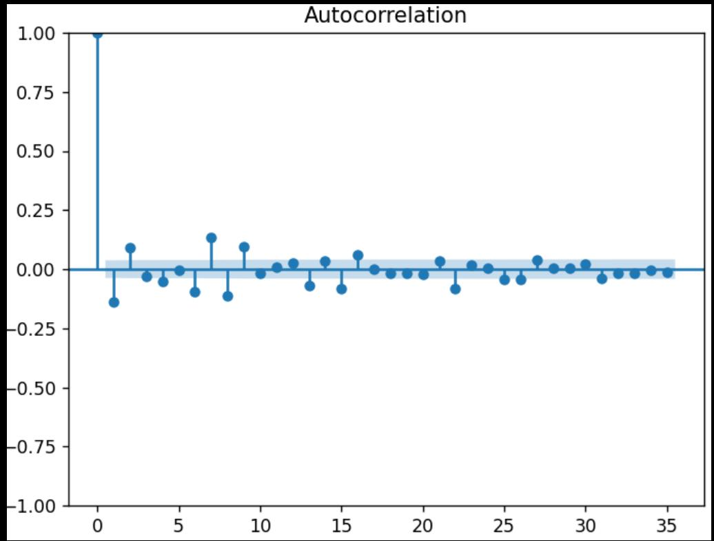

# SPY Example - Mean equation

- The parameters are significant, thus we got

$$
\left\{ \begin{array}{l l} r _ {t} = 0. 0 0 0 5 7 + a _ {t} & \\ & \text {i . i . d .} \\ a _ {t} = 0. 0 0 0 1 1 8   \varepsilon_ {t} \quad \text {w h e r e} \{\varepsilon_ {t} \} \sim \mathrm {N} (0, 1) \end{array} \right.
$$

import arch

$$
\begin{array}{l} \text {d a t a 1} = \text {d a t a} [ [ ^ {\prime} D a l l y R e t u r n ^ {\prime} ] ] \\ \mathsf {d a t a 1} = \mathsf {d a t a 1 . d r o p n a ()} \\ \end{array}
$$

$$
\begin{array}{l} \operatorname {a r x} = \text {a r c h . u n i v a r i a t e . A R X (y = d a t a 1 , l a g s = N o n e)} \\ \mathrm {r e s} = \operatorname {a r x . f i t ()} \\ \mathsf {p r i n t} (\mathsf {r e s}) \\ \end{array}
$$

Lag terms for mean series $r_t$

<table><tr><td colspan="6">AR - Constant Variance Model Results</td></tr><tr><td>Dep. Variable:</td><td colspan="2">(&#x27;Daily Return&#x27;, &#x27;&#x27;)</td><td>R-squared:</td><td>0.000</td><td></td></tr><tr><td>Mean Model:</td><td colspan="2">AR</td><td>Adj. R-squared:</td><td>0.000</td><td></td></tr><tr><td>Vol Model:</td><td colspan="2">Constant Variance</td><td>Log-Likelihood:</td><td>8585.64</td><td></td></tr><tr><td>Distribution:</td><td colspan="2">Normal</td><td>AIC:</td><td>-17167.3</td><td></td></tr><tr><td>Method:</td><td colspan="2">Maximum Likelihood</td><td>BIC:</td><td>-17155.4</td><td></td></tr><tr><td></td><td colspan="2"></td><td>No. Observations:</td><td>2767</td><td></td></tr><tr><td>Date:</td><td colspan="2">Sun, Oct 05 2025</td><td>Df Residuals:</td><td>2766</td><td></td></tr><tr><td>Time:</td><td colspan="2">22:05:45</td><td>Df Model:</td><td>1</td><td></td></tr><tr><td colspan="6">Mean Model</td></tr><tr><td>coef</td><td>std err</td><td>t</td><td>P&gt;|t|</td><td>95.0% Conf. Int.</td><td></td></tr><tr><td>Const</td><td>5.6800e-04</td><td>2.066e-04</td><td>2.749</td><td>5.981e-03</td><td>[1.630e-04,9.730e-04]</td></tr><tr><td></td><td></td><td colspan="4">Volatility Model</td></tr><tr><td>coef</td><td>std err</td><td>t</td><td>P&gt;|t|</td><td>95.0% Conf. Int.</td><td></td></tr><tr><td>sigma2</td><td>1.1814e-04</td><td>8.819e-06</td><td>13.397</td><td>6.306e-41</td><td>[1.009e-04,1.354e-04]</td></tr><tr><td colspan="6">Covariance estimator: White&#x27;s Heteroskedasticity Consistent Estimator</td></tr></table>

# SPY Example

# - Volatility clustering is obvious from the squared return chart

plot Squared return

plt.figure(figsize=(12,6))

plt.plot(data.index, data['Squared Return'], label='Squared Return')

plt.title('SPY Squared Return')

plt.xlabel('Date')

pltylabel('Squared Return')

pltlegend()

plt.grid(True)

plt.show()

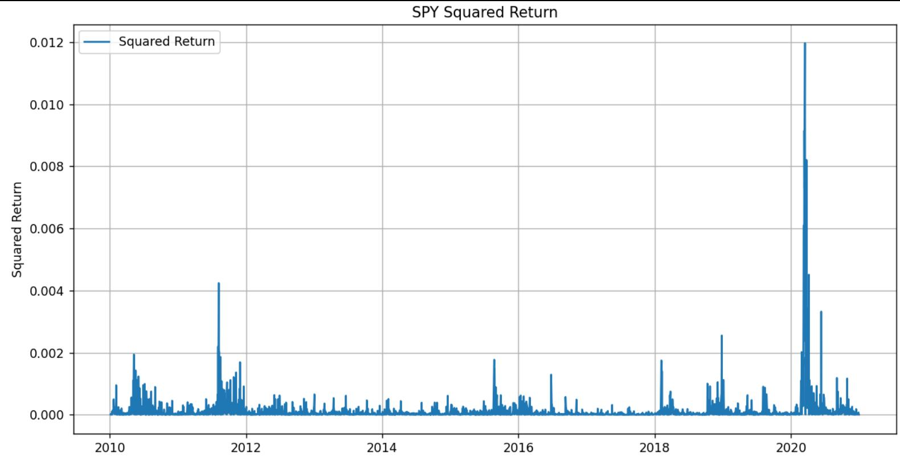

# SPY Example

- From squared returns' PACF, an ARCH(2) model is tentatively identified

$$
\left\{ \begin{array}{c} a _ {t} = \sigma_ {t} \varepsilon_ {t} \qquad \{\varepsilon_ {t} \} \stackrel {\mathrm {i . i . d .}} {\sim} \mathrm {N} (0, 1) \\ \sigma_ {t} ^ {2} = \alpha_ {0} + \alpha_ {1} a _ {t - 1} ^ {2} + \alpha_ {2} a _ {t - 2} ^ {2} \end{array} \right.
$$

Plot ACF and PACF  
data1 = data['Squared Return'].  
data1 = data1.dropna()  
plot_acf(data1)  
plot_pacf(data1)  
plt.show()

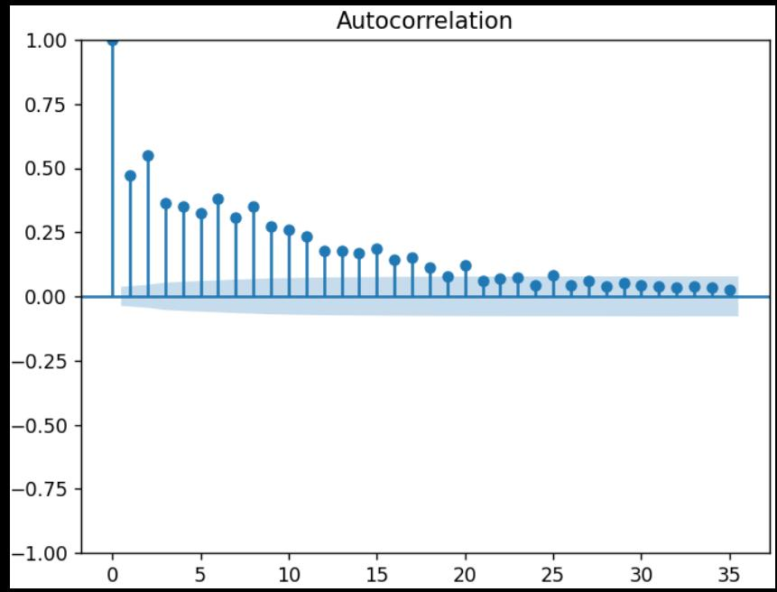

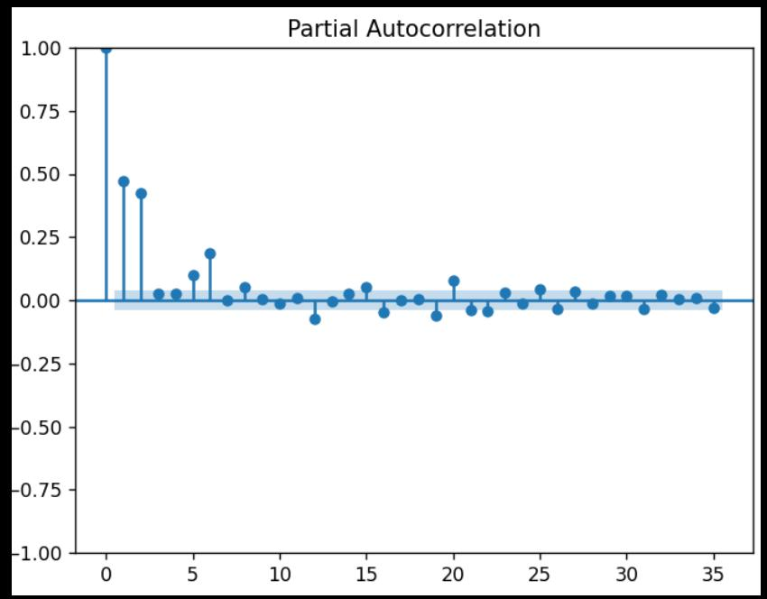

# SPY Example - Joint Estimation

- All parameters are significant, so our model will be

$$
\left\{ \begin{array}{l} r _ {t} = 0. 0 0 0 9 8 3 7 3 + a _ {t} \\ \qquad \qquad \qquad \qquad \qquad \qquad \qquad \qquad \qquad \qquad \qquad \qquad \qquad \qquad \qquad \qquad \qquad \qquad \qquad \qquad \qquad \qquad \qquad \qquad \qquad \qquad \qquad \qquad \qquad \qquad \qquad \qquad \qquad \qquad i. i. d. \\ a _ {t} = \sigma_ {t} \varepsilon_ {t} \qquad \{\varepsilon_ {t} \} \sim N (0, 1) \\ \sigma_ {t} ^ {2} = 0. 0 0 0 0 4 1 3 5 + 0. 3 2 5 a _ {t - 1} ^ {2} + 0. 3 2 5 a _ {t - 2} ^ {2} \end{array} \right.
$$

import arch

data1 = data[['Daily Return'])

data1 = data1.dropna()

arm = arch.univariate.arch_model( y=data1, lags=None, mean='AR', vol='ARCH', p=2

res = arm.fit()
print(res)

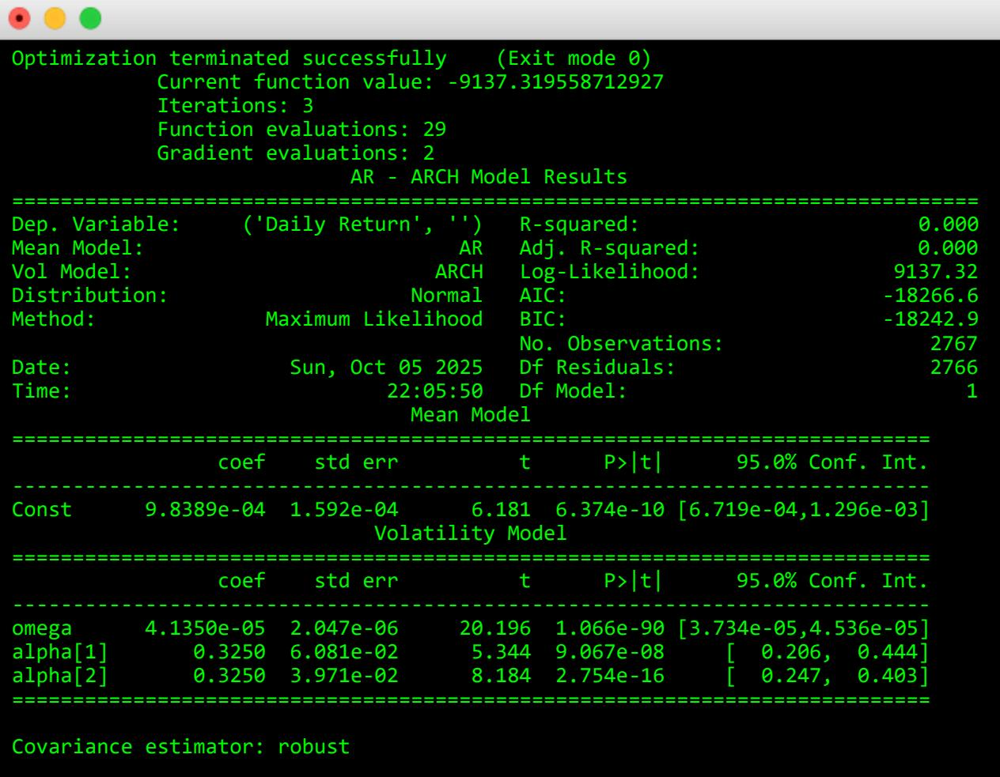

# SPY Example - Final model

- The unconditional variance of $a_{t}$

$$
V a r (a _ {t}) = \frac {\alpha_ {0}}{1 - \alpha_ {1} - \cdots - \alpha_ {m}} = \frac {0 . 0 0 0 0 4 1 3 5}{1 - 0 . 3 2 5 - 0 . 3 2 5} = 0. 0 0 0 1 1 8 1 4
$$

# Model Forecast

- Forecasting of ARCH models can be obtained recursively as that of AR   
1-step ahead forecast

$$
\begin{array}{l} \sigma_ {h} ^ {2} (1) = E \big (\sigma_ {h + 1} ^ {2} \big | F _ {h} \big) \\ = E \left(\alpha_ {0} + \alpha_ {1} a _ {h} ^ {2} + \dots + \alpha_ {m} a _ {h + 1 - m} ^ {2} \mid F _ {h}\right) \\ = \alpha_ {0} + \alpha_ {1} a _ {h} ^ {2} + \dots + \alpha_ {m} a _ {h + 1 - m} ^ {2} \\ = \sigma_ {h} ^ {2} \\ \end{array}
$$

# Model Forecast

2-step ahead forecast

$$
\begin{array}{l} \sigma_ {h} ^ {2} (2) = E \big (\sigma_ {h + 2} ^ {2} \big | F _ {h} \big) \\ = E \left(\alpha_ {0} + \alpha_ {1} a _ {h + 1} ^ {2} + \dots + \alpha_ {m} a _ {h + 2 - m} ^ {2} \mid F _ {h}\right) \\ = \alpha_ {0} + \alpha_ {1} E \left(a _ {h + 1} ^ {2} \mid F _ {h}\right) + \alpha_ {2} a _ {h} ^ {2} + \dots + \alpha_ {m} a _ {h + 2 - m} ^ {2} \\ = \alpha_ {0} + \alpha_ {1} E \left(\sigma_ {h + 1} ^ {2} \varepsilon_ {h + 1} ^ {2} \mid F _ {h}\right) + \alpha_ {2} a _ {h} ^ {2} + \dots + \alpha_ {m} a _ {h + 2 - m} ^ {2} \\ = \alpha_ {0} + \alpha_ {1} \sigma_ {h + 1} ^ {2} E \left(\varepsilon_ {h + 1} ^ {2} \mid F _ {h}\right) + \alpha_ {2} a _ {h} ^ {2} + \dots + \alpha_ {m} a _ {h + 2 - m} ^ {2} \\ = \alpha_ {0} + \alpha_ {1} \sigma_ {h} ^ {2} (1) + \alpha_ {2} a _ {h} ^ {2} + \dots + \alpha_ {m} a _ {h + 2 - m} ^ {2} \\ \end{array}
$$

# ARCH Model Forecast

- k-step ahead forecast

$$
\sigma_ {h} ^ {2} (k) = E \big (\sigma_ {h + k} ^ {2} \big | F _ {h} \big) = \alpha_ {0} + \sum_ {i = 1} ^ {m} \alpha_ {i} \sigma_ {h} ^ {2} (k - i)
$$

$$
\mathrm {w h e r e} \sigma_ {h} ^ {2} (k - i) = a _ {h + k - m} ^ {2} \mathrm {i f k - i \leq 0}
$$

# GARCH Model

# GARCH model

- Bollerslev (1986) proposes a useful extension known as the generalized ARCH (GARCH) model. For a mean-corrected return series $\{a_{t}\}$ , it is said to follow a GARCH(m, s) model if

$$
\left\{ \begin{array}{c} a _ {t} = \sigma_ {t} \varepsilon_ {t} \\ \sigma_ {t} ^ {2} = \alpha_ {0} + \sum_ {i = 1} ^ {m} \alpha_ {i} a _ {t - i} ^ {2} + \sum_ {j = 1} ^ {s} \beta_ {j} \sigma_ {t - j} ^ {2} \end{array} \right.
$$

$$
\text {w h e r e} \left\{ \begin{array}{c} \quad \text {i . i . d .} \\ \{\varepsilon_ {t} \} \sim \mathrm {N} (0, 1) \\ \max  _ {i = 1} ^ {m, s} (\alpha_ {i} + \beta_ {i}) <   1 \qquad \text {i n w h i c h} \alpha_ {i} = 0 f o r i > m a n d \beta_ {j} = 0 f o r j > s \end{array} \right.
$$

# GARCH model

- The GARCH(m, s) model reduces to a pure ARCH(m) model if $s = 0$ .   
- $\alpha_{i}$ is referred to as ARCH parameters.

GARCH error coefficients.   
Large value indicate volatility reacts quite intensely to market movements.   
- Volatility tend to be more spiky.

- $\beta_{j}$ is referred to as GARCH parameters.

GARCH lag coefficient.   
Large value indicate shocks to conditional variance take a long time to die out.   
- Volatility is persistent.

# GARCH(1,1) model

- The most commonly used GARCH model is the simplest GARCH(1,1) model

$$
\sigma_ {t} ^ {2} = \alpha_ {0} + \alpha_ {1} a _ {t - 1} ^ {2} + \beta_ {1} \sigma_ {t - 1} ^ {2} \qquad \mathrm {w h e r e} 0 \leq \alpha_ {1}, \beta_ {1} \leq 1, \alpha_ {1} + \beta_ {1} <   1
$$

- It can be seen that a large $a_{t - 1}^2$ or $\sigma_{t - 1}^2$ give rise to a large $\sigma_t^2$ . This means that a large $a_{t - 1}^2$ tends to be followed by another large $a_{t}^{2}$ generating the well-know behavior of volatility clustering in financial time series.

# GARCH(1,1) model

- Tail distribution: similar to ARCH models, the tail distribution of a GARCH(1,1) process is heavier than that of a normal distribution (kurtosis $>3$ )   
- Actually, if $a_t$ is 4-th order stationary with $m_4 = a_t^4$ and $m_2 = a_t^2$ . Then,

$$
\begin{array}{l} m _ {2} = E [ E (a _ {t} ^ {2} | F _ {t - 1}) ] = E [ E (\varepsilon_ {t} ^ {2} \sigma_ {t} ^ {2} | F _ {t - 1}) ] = E [ E (\sigma_ {t} ^ {2} | F _ {t - 1}) ] \\ = E (\sigma_ {t} ^ {2}) = \frac {1}{1 - \alpha_ {1} - \beta_ {1}} \\ \end{array}
$$

# GARCH(1,1) model

$$
m _ {4} = E [ E (a _ {t} ^ {4} | F _ {t - 1}) ] = E [ E (\varepsilon_ {t} ^ {4} \sigma_ {t} ^ {4} | F _ {t - 1}) ] = E (3 \sigma_ {t} ^ {4}) = 3 E (\sigma_ {t} ^ {4})
$$

Also, $E(a_{t}^{2}\sigma_{t}^{2}) = E(E(a_{t}^{2}\sigma_{t}^{2}|F_{t - 1})) = E(\sigma_{t}^{2}E(a_{t}^{2}|F_{t - 1})) = E(\sigma_{t}^{2}\sigma_{t}^{2}) = \frac{m_{4}}{3}$

Then,

$$
\begin{array}{l} m _ {4} = 3 E (\sigma_ {t} ^ {4}) = 3 E ((\alpha_ {0} + \alpha_ {1} a _ {t - 1} ^ {2} + \beta_ {1} \sigma_ {t - 1} ^ {2}) ^ {2}) \\ = 3 E (\alpha_ {0} ^ {2} + \alpha_ {1} ^ {2} a _ {t - 1} ^ {4} + \beta_ {1} ^ {2} \sigma_ {t - 1} ^ {4} + 2 \alpha_ {0} \alpha_ {1} a _ {t - 1} ^ {2} + 2 \alpha_ {0} \beta_ {1} \sigma_ {t - 1} ^ {2} + 2 \alpha_ {1} \beta_ {1} a _ {t - 1} ^ {2} \sigma_ {t - 1} ^ {2}) \\ = 3 (\alpha_ {0} ^ {2} + \alpha_ {1} ^ {2} m _ {4} + \beta_ {1} ^ {2} m _ {4} / 3 + 2 \alpha_ {0} \alpha_ {1} m _ {2} + 2 \alpha_ {0} \beta_ {1} m _ {2} + 2 \alpha_ {1} \beta_ {1} m _ {4} / 3) \\ \end{array}
$$

$$
\Rightarrow \qquad m _ {4} = \frac {3 (\alpha_ {0} ^ {2} + 2 \alpha_ {0} (\alpha_ {1} + \beta_ {1}) m _ {2})}{1 - 3 \alpha_ {t} ^ {2} - \beta_ {t} ^ {2} - 2 \alpha_ {1} \beta_ {1}}
$$

# GARCH(1,1) model

- So Kurtosis of $a_{t}$ is

$$
K (a _ {t}) = \frac {m _ {4}}{m _ {2} ^ {2}} = \frac {3 (\alpha_ {0} ^ {2} + 2 \alpha_ {0} (\alpha_ {1} + \beta_ {1}) m _ {2})}{(1 - 3 \alpha_ {t} ^ {2} - \beta_ {t} ^ {2} - 2 \alpha_ {1} \beta_ {1}) m _ {2} ^ {2}} = \frac {3 [ 1 - (\alpha_ {1} + \beta_ {1}) ^ {2} ]}{1 - (\alpha_ {1} + \beta_ {1}) ^ {2} - 2 \alpha_ {1} ^ {2}}
$$

- $1 - (\alpha_{1} + \beta_{1})^{2} - 2\alpha_{1}^{2} > 0$ the condition for the 4-order stationarity of the GARCH(1,1) model

# Forecasting GARCH model

Consider GARCH(1,1) model $\left\{ \begin{array}{l}\sigma_t^2 = \alpha_0 + \alpha_1a_{t - 1}^2 +\beta_1\sigma_{t - 1}^2\\ a_t = \sigma_t\varepsilon_t \end{array} \right.$   
- For 1-step ahead forecast, we have

$$
\sigma_ {h} ^ {2} (1) = E \big (\alpha_ {0} + \alpha_ {1} a _ {h} ^ {2} + \beta_ {1} \sigma_ {h} ^ {2} \big | F _ {h} \big) = \alpha_ {0} + \alpha_ {1} a _ {h} ^ {2} + \beta_ {1} \sigma_ {h} ^ {2}
$$

# Forecasting GARCH model

- For 2-step ahead forecast, we use $a_{t}^{2} = \sigma_{t}^{2}\varepsilon_{t}^{2}$ and rewrite the volatility equation as

$$
\sigma_ {t} ^ {2} = \alpha_ {0} + (\alpha_ {1} + \beta_ {1}) \sigma_ {t - 1} ^ {2} + \alpha_ {1} \sigma_ {t} ^ {2} (\varepsilon_ {t} ^ {2} - 1)
$$

- When $t = h + 1$ , the equation becomes

$$
\sigma_ {h + 2} ^ {2} = \alpha_ {0} + (\alpha_ {1} + \beta_ {1}) \sigma_ {h + 1} ^ {2} + \alpha_ {1} \sigma_ {h + 1} ^ {2} (\varepsilon_ {h + 1} ^ {2} - 1)
$$

- Since $E\left( {{\varepsilon }_{h + 1}^{2} - 1 \mid  {F}_{h}}\right)  = 0$ ,the 2-step ahead volatility forecast

$$
\sigma_ {h} ^ {2} (2) = \alpha_ {0} + (\alpha_ {1} + \beta_ {1}) \sigma_ {h} ^ {2} (1)
$$

# Forecasting GARCH model

In general, we have

$$
\sigma_ {h} ^ {2} (k) = \alpha_ {0} + (\alpha_ {1} + \beta_ {1}) \sigma_ {h} ^ {2} (k - 1)
$$

- This result is the same as that of an ARCH(1) model with ARCH parameter $(\alpha_{1} + \beta_{1})$   
- By repeated substitutions, the k-step ahead forecast can be written as

$$
\sigma_ {h} ^ {2} (k) = \frac {\alpha_ {0} [ 1 - (\alpha_ {1} + \beta_ {1}) ^ {k - 1} ]}{1 - \alpha_ {1} - \beta_ {1}} + (\alpha_ {1} + \beta_ {1}) ^ {k - 1} \sigma_ {h} ^ {2} (1)
$$

- Provided that $\alpha_{1} + \beta_{1} < 1$ , it tends to $\frac{\alpha_{0}}{1 - \alpha_{1} - \beta_{1}}$ when $k$ tends to $\infty$

# Summary of ARCH/GARCH models

# Advantages

They can model heteroscedasticity.   
They can model volatility clustering.   
They can model fat tail property.   
- They can model the evolution of the volatility.

# Weaknesses

- The model assumes that positive and negative shocks have the same effects on volatility because it depends on the square of the previous shocks. In practice, it is well known that price of a financial asset responds differently to positive and negative shocks.   
- GARCH models are likely to over-predict the lower volatilities because they respond slowly to large isolated shocks to the return series.   
- Recent empirical studies of high-frequency financial time series indicate that the tail behavior of GARCH models remains too short even with standardized Student-t innovations.

# Value at Risk (VaR)

# Value at Risk (VaR)

• VaR is the “maximum” loss of an asset over a time horizon (e.g. 1 day, 10 days) with a high confidence (eg. $95\%$ , $99\%$ )   
- For example, what is the maximum daily loss of an investment at $95\%$ confidence?   
A formal definition

- Let X be the PnL distribution (loss is negative, profit is positive)   
- The VaR at level $\alpha \epsilon (0,1)$ is the smallest number $y$ such that the probability that the loss $Y := -X$ does not exceed $y$ is $1 - \alpha$

$$
V a R _ {\alpha} (X) = - \inf \{x \epsilon \mathbb {R}: F _ {X} (x) > \alpha \} = F _ {Y} ^ {- 1} (1 - \alpha)
$$

# VaR Example

Consider an investment of $W_0 = \$ 10,000 in a stock for one month, and the monthly return is R ~ N(0.05, 0.1^2).

(a) What is the probability distribution at the end of month wealth $W_{1} = W_{0}(1 + R)?$   
(b) Calculate $P\left(W_{1}< 9000\right)$   
(c) Find the \(95 \%\)value- at- risk (VaR) on the \(\$ 10,000 investment in one month. i.e. to find VaR such that \(P \left(W _ {0} - W _ {1} < V a R\right) = 0. 9 5\)

# VaR Example - answer

(a) $W_{1} = W_{0}(1 + R) \sim N(10000(1 + 0.05), 10000^{2}0.1^{2}) = N(10500, 1000^{2})$   
(b) $P\left(W_{1}< 9000\right)=P\left(Z< \frac{9000-10500}{1000}\right)=P\left(Z< -1.5\right)=0.0668$   
(c) $P\left(W_{0} - W_{1}< V a R\right) = 0.95$

$$
\begin{array}{l} P (1 0 0 0 0 - (1 0 5 0 0 + 1 0 0 0 Z) <   V a R) = 0. 9 5 \\ P \left(Z > \frac {- V a R - 5 0 0}{1 0 0 0}\right) = 0. 9 5 \\ \frac {- V a R - 5 0 0}{1 0 0 0} = - 1. 6 4 5 \\ V a R = 1 1 4 5 \\ \end{array}
$$

# Relative VaR vs Absolute VaR

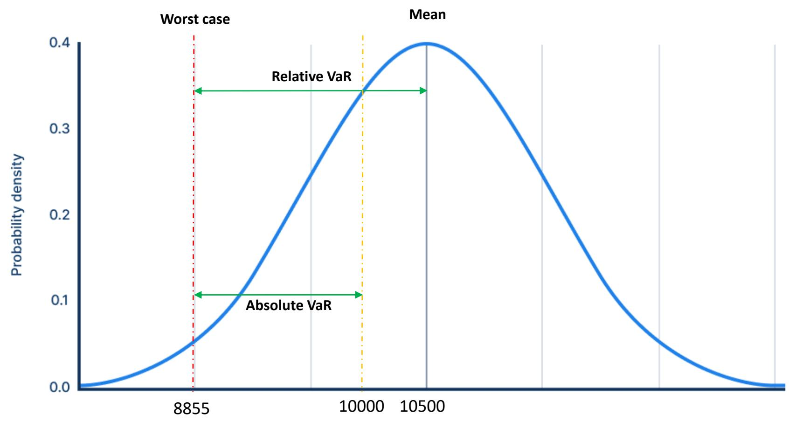  
Distribution of Portfolio Value

# Value-at-Risk (VaR) Estimation Method

- The example above is calculated based on parametric method (i.e. normal distribution)   
- Some common VaR approach used in the industry

1. Parametric VaR (or Variance-Covariance method)   
2. Historical VaR   
3. Hypothetical VaR   
4. Monte Carlo Simulation

# Parametric VaR

- In previous example, the return R is assumed to be normally distributed which is NOT a proper assumption.   
- The maximum loss of an investment cannot exceed -100%   
- In finance, it is more common to assume the log return $R$ follows normal distribution. (i.e. $e^{R}$ follows log-normal distribution)   
- Log normal distribution:

- If $X \sim N(\mu, \sigma^2)$ where $-\infty < X < \infty$   
- Then $Y = e^{X} \sim \operatorname{LogN}(\mu, \sigma^{2})$ where $0 < Y < \infty$   
$E(Y) = \exp \left(\mu +\frac{\sigma^2}{2}\right)$   
$\operatorname{Var}(Y) = \exp (2\mu + \sigma^2)\left[\exp (\sigma^2) - 1\right]$

# Parametric VaR Log-Normal Example

Consider an investment of $W_0 = \$ 10,000 in a stock for one month, and the monthly log return is R ~ N(0.05, 0.1^2).

(a) What is the probability distribution at the end of month wealth $W_{1} = W_{0} e^{R?}$ ?   
(b) Calculate $P\left(W_{1}< 9000\right)$   
(c) Find the \(95 \%\)value- at- risk (VaR) on the \(\$ 10,000 investment in one month. i.e. to find VaR such that \(P \left(W _ {0} - W _ {1} < V a R\right) = 0. 9 5\)

# Parametric VaR Log-Normal Example - answer

(a) $\operatorname{Log}\left( {W}_{1}\right)  = \operatorname{Log}\left( {W}_{0}\right)  + R \sim  N\left( {\operatorname{Log}\left( {W}_{0}\right)  + E\left( R\right) ,\operatorname{Var}\left( R\right) }\right)  = N\left( {\log \left( {{10000}}\right)  + {0.05},{0.1}^{2}}\right)  =$ $N\left( {{9.26},{0.1}^{2}}\right)$

$$
\mathrm {S o} W _ {1} \sim \operatorname {L o g N} (9. 2 6, 0. 1 ^ {2})
$$

(b) $P(W_{1} < 9000) = P(\log (W_{1}) < \log (9000)) = P\left(Z < \frac{\log(9000) - 9.26}{0.1}\right) = P(Z < -1.55) = 0.0605$   
(c) $P\left(W_{0} - W_{1}< V a R\right) = 0.95$

$$
P \left(W _ {1} > 1 0 0 0 0 - V a R\right) = 0. 9 5
$$

$$
P \left(Z > \frac {\log (1 0 0 0 0 - V a R) - 9 . 2 6}{0 . 1}\right) = 0. 9 5
$$

$$
\frac {\log (1 0 0 0 0 - V a R) - 9 . 2 6}{0 . 1} = - 1. 6 4 5
$$

$V a R = 1084.9$

# Historical VaR

Question: Give the previous 10 days’ return series. What’s the $90 \%$ daily VaR?

$$
\{1.1 \%, 2.4 \%, -1.3 \%, -0.4 \%, 3 \%, 2.6 \%, 1.4 \%, -0.8 \%, 0.9 \%, -0.5 \% \}
$$

# Answer:

$$
\{-1.3 \%, -0.8 \%, -0.5 \%, -0.4 \%, 0.9 \%, 1.1 \%, 1.4 \%, 2.4 \%, 2.6 \%, 3 \% \}
$$

sort the series in ascending order   
- Find the smallest number $y$ such that the probability that the loss does not exceed $y$ is $1 - 90\%$   
So $90\%$ worst case is $-0.8\%$   
- Also, the mean is $0.84\%$ .   
- So daily VaR (relative) will be $0.84\% - (-0.8\%) = 1.64\%$ .

# Historical VaR

- For the example above, what would be the $95 \%$ VaR?   
- The worst case lose is …

- $1.3\%$   
- $0.8\%$   
• $0.5^{*}(-1.3\% - 0.8\%) = -1.05\%$ ?

# Stress VaR

- VaR measures based on recent data can miss out extreme situations that could cause severe losses.   
- Stress VaR calculates potential loss for holding the current portfolio during a stress period.   
- A stress period is an actual event happened in the past, such as

Asian Financial Crisis in 1997;   
Dot-com bubbles in 2000;   
- Global Financial crisis in 2008;   
- European Debt Crisis in 2012;   
etc

- In other words, if financial crisis happen again and I do nothing with my portfolio during the whole period, what would be my "maximum" loss?

# Hypothetical VaR

- Hypothetical VaR calculates potential losses based on hypothetical scenarios rather than actual past data.   
- It is commonly used for risk assessment on extreme scenarios that don’t have past reference.   
- In other word, it calculates the "maximum" loss for "what-if" scenarios. eg.

US Fed Fund rate increase to $50\%$ ,   
S&P500 Index drops $90\%$ ,   
HKD and USD unpegged   
0

# Monte Carlo Simulation

- For a large investment portfolio consisting of many securities (eg. stocks, options, futures, currencies, bonds, etc), it involves multiple risk factors that make the risk assessment difficult.   
- Monte Carlo can be used to simulate the portfolio value under different possible paths and movements

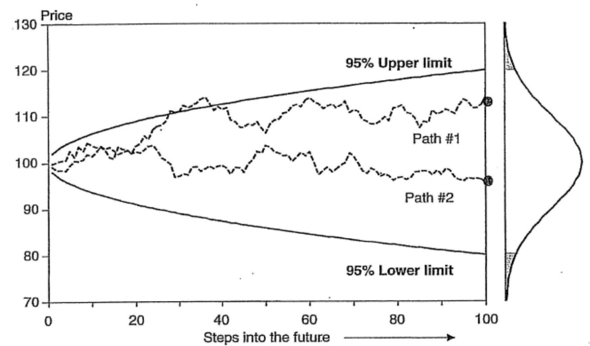

# Monte Carlo example

Mean stock price at the end of the year: 102.56

5th percentile stock price at the end of the year: 102.00

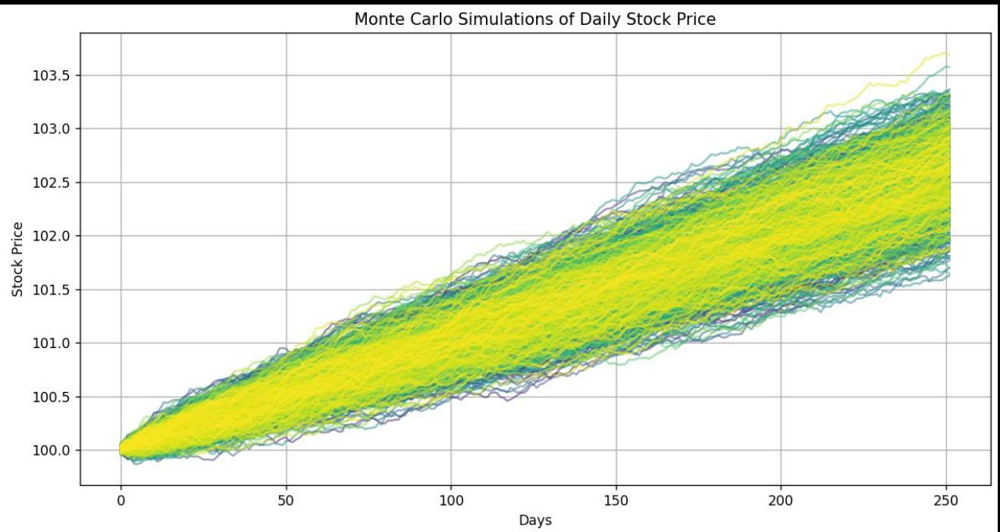

import numpy as np

import matplotlib.pyplot as plt

Parameters

initial_price = 100

num_simulations = 1000

num.days = 252

Approximate trading days in a year

daily_mean = 0.0001

daily_std_dev = 0.0002

Simulate the stock prices

simulatedprices $\equiv$ np.zeros((num_simulations, num_day))

for i in range(num_simulations):

dailyreturns $=$ np.random.normal(daily_mean,daily_std_dev,num_dayse)

price_series = initial_price * np.exp(np cumsum(dailyreturns))

simulated_price[i] = price_series

Calculate mean and 5th percentile at the end of the year

final_price $=$ simulated_price[:,-1]

mean_price = np.mean(final_price)

percentile_5 = np-percentile(final_price, 5)

Output the results

print(f"Mean stock price at the end of the year: {mean_price:.2f}")

print(f"5th percentile stock price at the end of the year: {percentile_5:.2f}")

Plotting the simulations with different colors

plt.figure(figsize=(12,6))

colors = plt.cm.viridis(np.linspace(0, 1, num_simulations)) # Use a colormap for different colors

for i in range(num_simulations):

plt.plot(simulated的价格[i], color=colors[i], alpha=0.5) # Set alpha for transparency

plt title('Monte Carlo Simulations of Daily Stock Price')

plt.xlabel('Days')

plt.ylabel('Stock Price')

plt.grid()

plt show()

# Limitation of VaR

- Assumptions: Assumes normal distribution of returns, which may not hold in reality.   
- Non-linear Risks: VaR does not account for extreme market movements.   
- Time Horizon Sensitivity: VaR can change significantly with the time horizon chosen.   
- Ignore about the loss in the tail distribution

# Other Risk Measures

- Conditional Value-at-Risk(CVaR) or Expected Shortfall (ES) or Tail Value-at-Risk (TVaR) or Conditional Tail Expectation (CTE)

$$
E (L o s s \mid L o s s > V a R)
$$

• Lower Partial Movement (r is the target return)

$$
E ([ \max (0, r - R) ] ^ {2})
$$

# Scenario Analysis

# Scenario Analysis

- Scenario analysis consists of evaluating the portfolio under various extreme but probable states of the world. It includes

1. Sensitivity Testing: Evaluate the portfolio by moving key variables sequentially by a large amount (ignoring correlations).   
2. Evaluate portfolios by creating scenarios of joint (but unusual) movements in key variables.

# Scenario Analysis

# Ways to come up with scenario

1. Prospective Scenarios: hypothetical events (eg. earthquake in Tokyo, Korean reunification, etc)   
2. Factor Push Method: push up or down all risk-factors individually by, say standard deviations, and then compute the changes to the portfolio   
3. Historical scenarios: based on extreme historical event to provide guideline on joint movements   
4. Conditional Scenario Method:

- Denote extreme movements in the key variable by $\mathsf{R}^{*}$   
- Regress other variables (denote by $\mathsf{R}$ ) on $\mathsf{R}^*$ . i.e. $R_{j} = \beta_{0} + \sum_{i}\beta_{ji}R_{i}^{*} + \varepsilon_{j}$   
- Predict $R_{j}$ by $E\left(R_{j} \mid R^{*}\right)$

# Capital Management

# Position Sizing

# Common position sizing strategy

1. Fixed Size   
2. Balance Rescaling   
3. Dollar Risk Approach   
4. Kelly Criterion

# Position Sizing - Fixed Size

- Trade at a fixed quantity every time regardless of balance change   
- Pros: simple to implement   
- Cons:

- Capital will be under utilized when profit keep accumulating   
- Expose to higher risk when balance decreases due to losses

# Position Sizing – Balance Rescaling

- Suppose initial capital is $B_{0}$ and initial trade size is $q_{0}$   
- We can adjust the trade size according to latest balance

$$
q _ {t} = \frac {B _ {t}}{B _ {0}} q _ {0}
$$

- Then round to the closest Tradable lot size   
Pros: dynamic quantity with the same risk level   
- Cons: ignore the win rate of a trade

# Dollar Risk Approach

- Dollar Risk is to risk on each trade only a small percentage of your entire account. It is to prevent your account from going straight to zero in case of a streak of losing trades.   
• For example, your account balance is US $10,000. Assume you want to risk only \(1 \%$ of your balance on each trade. In other word, you want to cap the maximum loss for each individual trade to US\)100.

$$
U S\\(10,000*1\% = US\\)100
$$

- Assuming this trade is EUR/USD, a standard lot has contract size of 100,000 units and therefore every pip has a value of US$10.

$$
1 0 0, 0 0 0 * 0. 0 0 0 1 = U S \mathbb {S} 1 0
$$

# Dollar Risk Approach

• Also suppose you want the stop-loss is 50 pips from the open price. This means that 50 pips are valued US$500 for a standard lot.

$$
U S \mathbb {S} 1 0 * 5 0 p i p s = U S \mathbb {S} 5 0 0
$$

- Since you want to only risk $100, while maintaining your stop-loss 50 pips away, then your position size should be 0.2 standard lot.

$$
\$ 100 / (\$ 10 * 50) = 0.2
$$

# Dollar Risk Approach

- To summarize, we need these inputs to calculate the trade size

- Current account balance   
Percentage of risk for a single trade   
- Stop loss in pips/points/ticks   
- Pip/point/tick value

Pros: maximum loss of each trade is fixed   
- Cons: only applicable to strategy that have fixed trade-level stop-loss

# Kelly Criterion

- The Kelly Criterion is a formula used to determine the optimal size of a series of bets.   
- It aims to maximize the long term wealth, balancing risk and reward.   
- Formula:

$$
f ^ {*} = \frac {b p - q}{b}
$$

where

- $f^{*} =$ the optimal percentage of capital to put in a bet   
- $b =$ odds received on the wager (net odds)   
p = probability of winning   
• $q =$ probability of losing $(1 - p)$

- Understand the components:

• Odds (b): If you bet $1 and win$ b, you gain $b. i.e. win amount / loss amount   
- Probability (p): Your estimated chance of winning the bet.

- If $f^{*}$ is calculated to be negative, then we shouldn't bet at all

# Utility Function U(W)

- A measure of satisfaction or value derived from consumption or wealth.   
- Types of Utility Functions:

1. Linear

$U(W) \propto W$

2. Quadratic

$U(W) \propto W^{2}$

3. Logarithmic

- $U(W) \propto \log (W)$

# Log Utility

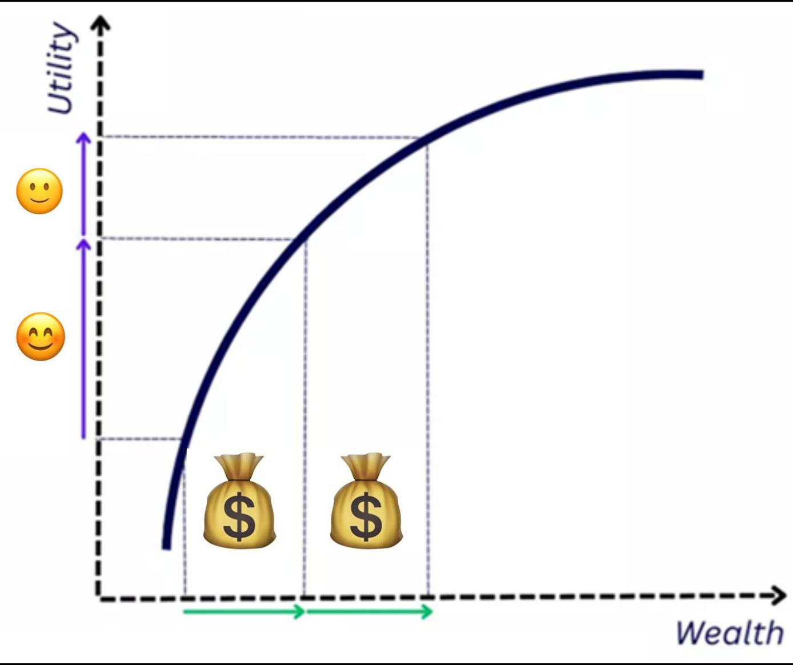

# Proof of Kelly Criterion

- Objective: maximize the log-utility function   
- Denote

W be the initial wealth   
- $f$ be the fraction of wealth bet   
W' be the wealth after the bet

- Then, $W'$ can be expressed as

$$
W ^ {\prime} = \left\{ \begin{array}{l l} W (1 + b f), & \text {w i t h p r o b a b i t y o f p} \\ W (1 - f), & \text {w i t h p r o b a b i t y o f q} \end{array} \right.
$$

Expected Log Wealth:

$$
\begin{array}{l} E (\log (W ^ {\prime})) = p \log \bigl (W (1 + b f) \bigr) + q \log \bigl (W (1 - f) \bigr) \\ = p \log (W) + p \log (1 + b f) + q \log (W) + q \log (1 - f) \\ = \log (W) + p \log (1 + b f) + q \log (1 - f) \\ \end{array}
$$

# Proof of Kelly Criterion

- Differentiate with respect to $f$ :

$$
\frac {\partial E (\log (W ^ {\prime}))}{\partial f} = \frac {p b}{1 + b f} - \frac {q}{1 - f}
$$

- Set the derivative to zero and substitute $q = 1 - p$ , then solve for $f$ ,

$$
\frac {p b}{1 + b f} = \frac {1 - p}{1 - f}
$$

$$
p b - p b f = 1 - p + b f - p b f
$$

$$
f = \frac {b p - (1 - p)}{b} = \frac {b p - q}{b}
$$

# Kelly Criterion Example

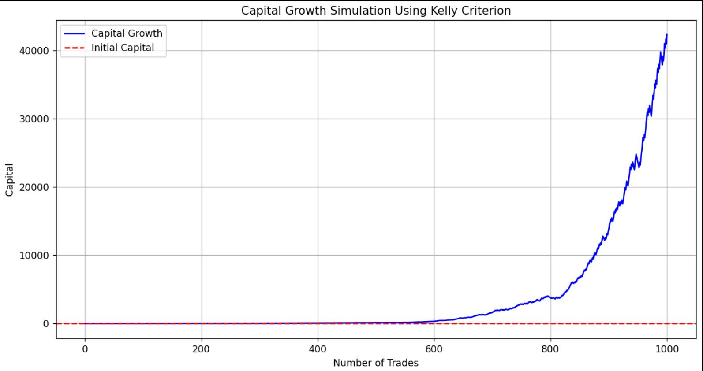

import numpy as np

import matplotlib.pyplot as plt

Parameters

np.random.seed(42) # For reproducibility

num_trades = 1000 # Number of trades

win_rate = 0.55 # Probability of winning

avg_win = 0.1 # Average win (10% return)

avg_loss = -0.05 # Average loss (-5% return) # Kelly Criterion Calculation

def calculate_kelly(p, b):

q = 1 - p

return $(\mathsf{b}^{*}\mathsf{p} - \mathsf{q}) / \mathsf{b}$

Simulate Trades

def simulate_trades(num_trades, win_rate, avg_win, avg_loss):

kelly_fraction = calculate_kelly(win_rate, avg_win / abs(avg_loss))

capital = 1.0 # Starting capital

capital_history = [capital]

for_in range(num_trades):

if np.random.randint() < win_rate: # Win

capital += capital * kelly_fraction * avg_win

else:#Loss

capital $+ =$ capital \* kelly_fraction \* avg_loss

capital_history.append(capital)

return capital_history

Run the simulation

capital_history = simulate_trades(num_trades, win_rate, avg_win, avg_loss)

Plot the results

plt.figure(figsize=(12,6))

plt.plot(capital_history, label='Capital Growth', color='blue')

plt.title('Capital Growth Simulation Using Kelly Criterion')

plt.xlabel('Number of Trades')

plt. ylabel('Capital')

plt(axhline(y=1, color='red', linestyle='---', label='Initial Capital')

pltlegend()

plt grid()

plt.show()

# Kelly Criterion Strategy

# - Backtest Setting

Instrument: SPYUS   
Data Interval: 1-day   
- Start Date: 2024-01   
End Date: 2024-07   
Initial Capital: US$100,000

from AlgoAPI import AlgoAPIUtil, AlgoAPI_Backtest

from datetime import datetime, timedelta

def calculate_kelly(p, b):

q = 1 - p

return $(\mathsf{b}^{*}\mathsf{p} - \mathsf{q}) / \mathsf{b}$

class AlgoEvent:

def __init__(self):

self timer = datetime(1970, 1, 1)

self.last_close = None

selfreturns $\equiv$ []

self.numObs = 30

def start(self, mEvt):

self EVT = AlgoAPI_Backtest.AlgoEvtHandler(self, mEvt)

get lot size

self.instrument = mEvt['subscribeList'][0]

self contractSize = self.evt.getContractSpec(self.instrument)["contractSize"]

self.evt.start()

def on_markdatafeed(self, md, ab):

if md.timestamp $> =$ self.timetherimedelta(hours=24):

self_timer = md.timestamp

update return series

if self.last_close != None:

selfreturns.append Md lastPrice/self.last_close-1)

self.last_close = md(lastPrice

keep only the recent observations

if len(selfreturns) $\rightharpoondown$ self.numObs:

selfreturns $=$ selfreturns[-self numObs:]

calculate Kelly Criterion

win_rate = sum([1 for r in selfreturns if r > 0]) / len(selfreturns)

avg_win = sum([r for r in selfreturns if r > 0]) / len(selfreturns)

avg_loss = sum([r for r in selfreturns if r < 0]) / len(selfreturns)

b = abs(avg_win/avg_loss)

kelly_fraction = calculate_kelly(win_rate, b)

if kelly_fraction<=0 or kelly_fraction>1: return

round to the closest number of lot

quantity = round(ab['availableBalance'] * kelly_fraction / (md.lastPrice * self_contractSize), 0)

if quantity>0:

order $=$ AlgoAPIUtil.OrderObject(

openclose = "open",

instrument = md.instrument,

buysell $= 1$

volume $=$ quantity,

ordertype $= 0$ # market order

holdtime $= 24^{*}60^{*}60$ # hold for 1 day only

(1) ${\mathrm{F}}_{2}$ 与黄色亲本杂交,后代有两种表现型。 现状为_____,黄色为_____;红色为_____;判断依据是：

self.evt.sendOrder(order)

# Kelly Criterion Example

Why performance not good?

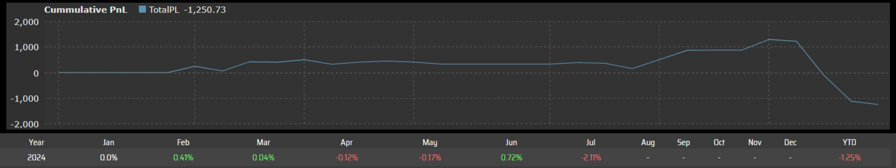

# Kelly Criterion Assumptions

<table><tr><td>Gambling</td><td>Investment</td></tr><tr><td>The risk and reward are determined. (eg. 50% win rate for flipping a coin)</td><td>The chance of winning a trade is a variable</td></tr><tr><td>Each bet has only binary outcomes which are determined. (eg. Every time when if you win, you get $10; if you lose, you lose $10)</td><td>The outcome is return which is a continuous variable</td></tr><tr><td>Each bet is independent</td><td>There could be serial correlation</td></tr></table>

# Kelly Criterion Enhancement

- For risk averse traders, only trade at a fraction of $f^{*}$   
- Define a take-profit and stop-loss level (eg. 20 points from entry price) $\rightarrow$ fix the profit/loss amount of each trade   
Instead of applying Kelly formula directly to the original price, we can apply it to the trading signals generated from other models $\rightarrow$ ensure the trades are independent   
• There are other literature studying the applicability of Kelly Criterion in financial market. For example, this paper (https://sites.math.washington.edu/~morrow/336_20/2016papers/nikhil.pdf) suggests the optimal quantity would be

$$
f ^ {*} = \frac {\mu - r}{\sigma^ {2}}
$$

# Key Takeaways

- Understand the risk management cycle employed by financial institutions   
- Learn about commonly used risk models

ARCH and GARCH model   
- Value-at-Risk (VaR)   
- Stress testing, Scenario analysis

- Learn about common position sizing strategy for capital management

- Fixed Size   
- Balance Rescaling   
- Dollar Risk Approach   
- Kelly Criterion