# L8: Order book and high frequency data modeling

Course Code: COMP7415

# Agenda

- Trading ideas and insights from an order book   
Market impact of a large order   
- Queuing theory for order book modelling   
• Introduction to high frequency trading   
Major types of arbitrage   
- Triangular Arbitrage Strategy   
- Market Making Strategy

# Revision of Order Book

- Order book is a list of buy and sell orders   
- Bid book represents the demand side   
- Ask book represents the supply side   
- An order book can provide insights for microeconomic structure

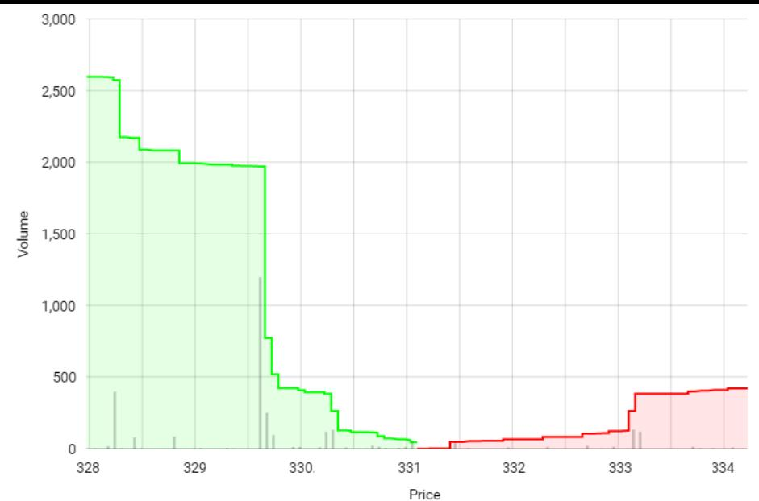

Order Book   

<table><tr><td></td><td>Bid</td><td>Ask</td><td></td></tr><tr><td>3,151</td><td>9139.60</td><td>9152.80</td><td>167</td></tr><tr><td>1,574</td><td>9138.40</td><td>9153.21</td><td>1,600</td></tr><tr><td>338</td><td>9138.20</td><td>9153.60</td><td>736</td></tr><tr><td>789</td><td>9138.10</td><td>9153.71</td><td>1,602</td></tr><tr><td>800</td><td>9138.00</td><td>9154.10</td><td>1,649</td></tr><tr><td>309</td><td>9137.79</td><td>9154.21</td><td>1,965</td></tr><tr><td>2,140</td><td>9137.60</td><td>9154.50</td><td>3,984</td></tr><tr><td>48</td><td>9137.40</td><td>9154.60</td><td>763</td></tr><tr><td>144</td><td>9137.29</td><td>9154.71</td><td>157</td></tr><tr><td>136</td><td>9137.20</td><td>9154.80</td><td>56</td></tr><tr><td>528</td><td>9137.00</td><td>9155.50</td><td>320</td></tr><tr><td>1,654</td><td>9136.90</td><td>9155.71</td><td>200</td></tr><tr><td>40</td><td>9136.79</td><td>9156.10</td><td>16</td></tr><tr><td>46</td><td>9136.70</td><td>9156.21</td><td>219</td></tr><tr><td>608</td><td>9136.60</td><td>9156.30</td><td>40</td></tr><tr><td>48</td><td>9136.50</td><td>9156.40</td><td>80</td></tr></table>

# Breakdown an Order Book

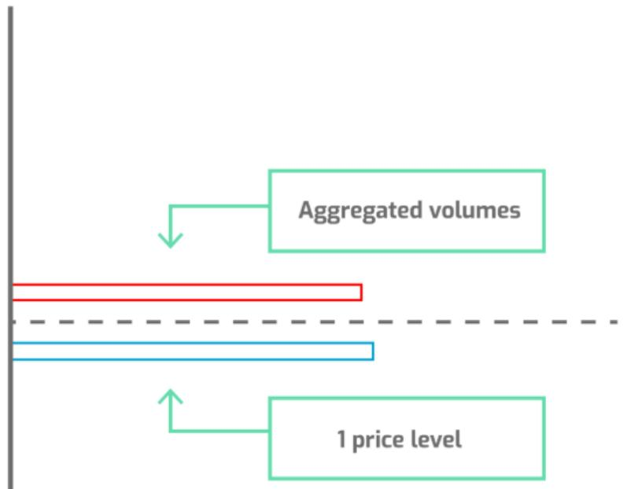  
Level 1

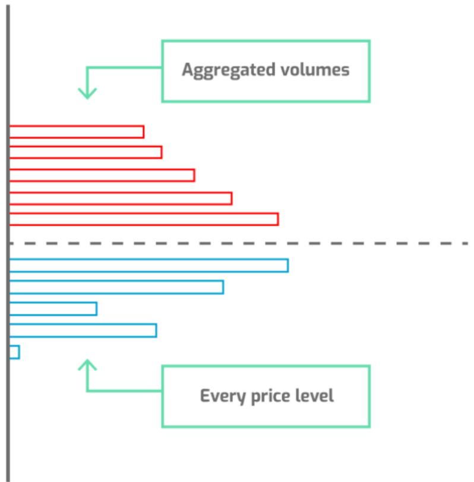  
Level 2

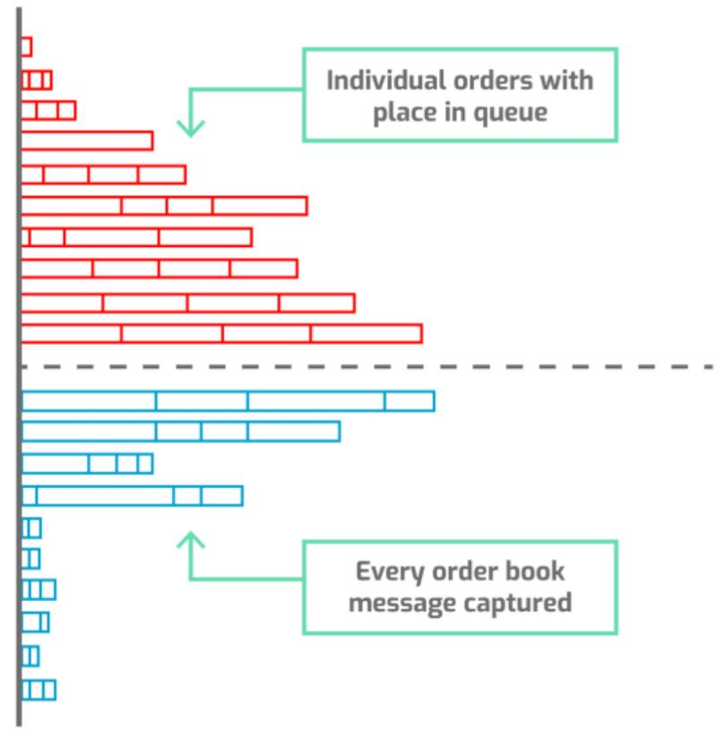  
Level 3

# Order Book Mechanism

- Limit orders operated under a price-time priority rule.

- Limit orders are sorted by the price and higher priority is given to the orders at the best prices   
- Orders at the same price are ranked depending on when they entered the queue according to FIFO

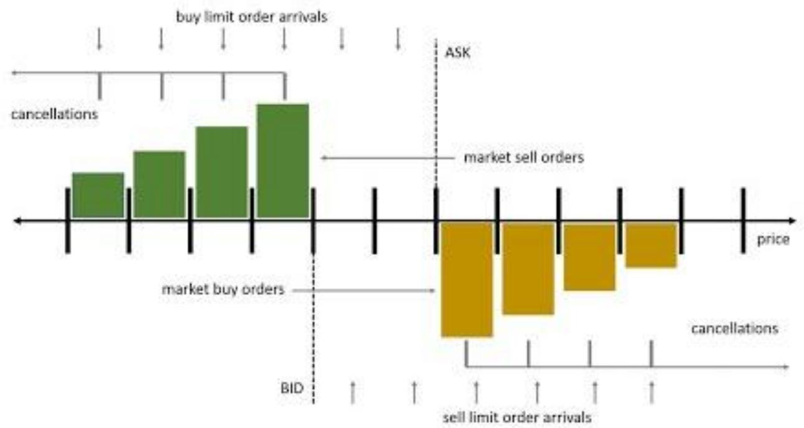

# What an order book can tell you?

1. Supply & Demand: Insights into trader behaviour and market sentiment.   
2. Support & Resistance Level: Insights from orders with large volume   
3. Market Liquidity: Measure liquidity through order sizes.   
4. Market Depth: Analysis of the number of buy/sell orders at various price levels.

# Trading Strategies Based on Order Book Data

# 1. Momentum Trading:

Identifying trends through order flow signals.   
- Monitor the ratio of buy to sell orders. A significant imbalance can signal potential price movements.

# 2. Sniping Strategy:

- Taking advantage of large orders (eg. iceberg orders) before they get fully executed.

# 3. Liquidity Provisioning:

- Market-making strategies to earn from the bid-ask spread.

# Market Impact

# Market Impact

A large market order is likely to fill up the order book and lead to   
- significant price movement   
- reduced market depth and liquidity

- Immediate Impact: Price change upon execution of the order.   
- Temporary Impact: Short-term fluctuations that revert after order execution.   
- Permanent Impact: Lasting price changes due to order flow

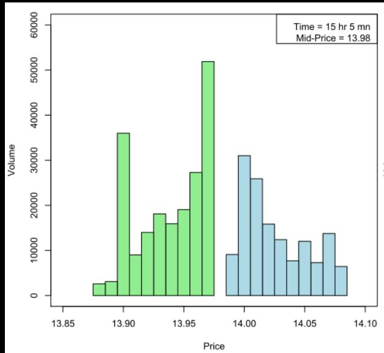

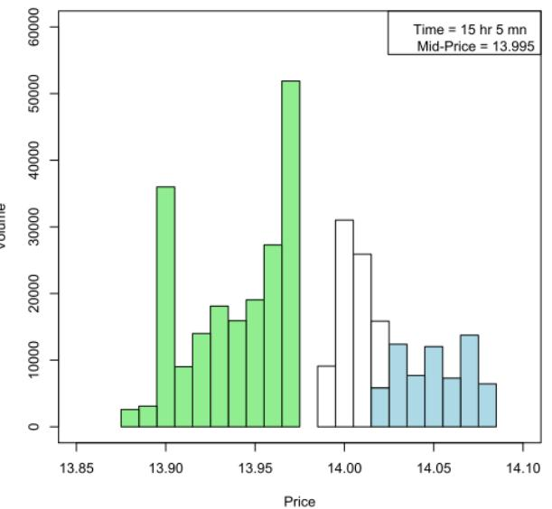

# Factors Influencing Market Impact

# 1. Order Size:

- Larger orders typically lead to greater impact

# 2. Order Type:

Market orders vs limit orders

# 3. Market Conditions:

Less liquid markets experience higher impact   
- Volatility and market volume affect impact

# Strategies to Mitigate Market Impact

# 1. Order Splitting:

- Break large orders into smaller segments.   
- Execute over time to reduce immediate impact.

# 2. Use of Limit Orders:

- Place limit orders to control execution price.   
- Avoid the risks of market orders.

# 3. Time-weighted Average Price (TWAP):

- Execute orders evenly over a specified time period.   
- Helps in minimizing market impact.

# 4. Volume-weighted Average Price (VWAP):

- Execute orders in proportion to market volume.   
- Reduces price impact by blending into the market.

# 1. Order Splitting

- If informed investors' trades are the main cause of stock price changes, large trades by informed traders would reveal their information because traders can easily discern those who execute large transactions.   
- However, small trades executed repeatedly will incur excessive transactions costs.   
- Thus, informed traders will tend to fragment orders into medium-sized trades sufficiently small to disguise themselves but large enough to maintain fairly small transactions costs.

# Example: Slicing the Large Order

- Suppose a client of the XYZ brokerage firm wants to buy $X = 80,000$ shares with the best possible execution.   
These execution costs $B$ will include

order processing costs $F$ and   
- market impact (slippage) costs that are increasing in the size $c$ of each of $n$ equal-size transactions.

- Broker XYZ works with a market impact model that estimates the slippage cost $S$ of each execution of size $c = X / n$ with function $S = \nu c^{\mathfrak{m}}$ , where the coefficient $\nu$ and exponent $m$ are related to the liquidity of the security:

$$
B / n = F + v (X / n) ^ {m}
$$

# Example: Slicing the Large Order

- Suppose that broker estimated F to be \(0.03 per order, and v and m to be 0.00001 and 1.5. What are the optimal number of transactions and transaction sizes? We set up a total transactions cost function as follows:

$$
B = n F + n v \left(\frac {X}{n}\right) ^ {m} = 0. 0 3 n + 0. 0 0 0 0 1 \frac {8 0 , 0 0 0 ^ {1 . 5}}{n ^ {0 . 5}} = 0. 0 3 n + 2 2 6. 2 7 n ^ {- 0. 5}
$$

Take derivative of $B$ with respect to $n$ , and solve for $n$ as follows:

$$
\frac {d B}{d n} = \frac {d \left[ n F + n v \left(\frac {X}{n}\right) ^ {m} \right]}{d n} = F - (m - 1) v \frac {X ^ {m}}{n ^ {m}} = 0. 0 3 - 0. 5 (0. 0 0 0 0 1) \frac {X ^ {m}}{n ^ {m}} = 0. 0 3 - \frac {1 1 3 . 1 4}{n ^ {1 . 5}} = 0. 0 2
$$

$$
n = \sqrt [ m ]{\frac {(m - 1) v X ^ {m}}{F}} = \sqrt [ 1. 5 ]{\frac {0 . 5 (0 . 0 0 0 0 1) \cdot 8 0 , 0 0 0 ^ {1 . 5}}{0 . 0 3}} = 2 4 2. 2 8 \approx 2 4 2
$$

- Thus, the optimal number of stock transactions for this order is $n = 242$ , each with transaction size of $X / n$ equal to $80,000 / 242 = 330$ (subject to rounding)

# Improve the order split mechanism

- There are many factors that we can consider when designing the optimal cost or trade-slicing functions.   
- The model above provides no guidance on spacing trades through the day or time frame

- The amount of time elapsing between trades executing at time $t$ and time $t + 1$ would be inversely related to market impact costs. That is, more time elapses between the transactions, slippage will be reduced.   
- Stocks tend to be more liquid during the earliest and latest parts of the day, and least liquid in the middle. That is, one might expect liquidity during the day to be "U"-shaped, and market impact costs to resemble an upside down U.

# 2. Use of Limit Orders

- Suppose we want to buy 1000 shares

- If we directly send a market order, the whole ask book will be cleared and the purchase price can be expensive   
Instead of market order, we can place multiple limit orders at different price levels

Current order book   

<table><tr><td>Bid Size</td><td>Bid Price</td><td>Ask Price</td><td>Ask Size</td></tr><tr><td>20</td><td>9.9</td><td>10.5</td><td>100</td></tr><tr><td>30</td><td>9.6</td><td>11.0</td><td>50</td></tr><tr><td>50</td><td>8.8</td><td>11.6</td><td>300</td></tr><tr><td>50</td><td>8.1</td><td>12.3</td><td>100</td></tr><tr><td>10</td><td>7.5</td><td>12.9</td><td>120</td></tr><tr><td>50</td><td>7.3</td><td>20.0</td><td>200</td></tr><tr><td>10</td><td>7.1</td><td></td><td></td></tr><tr><td>70</td><td>6.9</td><td></td><td></td></tr><tr><td>80</td><td>6.6</td><td></td><td></td></tr></table>

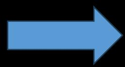

<table><tr><td>Bid Size</td><td>Bid Price</td><td>Ask Price</td><td>Ask Size</td></tr><tr><td>250</td><td>10</td><td>10.5</td><td>100</td></tr><tr><td>20</td><td>9.9</td><td>11.0</td><td>50</td></tr><tr><td>30</td><td>9.6</td><td>11.6</td><td>300</td></tr><tr><td>250</td><td>9.5</td><td>12.3</td><td>100</td></tr><tr><td>250</td><td>9.0</td><td>12.9</td><td>120</td></tr><tr><td>50</td><td>8.8</td><td>20.0</td><td>200</td></tr><tr><td>250</td><td>8.5</td><td></td><td></td></tr><tr><td>50</td><td>8.1</td><td></td><td></td></tr><tr><td>10</td><td>7.5</td><td></td><td></td></tr><tr><td>50</td><td>7.3</td><td></td><td></td></tr><tr><td>10</td><td>7.1</td><td></td><td></td></tr><tr><td>70</td><td>6.9</td><td></td><td></td></tr><tr><td>80</td><td>6.6</td><td></td><td></td></tr></table>

# Potential issues of using limit orders

- Wait too long for the limit order to get filled if the limit price is set too far from the top book.   
- Other market participants may discover the large order buyer/seller if there is a sudden increase in the order book's volume.

- Solution: split into smaller limit order and place slowly to the market

# 3. Time-weighted Average Price (TWAP)

- Place market orders with the same size evenly over a specified time period.   
- Parameters:

- total_order_size: Total number of shares you want to buy or sell.   
- execution_duration: Total time over which to execute the order.   
- interval: Time interval for executing parts of the order.

$$
S h a r e s p e r i n t e r v a l = R o u n d (\frac {t o t a l \_ o r d e r \_ s i z e}{e x e c u t i o n \_ d u r a t i o n / i n t e r v a l}, 0)
$$

# Example: TWAP

- Suppose we want to buy a total of 1000 shares.   
- To reduce the market impact, we decide to buy a small fraction every 5 minutes for a total duration of 1 hour.   
Thus,

- total_order_size = 1000   
- execution_duration = 60   
- interval = 5

• Shares per interval = round(1000 / (60 / 5), 0) = 83   
• Remaining shares = 1000 - 83* (60/5) = 4

# Potential issues of TWAP

- Large orders executed over time can still impact market prices, especially for illiquid markets.   
- Delays or failures in order execution at specified intervals (eg. due to market close) can disrupt the planned strategy.   
- TWAP assumes a stable price environment; high volatility can lead to significant deviations.

# 4. Volume-weighted Average Price (VWAP)

- VWAP is the average price a security has traded at throughout the day, based on both volume and price.   
- Formula

$$
V W A P = \frac {\sum (P r i c e \times V o l u m e)}{\sum V o l u m e}
$$

# Where

Price: The price at which trades occur.   
Volume: The number of shares traded at each price.

# Use of VWAP

- Benchmarking: Provides a standard for evaluating our purchase price.   
- Execution Strategy: Helps traders execute orders with minimal market impact.   
- Trend Indicator: Can signal potential reversals when the price diverges from VWAP.

# VWAP Example

- Assume the following trades occur throughout a trading day:

<table><tr><td>Time</td><td>Price</td><td>Volume</td></tr><tr><td>09:30</td><td>$100</td><td>200</td></tr><tr><td>09:35</td><td>$101</td><td>150</td></tr><tr><td>09:40</td><td>$102</td><td>250</td></tr><tr><td>09:45</td><td>$100</td><td>300</td></tr><tr><td>09:50</td><td>$103</td><td>100</td></tr></table>

- VWAP = $\frac{100 * 200 + 101 * 150 + 102 * 250 + 100 * 300 + 103 * 100}{200 + 150 + 250 + 300 + 100} = 100.95$   
- So we can execute order in smaller increments around the VWAP to avoid impacting the market   
- For example, you might place the following orders close to VWAP:

- Buy 200 shares at \(100.90   
Buy 300 shares at \(100.95   
Buy 500 shares at \(101.00

# Impact of VWAP on Execution

- By using VWAP:

- The majority of orders are executed around the VWAP price, which is $100.95.   
- The average execution price might be slightly higher than the VWAP, but it reduces the likelihood of large market movements caused by a single large order.

# Order Book Modeling with Queuing Theory

# Why Queuing Theory?

- To analyze how orders flow through the market and how they impact price movement.   
Key Questions:

How long do orders wait before being executed?   
What is the optimal order size?   
- How do market conditions (eg. volatility) affect execution time?

# Basic Concepts of Queuing Theory

# - Queue Components

- Arrival Process $(\lambda)$ : Rate at which an event arrives. (eg. customer)   
- Service Rate $(\mu)$ : Rate at which an event is executed.   
- Queue Discipline: How events are processed (e.g. FIFO).

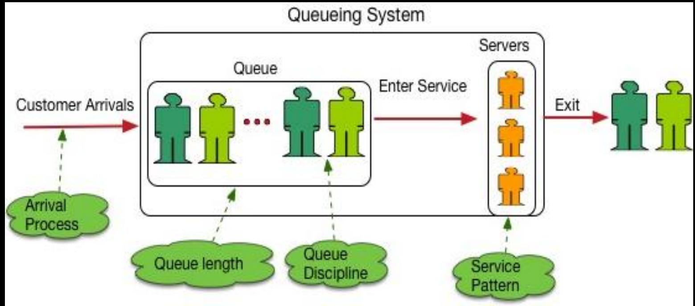

# How is it related to Order Book?

- Incoming orders (buy/sell) can be viewed as entities arriving at a queue. The order book acts as a queue where these orders wait to be matched.   
- Each order can be treated as a customer in a queue, where the "service" is the execution of trades.   
- Arrival and Service Rates:

• Arrival Rate: The rate at which orders enter the order book (eg. how many orders are placed per second).   
- Service Rate: The speed at which orders are matched and executed. This is influenced by the market's liquidity and the efficiency of the trading system.

# How is it related to Order Book?

Event: arrival of a new limit order   
- Queuing time: the time to wait from placing a limit order until it reaches to the top book   
- Service time: the elapsed time for the limit order being matched/executed when it is at the top book

<table><tr><td>Bid Size</td><td>Bid Price</td><td>Ask Price</td><td>Ask Size</td></tr><tr><td>20</td><td>9.9</td><td>10.5</td><td>100</td></tr><tr><td>30</td><td>9.6</td><td>11.0</td><td>50</td></tr><tr><td>50</td><td>8.8</td><td>11.6</td><td>300</td></tr><tr><td>50</td><td>8.1</td><td>12.3</td><td>100</td></tr><tr><td>10</td><td>7.5</td><td>12.9</td><td>120</td></tr><tr><td>50</td><td>7.3</td><td>13.0</td><td>1000</td></tr><tr><td>10</td><td>7.1</td><td>13.4</td><td>50</td></tr><tr><td>70</td><td>6.9</td><td></td><td></td></tr><tr><td>80</td><td>6.6</td><td></td><td></td></tr></table>

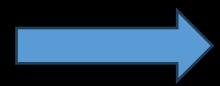

<table><tr><td>Bid Size</td><td>Bid Price</td><td>Ask Price</td><td>Ask Size</td></tr><tr><td>150</td><td>12.0</td><td>13.0</td><td>1000</td></tr><tr><td>150</td><td>11.5</td><td>13.4</td><td>50</td></tr><tr><td>100</td><td>10.8</td><td>13.6</td><td>200</td></tr><tr><td>100</td><td>10.5</td><td>14.3</td><td>150</td></tr><tr><td>20</td><td>9.9</td><td>14.9</td><td>100</td></tr><tr><td>30</td><td>9.6</td><td></td><td></td></tr><tr><td>50</td><td>8.8</td><td></td><td></td></tr><tr><td>50</td><td>8.1</td><td></td><td></td></tr><tr><td>10</td><td>7.5</td><td></td><td></td></tr></table>

# Probability density function

# Exponential Distribution

Density function

$$
f (x) = \left\{ \begin{array}{l l} \frac {1}{\lambda} e ^ {\frac {- x}{\lambda}}, & x \geq 0 \\ 0, & x <   0 \end{array} \right.
$$

where $\lambda$ is the average time taken between events.

- Cumulative function

$$
F (x) = \left\{ \begin{array}{l l} 1 - e ^ {\frac {- x}{\lambda}}, & \quad x \geq 0 \\ 0, & \quad x <   0 \end{array} \right.
$$

Expected value $E(X) = \lambda$   
- Variance $\operatorname{Var}\left( X\right)  = {\lambda }^{2}$   
- Memorylessness property

$$
P (X > s + t | X > s) = P (X > t)
$$

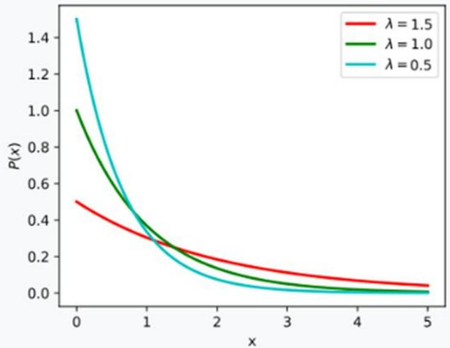  
Cumulative distribution function

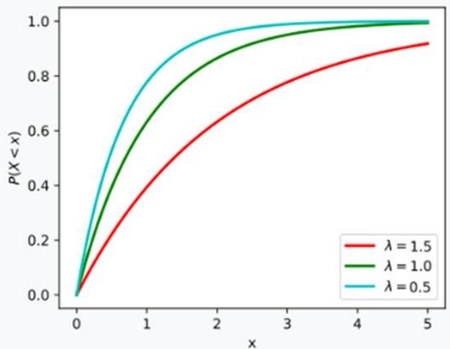

# Poisson Distribution

Density function

$$
f (x) = \left\{ \begin{array}{c c} \frac {\theta^ {x} e ^ {- \theta}}{x !}, & x = 0, 1, 2, \ldots \\ 0, & o t h e r w i s e s \end{array} \right.
$$

where $\theta$ is the average number of events occurred in a fixed time interval.

- Cumulative function

$$
F (x) = \sum_ {k = 0} ^ {x} \frac {\theta^ {k} e ^ {- \theta}}{k !}
$$

- $E(X) = \operatorname{Var}(X) = \theta$

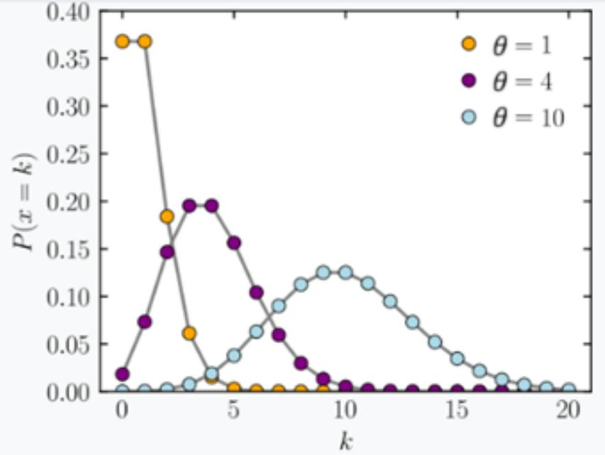  
Probability mass function

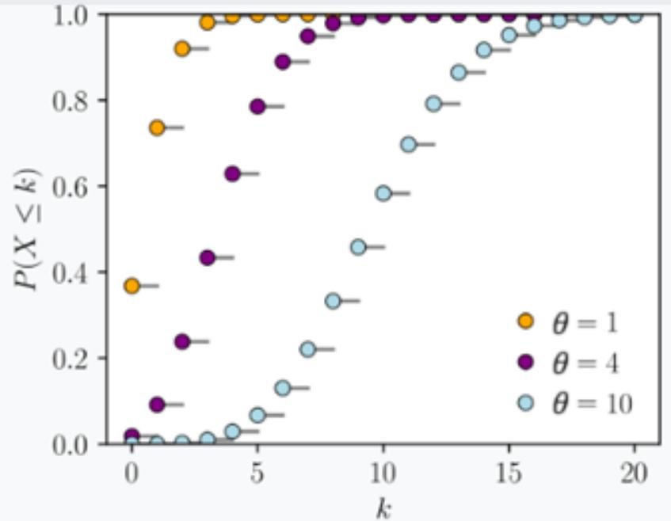  
Cumulative distribution function

# Poisson vs Exponential Distribution

- The Poisson distribution is used to count the number of events in a fixed time period, while the exponential distribution is used to model the time between these events.   
- If events occur according to a Poisson process with rate $\theta$ , the time between consecutive events follows an exponential distribution with the rate $\lambda$ . Then, we have

$$
\theta = \frac {1}{\lambda}
$$

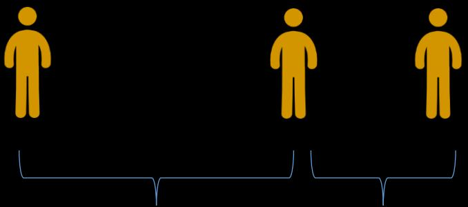  
Arrival time t1   
Arrival time t2   
Exponential Distribution $f(t)$

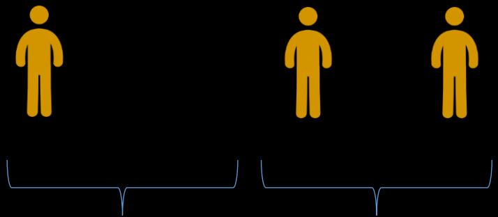  
Number of arrival k1   
Number of arrival k2   
Poisson Distribution $f(k)$

# One-side Queuing Model Formulation

M/M/1 Queue:

M: Memoryless arrival process (Poisson)   
M: Memoryless service process (Exponential)   
1: Single service channel (eg. one market maker)

• The model can be described as continuous time Markov chain with transition rate matrix on the state space $\{0,1,2,3,\ldots\}$

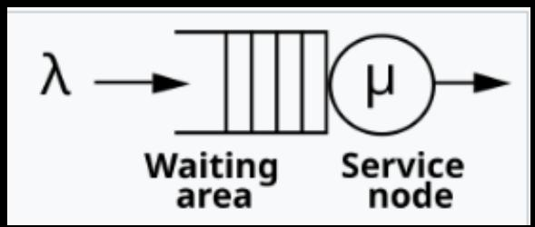

$$
Q = \left[ \begin{array}{c c c c c} - \lambda & \lambda & & & \\ \mu & - (\mu + \lambda) & \lambda & & \\ & \mu & - (\mu + \lambda) & \lambda & \\ & & \mu & - (\mu + \lambda) & \\ & & & & \ddots \end{array} \right]
$$

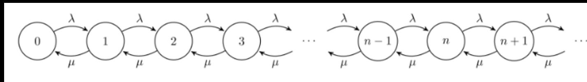

# Transition Rate Matrix

- In a typical M/M/1 queue transition rate matrix, the off-diagonal elements represent the rates of moving between states:

- $Q_{i,i + 1} = \lambda$ : Transition from state $i$ to $i + 1$ (arrival).   
- $Q_{i,i - 1} = \mu$ : Transition from state $i$ to $i - 1$ (service completion).

- The diagonal entry $Q_{ii} = -(\lambda + \mu)$ refers to the total rate of leaving state $i$ .   
- The sum of each row in the transition rate matrix equals zero, meaning that the rate of leaving state $i$ must equal the total rate of entering state $i$ from all other states.

$$
\sum_ {j} Q _ {i j} = 0
$$

# Steady-State Probabilities $(\pi)$

- To find the steady-state probabilities $\pi$ of being in each state, we solve the system of equations derived from the balance equations $\pi Q = 0$ along with the normalization condition $\sum \pi_{i} = 1$ .

- $\pi_{i}$ means the probability of having $i$ events (i.e. limit orders) in the queuing system

- From the steady-state probabilities, we can derive various useful metrics:

Average number of customers in the system (L)   
- Average time a customer spends in the system (W)   
- Utilization of the server $(\rho)$

# Queuing Model Formulation

- The model is considered stable only if $\lambda < \mu$ . If, on average, arrivals happen faster than service completions the queue will grow indefinitely long and the system will not have a stationary distribution. The stationary distribution is the limiting distribution for large values of $t$ .   
- Under stationary process and first-come first-served (FIFO) discipline, the response time (i.e. the sum of waiting and service time) has a probability density function

- i.e. the time for a new limit order entering into the order book until it is filled

$$
f (t) = \left\{ \begin{array}{l l} (\mu - \lambda) e ^ {- (\mu - \lambda) t}, & t > 0 \\ 0, & \text {o t h e r w i s e} \end{array} \right.
$$

# Traffic Intensity

- Traffic Intensity $(\rho)$ : $\rho = \frac{\lambda}{\mu}$   
- Traffic intensity $\rho$ measures the utilization of the queuing system.   
• Ranges

- $\rho < 1$ : The system is stable which can handle incoming traffic without becoming overloaded. The queue will not grow indefinitely. Customers are served on average faster than they arrive.   
- $\rho = 1$ : The system is operating at its capacity. The arrival rate equals the service rate, leading to a steady-state condition where the queue can grow without bound.   
- $\rho > 1$ : The system is unstable. The arrival rate exceeds the service rate, leading to an ever-growing queue.

# Key Results of M/M/1 Queuing Model

- Average time an order spends in the system (W):

$$
W = E (T) = \frac {1}{\mu - \lambda} = \frac {1}{\mu (1 - \rho)}
$$

Average number of orders in the system (L):

$$
L = \lambda W = \frac {\lambda}{\mu - \lambda} = \frac {\rho}{1 - \rho}
$$

- Average time an order waiting in the queue $(W_{q})$ :

$$
W _ {q} = W - \frac {1}{\mu} = \frac {\lambda}{\mu - \lambda} = \frac {\rho}{\mu (1 - \rho)}
$$

- Average number of orders in the queue $(L_{q})$ :

Here $\frac{1}{\mu}$ represents the average service time.

$$
L _ {q} = \lambda W _ {q} = \frac {\rho^ {2}}{1 - \rho}
$$

# Estimating $\lambda$ (Arrival Rate)

- In trading, an "arrival" can refer to new limit orders entering the market.   
- The arrival rate $\lambda$ can be calculated as

$$
\lambda = \frac {T o t a l n u m b e r o f a r r i v a l s}{T o t a l t i m e p e r i o d}
$$

- Example: if a trading system receives 600 limit orders over a 10-minute period, $\lambda$ would be

$$
\lambda = \frac {6 0 0}{1 0} = 6 0 o r d e r s p e r m i n u t e
$$

# Estimating $\mu$ (Service Rate)

- In trading, the "service" could refer to the execution of orders.   
- The service rate $\mu$ can be calculated as:

$$
\mu = \frac {1}{A v e r a g e s e r v i c e t i m e}
$$

Example: If the average time to execute an order is 2 seconds, then

$$
\mu = \frac {1}{2} = 0. 5 o r d e r s p e r s e c o n d = 3 0 o r d e r s p e r m i n u t e
$$

# Example

- In an order book, buy orders arrive at an average rate of 12 orders per minute, while sell orders arrive at an average rate of 10 orders per minute.   
- Assuming that both types of orders are processed immediately and that the system operates under a Poisson arrival process, what is the expected number of buy orders in the queue at any given time?   
• Answer:

- Arrival rate $\lambda$ for buy orders $= 12$   
- Service rate $\mu = 12 + 10$ (i.e. the total rate at which orders can be processed)   
Average number of orders in the system (L):

$$
L = \frac {\lambda}{\mu - \lambda} = \frac {1 2}{2 2 - 1 2} = 1. 2
$$

Average number of buy orders in the queue $(L_{q})$

$$
L _ {q} = \frac {\lambda}{\mu} L = \frac {1 2}{2 2} 1. 2 = 0. 6 5
$$

# Remarks

- Time Period: Ensure that the time period for your data collection is consistent when calculating $\lambda$ and $\mu$ .   
- Market Conditions: Be aware that both $\lambda$ and $\mu$ can vary significantly with market conditions (eg. volatility, liquidity).   
- Statistical Methods: You can use statistical methods to refine your estimates, such as calculating confidence intervals or conducting regression analysis if you have larger datasets.

# Key Assumptions of the Basic Queuing Model

- Poisson Arrivals:

- Assumes that orders arrive randomly and independently.   
Real-world order flows can exhibit clustering or trends.

- Exponential Service Times:

- Assumes a constant average execution time for orders.   
- In reality, execution times can vary significantly due to order size, market volatility, etc.

- Single Server:

- Assumes a single market maker or execution venue.   
- Multiple venues and decentralized markets can complicate execution dynamics

# Trading Strategies based on Queuing Theory

# 1. Optimal Order Placement

- Concept: Apply queuing principles to optimize order placement.   
Strategy:

- Analyze the average waiting times and queue lengths to determine the best times to place orders.   
- Use limit orders strategically when the queue is shorter (lower waiting times), and market orders when the queue is longer.   
- Adjust order sizes based on the current traffic intensity $(\rho)$ to avoid slippage.

# Trading Strategies based on Queuing Theory

# 2. Order Flow Analysis

- Concept: Use arrival rates $(\lambda)$ and service rates $(\mu)$ to analyse market liquidity.   
Strategy:

- Monitor the number of incoming orders and execution times to gauge market activity.   
- Increase trading frequency during periods of high arrival rates to capitalize on liquidity.   
- Reduce trading during low liquidity periods.

# Trading Strategies based on Queuing Theory

# 3. Queue Analysis

- Concept: Utilize queue lengths to inform directional move.   
Strategy:

- When the queue length (or the area) of bid book is much longer than that of ask book, it may imply a strong market demand and suggest a short-term upward trend   
- Pair this with indicators that signal buy or sell conditions.

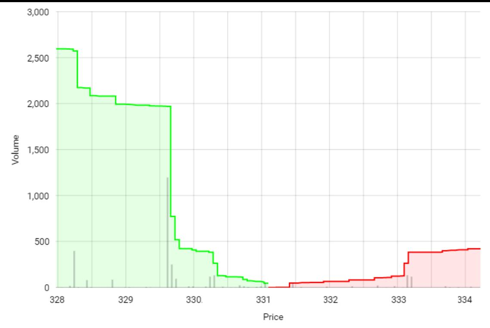

# Backtest Order Book Imbalance

# Trading Logic:

- For each second,

- Collect the latest bid-book and ask-book data   
- Compute the total volume in both bid-book and ask-book respectively   
Market Entry:

- If last trade time is 15 minutes before,

- If bid-book volume $>2^{*}$ ask-book volume, open a BUY order   
- If ask-book volume $>2^{*}$ bid-book volume, open a SELL order

Market Exit:

- Close if previously open a BUY order, but now bid-book volume $<$ ask-book volume   
- Close if previously open a SELL order, but now ask-book volume $<$ bid-book volume

# Backtest Settings

- Backtest Period = 2024-01   
- Data Interval = Tick   
- Initial Capital = 10,000 USD   
- Leverage = 5   
Transaction Cost = 0   
- Allow Short Sell = True   
- Position Netting = False   
- Instruments = BTCUSDM

# Settings

# Strategy Name

# Order Imbalance

# Start Period

2024-01

# End Period *

2024-01

#

# Data Interval

tick

#

# Initial Capital

10000.0

# Base Currency

USD

#

# Leverage

5.0

# Transaction Cost

0.0

# Risk free Rate

0.0

# Enable Short Sell


# Position Netting


# News Data


# Weather Data


# Economics Data


# Instruments


# (Max. 100 items)

BTCUSD X

# Full Script

```python
from AlgoAPI import AlgoAPIUtil, AlgoAPI_Backtest from datetime import datetime, timedelta 
```

class AlgoEvent: def __init__(self): self_timer $=$ datetime(1970,1,1) self.last_trade $=$ datetime(1970,1,1) self.thre $= 2$

```python
def start(self, mEvt): self.evt = AlgoAPI_Backtest.AlgoEvtHandler(self, mEvt) self.evt.start() 
```

def on_marketdatafeed(self, md, ab): # reset grid every 1 minute if md.timestamp $> =$ self.timemr+timedelta(seconds=1): # update timer self.timemr $\equiv$ md.timestamp

```python
calculate cumulative volume for bid and ask book  
bid_volume, ask_volume = 0, 0  
for p,v in md.bidOrderBook:  
    bid_volume += v  
for p,v in md.askOrderBook:  
    ask_volume += v 
```

```python
# entry signal
if md.timestamp >= self.last_trade + timedelta(minutes=15):
    if bid_volume > self.thre*ask_volume:
        self.last_trade = md.timestamp
        order = AlgoAPIUtil.OrderObject(
            instrument=md.instrument,
            openclose='open',
            buysell=1,
            volume=0.0001
        )
        self.evt.sendOrder(order)
elif ask_volume > self.thre*bid_volume:
    self.last_trade = md.timestamp
    order = AlgoAPIUtil.OrderObject(
        instrument=md.instrument,
        openclose='open',
        buysell=-1,
        volume=0.0001
    )
    self.evt.sendOrder(order) 
```

# Backtest Result

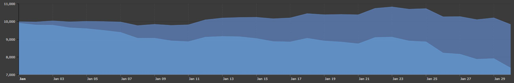  
Capital Usage:

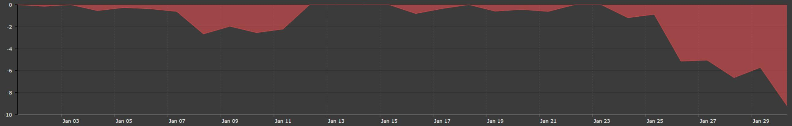  
Equity Drawdown $(\%)$ :

Performance Statistics: 1   

<table><tr><td>No. of Tradable Days:</td><td>31</td><td>No. of Win Days:</td><td>16</td><td>No. of Loss Days:</td><td>14</td></tr><tr><td>Win Rate:</td><td>53.3333%</td><td>Max. Consecutive Win Day:</td><td>5</td><td>Max. Consecutive Loss Day:</td><td>3</td></tr><tr><td>Odd Ratio:</td><td>1.1429</td><td>Max. Consecutive Gains:</td><td>457.88</td><td>Max. Consecutive Loss:</td><td>-461.27</td></tr><tr><td>No. of Trades:</td><td>2919</td><td>Average Consecutive Win Day:</td><td>0.93</td><td>Average Consecutive Loss Day:</td><td>0.6</td></tr><tr><td>Total PnL:</td><td>-173.62</td><td>Average Per Trade PnL:</td><td>-0.06</td><td>Average Per Day PnL:</td><td>-5.6</td></tr><tr><td>Mean Daily Return:</td><td>-0.0462%</td><td>Median Daily Return:</td><td>0.1058%</td><td>Mean Annual Return:</td><td>-11.6511%</td></tr><tr><td>Daily Return StdDev:</td><td>1.5529%</td><td>25th percentile Daily Return:</td><td>-0.5793%</td><td>75th percentile Daily Return:</td><td>0.5763%</td></tr><tr><td>Daily Return Downside StdDev:</td><td>1.0594%</td><td>95% 1 day return VaR:</td><td>-2.9652%</td><td>99% 1 day return VaR:</td><td>-4.128%</td></tr><tr><td>Daily Sharpe Ratio:</td><td>-0.0298</td><td>Annual Sharpe Ratio:</td><td>-0.4726</td><td>Max. Drawdown Amount:</td><td>995.9</td></tr><tr><td>Daily Sortino Ratio:</td><td>-0.0436</td><td>Annual Sortino Ratio:</td><td>-0.6928</td><td>Max. Drawdown Percent:</td><td>9.2023%</td></tr><tr><td>Max. Drawdown Duration:</td><td>8</td><td>Average Drawdown Duration:</td><td>2.45</td><td>Annual Volatility:</td><td>24.5542%</td></tr><tr><td>Gross Profit:</td><td>0.0</td><td>Gross Loss:</td><td>0.0</td><td>Profit Factor:</td><td>0.0</td></tr><tr><td>Jensen Alpha:</td><td>0.0</td><td>Beta:</td><td>0.0</td><td>Information Ratio:</td><td>0.0</td></tr><tr><td>Omega Ratio:</td><td>0.0</td><td>Treynor Ratio:</td><td>0.0</td><td>Tail Ratio:</td><td>0.8897</td></tr><tr><td>Calmar Ratio:</td><td>1.2661</td><td>Average Holding Day:</td><td>14.4259</td><td>Annual Turnover Rate:</td><td>0.0%</td></tr></table>

# Limitations of the Basic M/M/1 Queuing Model

- Assumes a simple FIFO processing, while actual order execution may depend on priority rules or other factors. Eg. a trader can randomly place a limit order at any price level.   
- Market makers may keep placing and cancelling limit orders which makes the analysis more complicated.   
It ignores the size of order. A larger size is expected to take longer time to get filled (i.e. longer service time)   
- Assumes constant arrival and service rates, while these rates can fluctuate with market volatility and liquidity

# Optional Reading

- The order book as a queueing system: average depth and influence of the size of limit orders (https://hal.science/hal-01006410/document)   
- Simulating and analyzing order book data: The queue-reactive model (https://arxiv.org/pdf/1312.0563)   
- A Model for Queue Position Valuation in a Limit Order Book (https://moallemi.com/ciamac/papers/queue-value-2016.pdf)

# High Frequency Trading


# High Frequency Trading

- Rapid executions of multiple transactions followed by extremely short holding periods.   
Profit from small price changes and discrepancies   
- Require sophisticated technology, communications and computing resources   
- High frequency trading depends heavily on execution speed and latency

# Co-location

- High frequency trading firms usually rent space from market centers, such as from the major exchanges   
- The purpose to put their servers next to the market center's data servers is to reduce latency. It provides significant millisecond and even microseconds advantages, and enable institutions to better serve their clients.


# Co-location

- Light or an electronic signal, travels approximately 300 meters in just 1 microsecond. Therefore,   
- from the NYSE to a financial institution in Hong Kong, which is around 13,000 kilometers away, it would take about 43.3 milliseconds   
- This calculation ignores the additional latency induced by routers, switches, etc.   
- An exchange provides institutions that co-locate in its facilities with cables of identical length to connect its data feeds, regardless of how many meters an office is from the feeds.

# Latency Arbitrage

- Latency refers to the speed at which quotations are displayed or orders are executed after being placed   
- Consider this example involving a high-frequency trader (HFT) that uses automated trading to leverage its informational edge:

- The initial market bid and ask price for Stock X are 50.00 and 50.01.   
- Due to its advanced technology and strategic location, HFT receives an institutional market order for Stock X. This information reaches the trader's system 10 microseconds before it does for most competing traders.   
- HFT purchases all available shares at 50.01 before other traders can react.   
- As a result, the institutional buyer is unable to buy at 50.01.   
- HFT then place a sell limit order at 50.02, and thus market ask price adjusts to 50.02.   
- The institutional buyer's market order finally execute at 50.02, locking a 0.01 profit per share for HFT

# Latency Arbitrage

- Another example highlighted in the Wall Street Journal.

- In July 2009, Intel, announced strong earnings, prompting some traders to view the semiconductor company Broadcom as a potential buying opportunity.   
- To mask their interest, many of these traders divided their orders into smaller quantities.   
- On that day, Broadcom opened trading at \(26.20. High-frequency traders (HFTs), who had quicker access to market quotes, noticed the significant interest in Broadcom.   
- Consequently, the HFTs started purchasing Broadcom shares and subsequently reselling them to slower investors at elevated prices. The share price of Broadcom swiftly climbed to $26.39 as HFTs began offering hundreds of thousands of shares for sale.   
- Slower traders ended up spending $1.4 million for around 56,000 shares, incurring an additional cost of $7,800 compared to if they had been able to act as quickly as the high-frequency traders.

# Common High Frequency Strategy

# 1. Market Making

Providing liquidity by placing buy and sell orders simultaneously to profit from the bid-ask spread   
- Some exchanges also provide rebates to market makers

# 2. Latency Arbitrage

- Exploiting delays in market data transmission to execute trades before other market participants can react   
- Co-location for rapid data feed and order execution is crucial

# 3. Cross Market Arbitrage

Identifying and exploiting price discrepancies between different asset classes, markets or exchanges. (eg. 0700.HK vs TCEHY)

# 4. Order Flow Analysis

- Monitoring the flow of buy and sell orders to predict short-term market direction.

# HFT: Is it worth?

It is an arms race to build   
- more reliable and faster execution platforms (computer engineering and science)   
- more comprehensive and accurate prediction models (mathematics, physics)   
- Reduce the latency (information engineering)   
- It is a money burning game to buy or rent   
- Faster data feed and lower latency   
- Bigger storage space and more powerful system   
- But, after you spend so much money, can you make the profit?

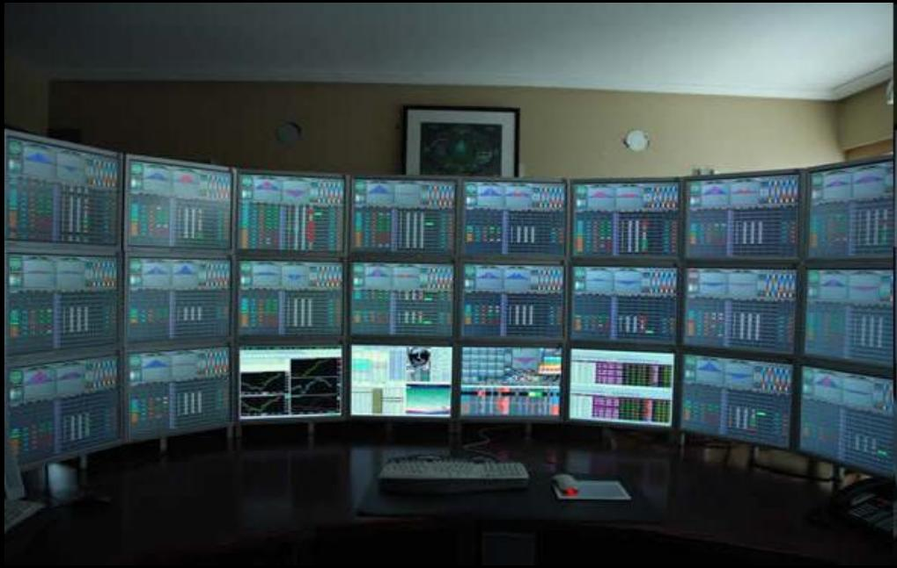

投資組合

新闻

外幣

港股

美股

金價

油價

行情

財經日曆

地產

理财

專欄

財經大人物

媒

# 高頻交易|傳內地打壓高頻交易要求將客戶伺服器遷出交易所數據中心

BossMind

2026年1月16日


彭博引述知情人士報道，中國監管機構要求將客戶伺服器遷出交易所運營的數據中心，料將削高頻交易機構的優勢。據報上海和廣州的大宗商品期貨交易所，已依照監管機構指示，要求本地經紀公司將客戶伺服器遷出交易所營運的數據中心。

知情人士透露，這一舉措由監管機構主導，上海期貨交易所已告知經紀商，他們需要在下個月底前將高頻客戶的設備移出，而其他客戶則需要在4月30日前完成。

這一措施影響的不僅僅是高頻交易機構，但它們受到的衝擊可能最大。除了內地本土的高頻交易公司，城堡證券（Citadel Securities）、Jane Street Group和Jump Trading等外國公司的伺服器接入亦將受到影響。

# Arbitrage

# What is arbitrage?

- Arbitrage is the simultaneous purchase and sale of related assets in different markets to profit from price discrepancies.   
- It usually requires efficient algorithms and high performing computers for execution.   
- Helps in maintaining market efficiency by aligning prices across different markets.

# Type of Arbitrage

1. Spatial Arbitrage

- Involves buying and selling the same asset in different locations.

2. Temporal Arbitrage   
- Involves buying and selling the same asset at different times.   
3. Statistical Arbitrage   
- Relies on mathematical models to identify price inefficiencies.

# Spatial Arbitrage: Big Mac Example

# Suppose

Big Mac in Hong Kong costs 30 HKD   
Big Mac in Shenzhen costs 26 RMB   
Exchange rate: 1 HKD = 0.9 RMB

# Actions:

- Buy a Big Mac in Shenzhen   
- Sell it in Hong Kong   
- Net Profit = $30^{*}0.9 - 26 = 1$ RMB

HKD 1 <> RMB 0.9


HKD 30.0

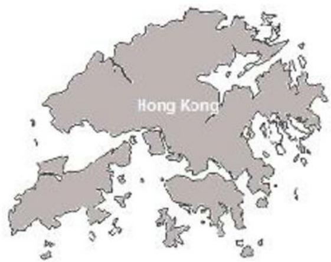


RMB 26.0


# Spatial Arbitrage: Cross Exchanges Example

• Suppose you have US\(100,000 in both Binance and Bybit account.   
- Let's say you observe the following bitcoin future prices:

<table><tr><td>Exchange</td><td>Bid Price</td><td>Ask Price</td></tr><tr><td>Binance</td><td>96,531.5</td><td>96,532.0</td></tr><tr><td>Bybit</td><td>96,529.0</td><td>96,531.0</td></tr></table>

- Actions:

• Buy 1 contract of bitcoin future on Bybit at $96,531   
- Sell 1 contract of bitcoin future on Binance at \(96,531.5   
- Net Profit = $0.5

# Temporal Arbitrage Example

- Suppose 2 companies A (acquiring company) and B (target company) are going to merge to company C.   
- After merge, A and B will be removed from stock exchange while C will be listed.   
- Before the merge is done

- the shares value of the targeted company B will typically be lower than that of the combined company C   
- the share value of the acquiring company A will be slightly higher than that of the combined company C

- An arbitrager can buy shares from the targeted company and sells shares for the acquiring company at the same time. Upon the merger is closed, the discrepancy in shares value will be the profit.

# High Frequency Strategy 1: Triangular Arbitrage

# Triangular Arbitrage

- Triangular arbitrage is a trading strategy that exploits discrepancies in currency exchange rates.   
• Suppose you have US\(1000 and observe the current exchange rates in the market

EUR/USD = 0.8631   
• EUR/GBP = 1.4600   
- USD/GBP = 1.6939

Note:

- In market convention, the quotation XXX/YYY means the amount of XXX you can get in exchange for 1 unit of YYY

# Triangular Arbitrage

- The exchange rates do not match up. We can capture the arbitrage profit as follows:

- Sell dollars for euros: \(1000 \times 0.8631 = €863.1   
- Sell euros for pounds: €863.1/1.4600 = £591.1644   
• Sell pounds for dollars: £591.1644 x 1.6939 = $1001.373   
• Net profit = $1001.373 -$ 1000 = $1.373

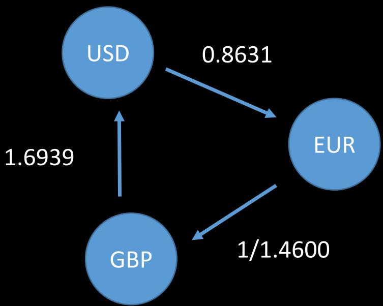

# Polygonal Arbitrage

- The idea of Triangular Arbitrage can be extended to a so-called “Polygonal Arbitrage” among $N$ currencies

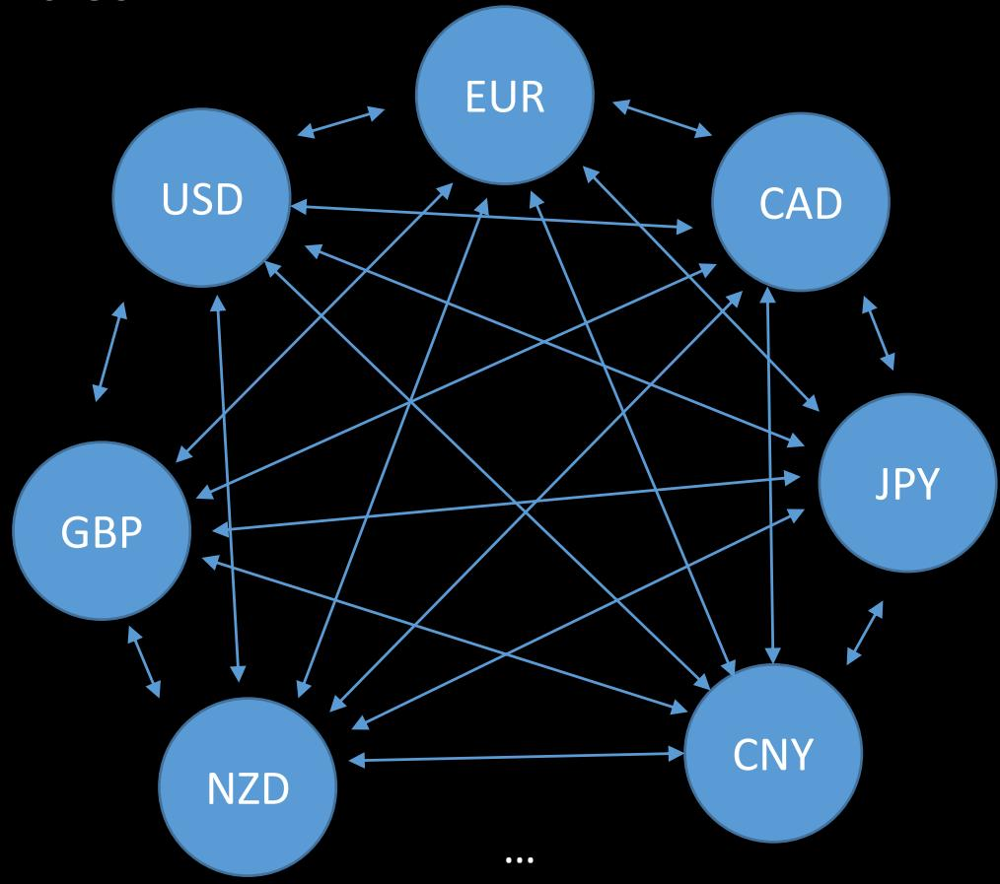

# Polygonal Arbitrage - Example

- Suppose we obtain the following snapshot at a particular time during a trading day.

<table><tr><td>Symbol</td><td>Bid</td><td>Ask</td></tr><tr><td>CAD/AUD</td><td>0.89068</td><td>0.89071</td></tr><tr><td>CNY/AUD</td><td>4.67769</td><td>4.67784</td></tr><tr><td>EUR/AUD</td><td>0.61055</td><td>0.61065</td></tr><tr><td>GBP/AUD</td><td>0.5178</td><td>0.51791</td></tr><tr><td>JPY/AUD</td><td>73.5981</td><td>73.6017</td></tr><tr><td>NZD/AUD</td><td>1.04152</td><td>1.04163</td></tr><tr><td>USD/AUD</td><td>0.66956</td><td>0.66964</td></tr><tr><td>CNY/CAD</td><td>5.24968</td><td>5.25003</td></tr><tr><td>EUR/CAD</td><td>0.68523</td><td>0.6853</td></tr><tr><td>GBP/CAD</td><td>0.58144</td><td>0.58161</td></tr><tr><td>JPY/CAD</td><td>82.5996</td><td>82.6034</td></tr><tr><td>NZD/CAD</td><td>1.16878</td><td>1.16898</td></tr><tr><td>CAD/USD</td><td>1.33033</td><td>1.33037</td></tr><tr><td>EUR/CNY</td><td>0.13051</td><td>0.13055</td></tr></table>

<table><tr><td>Symbol</td><td>Bid</td><td>Ask</td></tr><tr><td>GBP/CNY</td><td>0.11074</td><td>0.11075</td></tr><tr><td>JPY/CNY</td><td>15.7357</td><td>15.7364</td></tr><tr><td>NZD/CNY</td><td>0.22269</td><td>0.22277</td></tr><tr><td>CNY/USD</td><td>6.98578</td><td>6.98589</td></tr><tr><td>GBP/EUR</td><td>0.84851</td><td>0.84853</td></tr><tr><td>JPY/EUR</td><td>120.558</td><td>120.562</td></tr><tr><td>NZD/EUR</td><td>1.70653</td><td>1.70667</td></tr><tr><td>USD/EUR</td><td>1.09665</td><td>1.09667</td></tr><tr><td>JPY/GBP</td><td>142.092</td><td>142.113</td></tr><tr><td>NZD/GBP</td><td>2.01151</td><td>2.01182</td></tr><tr><td>USD/GBP</td><td>1.29277</td><td>1.2929</td></tr><tr><td>JPY/NZD</td><td>64.7773</td><td>64.7779</td></tr><tr><td>JPY/USD</td><td>109.924</td><td>109.931</td></tr><tr><td>USD/NZD</td><td>0.64288</td><td>0.64298</td></tr></table>

# Polygonal Arbitrage - Example

- We need to take into account of the bid-ask direction.   
- For a quotation XXX/YYY,

- Use ask price for calculation if we convert from XXX to YYY   
- Use bid price for calculation if we convert from YYY to XXX

- Eg. JPY/USD,

- If you sell 100 JPY for USD (i.e. buy USD), you will convert using ask and get $100 / 109.931 = 0.91$ USD.   
If you sell 100 USD for JPY (i.e. buy JPY), you will convert using bid and get 10,992.4 JPY

<table><tr><td>Symbol</td><td>Bid</td><td>Ask</td></tr><tr><td>JPY/USD</td><td>109.924</td><td>109.931</td></tr></table>

# Polygonal Arbitrage - Example

We are interested in the following questions

1. Is there arbitrage opportunity?   
2. What is the optimal path that can yield the highest return after a circulation?

- The most straightforward method is by using high school mathematics!!!

1. Loop for any $3,4,5,\ldots$ number of currencies (i.e. combination)   
2. For each combination, loop for different currency order (i.e. permutation)   
3. Multiply the exchange rate along the currency path   
4. Arbitrage exists if the value is greater than 1

# Polygonal Arbitrage - Example

from itertools import combinations, permutations   
print('currencies=','currencies')   
```python
def calculate_profit(rate_dict, currencies): initial_amount = 1 # Starting with 1 unit of the first currency current_amount = initial_amount action_path = [] 
```

```javascript
for i in range(len(currencies)): from_currency = currencies[i] to_currency = currencies[(i + 1) % len(currencies)] # Wrap around 
```

```txt
if (to_currency, from_currency) in rate_dict:  
    bid_price = rate_dict[(to_currency, from_currency)][0]  
    current_amount *= bid_price  
    action_path.append(f"Buy {current_amount:.5f} {to_currency} from {initial_amount:.4f} {from_currency} at bid price {bid_price:.5f}")  
    initial_amount = current_amount # Update for the next trade 
```

return current_amount, action_path   
```python
if (from_currency, to_currency) in rate_dict: ask_price = rate_dict[(from_currency, to_currency)][1] current_amount /= ask_price action_path.append(f"Sell {initial_amount:.5f} {from_currency} for {current_amount} {to_currency} at ask price {ask_price:.5f}") initial_amount = current_amount # Update for the next trade 
```

```python
def findpolygonal_arbitrage(exchangeRates): # Create a dictionary to store the exchange rates  
rate_dict = {}  
for pair, bid, ask in exchangeRates:  
    cur1, cur2 = pair.split('/')  
    rate_dict[(cur1, cur2)] = (bid, ask) 
```

```txt
Iterate through combinations of currencies (from 3 up to the number of currencies available)  
currencies = setPAIR.split('/')[0] for pair in [pair[0] for pair in exchangeRates]) 
```

```python
for r in range(3, len(currencies) + 1):  
    for currency Combination in combinations(currencies, r):  
        for currency_permutation in permutations(currency Combination):  
            value, action_path = calculate_profit(rate_dict, currency_permutation)  
            if value > 1: # More than the initial investment indicates arbitrage return True, action_path, value  
return False, [], 0 # No arbitrage opportunity found 
```

# Polygonal Arbitrage - Example

currencies= ('JPY', 'CAD', 'NZD')  
currencies= ('JPY', 'NZD', 'CAD')  
Arbitrage OpportunityExists:  
Sell 1.00000 JPY for 0.0154373636687821 NZD at ask price 64.77790  
Sell 0.01544 NZD for 0.013205840706241425 CAD at ask price 1.16898  
Buy 1.09080 JPY from 0.0132 CAD at bid price 82.59960  
Total value after circulation: 1.0908

exchangeRates $=$ [

[′CAD/AUD, 0.89068, 0.89071],

[CNY/AUD', 4.67769, 4.67784],

[EUR/AUD', 0.61055, 0.61065],

[GBP/AUD', 0.5178, 0.51791],

['JPY/AUD', 73.5981, 73.6017],

[NZD/AUD', 1.04152, 1.04163]

[USD/AUD', 0.66956, 0.66964].

[CNY/CAD', 5.24968, 5.25003]

[EUR/CAD', 0.68523, 0.6853],

[GBP/CAD', 0.58144, 0.58161]

['JPY/CAD', 82.5996, 82.6034],

[NZD/CAD', 1.16878, 1.16898]

[CAD/USD', 1.33033, 1.33037],

[EUR/CNY, 0.13051, 0.13055]

[GBP/CNY', 0.11074, 0.11075],

['JPY/CNY', 15.7357, 15.7364],

[NZD/CNY, 0.22269, 0.22277]

[CNY/USD', 6.98578, 6.98589]

[GBP/EUR', 0.84851, 0.84853]

['JPY/EUR', 120.558, 120.562],

[NZD/EUR', 1.70653, 1.70667]

[USD/EUR', 1.09665, 1.09667]

['JPY/GBP', 142.092, 142.113],

[NZD/GBP', 2.01151, 2.01182].

[USD/GBP', 1.29277, 1.2929],

['JPY/NZD', 64.7773, 64.7779],

['JPY/USD', 109.924, 109.931],

[USD/NZD', 0.64288, 0.6429]

]

has_arbitrage, action_path, value = findpolygonal_arbitrage(exchangeRates)

If has_arbitrage:

print("Arbitrage Opportunity EXISTS:")

for action in action_path:

print(action)

print(f"Total value after circulation: {value:.4f}")

else:

print("No Arbitrage Opportunity.")

# Computational Complexity

# - Combinations

• The number of combinations of $n$ currencies taken $r$ at a time is given by $C(n, r)$ which is $\frac{n!}{r!(n - r)!}$   
- This operates in $O(n^{r})$ for each combination size $r$

# Permutations

- The number of permutations of $r$ currencies is $r!$   
- For each combination, we need to consider all permutations, which adds an additional factor of $r!$

# - Total Complexity

- For each combination of currencies, we compute the profit for all permutations. Therefore, the total computational complexity can be approximated as: $O\left(\sum_{r=3}^{n} C(n, r) \cdot r!\right)$   
- This can be simplified to $O(n! \cdot 2^{n})$ in the worst case because you are iterating through all combinations and permutations of the currencies.

# Important Notes

# To successfully implement the polygonal arbitrage strategy,

Take into account of the bid-ask prices   
- Factor in transaction cost in the calculation   
- Beware of the rounding issue   
- Beware of market slippage   
- Lower chance of arbitrage if the bid-ask spread is large   
- Need a fast-computing algorithm to solve for a path with

- The highest return (global maximum), or   
- The first identified arbitrage

# Can you execute in real market?

# 1. Cash exchange physically

- Compare prices across different shops   
- Need manually input price in your program for calculation   
- Slow processing and settlement due to human operation

NO

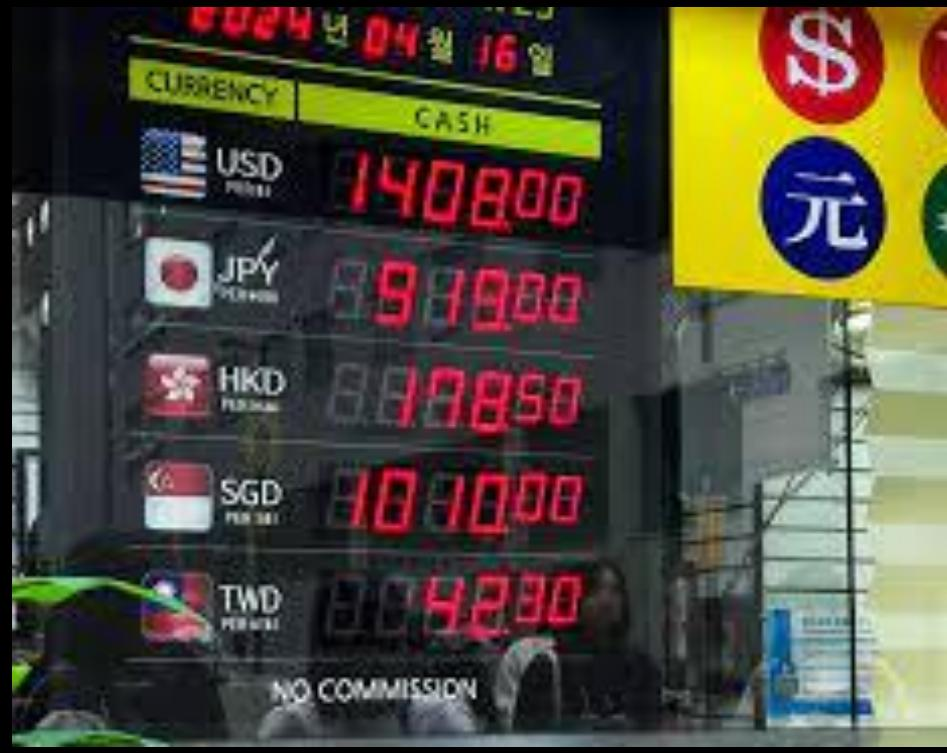

# Can you execute in real market?

2. Currency exchanges via banks

- Bid-ask spread is too large   
- How can you to get the real-time exchange rates and trade programmatically on the banking system?

NO


HSBC

Banking

Accounts & Services

Borrowing

Cards & Loans

Investing

Securities & Currency Exchange

Insurance

Protection & Planning

Insights

Analysis & Market Data

Offers

Latest Rewards

Exchange rates of foreign currencies against HK Dollar

<table><tr><td>Currency</td><td>Telegraphic Transfer Bank Buy</td><td>Telegraphic Transfer Bank Sell</td><td>Banknotes Bank Buy</td><td>Banknotes Bank Sell</td><td>Last Updated</td></tr><tr><td>US Dollar</td><td>7.74820</td><td>7.80980</td><td>7.71630</td><td>7.84170</td><td>as at 18 Feb 2025 13:28 HKT</td></tr><tr><td>Australian Dollar</td><td>4.90450</td><td>4.97840</td><td>4.87720</td><td>5.00560</td><td>as at 18 Feb 2025 13:28 HKT</td></tr><tr><td>Canadian Dollar</td><td>5.43200</td><td>5.51860</td><td>5.40080</td><td>5.54980</td><td>as at 18 Feb 2025 13:28 HKT</td></tr><tr><td>Euro</td><td>8.06410</td><td>8.20180</td><td>8.02470</td><td>8.24120</td><td>as at 18 Feb 2025 13:28 HKT</td></tr><tr><td>Japanese Yen</td><td>0.05076</td><td>0.05154</td><td>0.05041</td><td>0.05189</td><td>as at 18 Feb 2025 13:28 HKT</td></tr><tr><td>New Zealand Dollar</td><td>4.39730</td><td>4.47870</td><td>4.37250</td><td>4.50400</td><td>as at 18 Feb 2025 13:28 HKT</td></tr><tr><td>Pound Sterling</td><td>9.71900</td><td>9.87600</td><td>9.61600</td><td>9.97800</td><td>as at 18 Feb 2025 13:28 HKT</td></tr><tr><td>Renminbi</td><td>1.06170</td><td>1.07590</td><td>1.05570</td><td>1.08190</td><td>as at 18 Feb 2025 13:28 HKT</td></tr><tr><td>Singapore Dollar</td><td>5.74340</td><td>5.83060</td><td>5.70300</td><td>5.87100</td><td>as at 18 Feb 2025 13:28 HKT</td></tr><tr><td>Swiss Franc</td><td>8.55460</td><td>8.67190</td><td>8.50010</td><td>8.72650</td><td>as at 18 Feb 2025 13:28 HKT</td></tr><tr><td>Thai Baht</td><td>0.22660</td><td>0.23420</td><td>0.21690</td><td>0.24390</td><td>as at 18 Feb 2025 13:28 HKT</td></tr></table>

# Can you execute in real market?

3. FX brokers (eg. via MetaTrader)

It is CFD trading, not currency exchange!   
- But it might still work…

MAY BE

Order

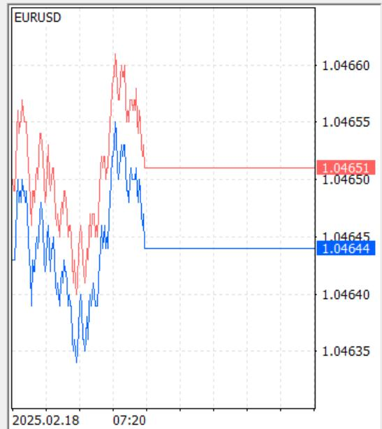

Symbol:

EURUSD, Euro vs US Dollar

Type:

Instant Execution

Volume:

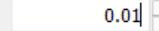

1000EUR

Stop Loss:

0.0000

Take Profit:

0.0000

Comment:

Deviation:

0

1.04644 / 1.04651

Sell

Buy

# Triangular Arbitrage for CFD market

- Recall that triangular arbitrage exists if

$$
\frac {E U R}{U S D} \frac {U S D}{J P Y} \frac {J P Y}{E U R} > 1
$$

It can be re-written as

$$
\log \left(\frac {U S D}{E U R}\right) = \log \left(\frac {U S D}{J P Y}\right) + \log \left(\frac {J P Y}{E U R}\right) + \varepsilon , \mathrm {w h e r e} \varepsilon \mathrm {i s a n e r r o r t e r m v e r y c l o s e t o z e r o}
$$

- We can fit a multiple linear regression (without intercept).

$$
Y _ {t} = \beta_ {1} X _ {1, t} + \beta_ {2} X _ {2, t} + \varepsilon_ {t}
$$

- The estimated value of $\beta_{1}$ and $\beta_{2}$ will be very close to 1.   
- It can be traded as a mean reversion strategy based on the price discrepancies.

# Can you execute in real market?

We need a broker that supports FX Spot trading or currency exchange (eg. Interactive Brokers, Futu, etc)   
IB charges at least 2 USD commission per transaction   
- For a circulation involving 3 currencies, total cost = 6 USD.   
- Suppose our program detects $0.01\%$ arbitrage profit among 3 currencies, the breakeven capital will be $\frac{6}{0.01\%} = 60,000 \mathrm{USD}$   
• If we require the cost ratio to be $10\%$ , we need capital at least $\frac{60,000}{10\%} = 600,000$ USD

# MAY BE


# InteractiveBrokers

Monthly Trade Value (USD) $^2$

≤1,000,000,000   
1,000,000,000.01 - 2,000,000,000   
2,000,000,000.01 - 5,000,000,000   
>5,000,000,000

Minimum per order

Tiered

0.20 basis point $^3$ * Trade Value $^4$

0.15 basis point $^{3*}$ Trade Value

0.10 basis point $^{3*}$ Trade Value

0.08 basis point $^{3}$ * Trade Value $^{4}$

Tier 1 - USD 2.00

Tier II - USD 1.50

Tier III - USD 1.25

Tier IV - USD 1.00

# Conclusion

- FX market is quite efficient nowadays.   
- Triangular/Polygonal arbitrage doesn’t occur very often.   
- Arbitrage profit, if any, its return won't be too high.   
- However, it requires   
- a large capital to cover the potential costs   
- an efficient algorithm (software) and fast computer (hardware) to execute the trades   
It is not wise to put so much idle money to wait for small profits   
- Thus, not many market players still use this strategy

# High Frequency Strategy 2: Market Making

# Liquidity Providing

- Some high frequency traders can make profits from order flow.   
- Exchanges usually offer rebates (eg. $0.0025 per share) to certain brokers (so called “market maker”) that place limit orders in the market.   
- The rebate is a payment to encourage brokers to provide liquidity in the market.   
• A broker places a buy limit order that filled at $10, and quickly places another sell limit order that filled again at$ 10, can still make a $0.005 profit per share from the liquidity rebate.   
- Other buy side traders may pay higher fee to exchange, because it is regarded as the cost of using liquidity in the market.

# Market Making Strategy

Market making strategy generates profits by capturing the bid-ask spread   
- The simplest execution of a market making strategy is to place a pair of bid and offer trades, and have the 2 trades filled over time.   
- When the market is not in trending, this algorithm is reasonably effective to earn the price differential.

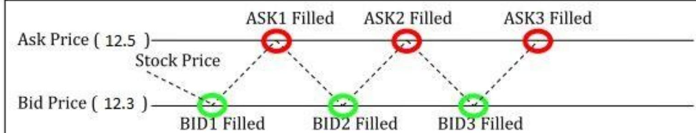

# Market Making Strategy

- However, this strategy fails if the market does not stay in a trading range, because one of the orders doesn't get fill and wait for a long time to capture the spread.   
- A logical solution to this is, if a pair of order doesn't get fill on both side, we would want to reset the algorithm and submit a new set of pairs:

- Constantly check if we have unfilled orders in the order book.   
- If no, we can simply submit a new set of pairs.   
- Otherwise, we should cancel the previous unfilled order, and submit another pair of limit orders.   
- Try to adjust the bid-ask level or quantity so as to balance the inventory.

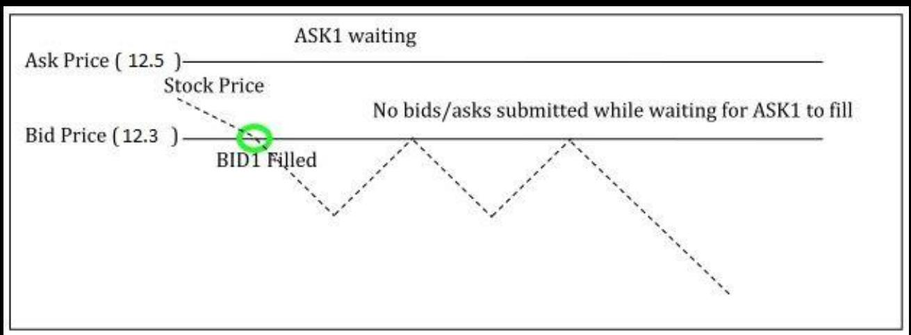

# Market Making Strategy Backtest

- Backtest Period = 2024-01 to 2024-03   
- Data Interval = 1 hour   
- Initial Capital = 100,000 USD   
- Leverage $= 1$   
Transaction Cost = 0   
- Allow Short Sell = True   
- Position Netting = True   
- Instruments = XAUUSD

from AlgoAPI import AlgoAPIUtil, AlgoAPI_Backtest from datetime import datetime, timedelta

class AlgoEvent: def __init__(self): self.lasttradetime = datetime(1970,1,1)

def start(self, mEvt): self EVT = AlgoAPI_Backtest.AlgoEvtHandler(self, mEvt) self EVT.start()

def on_marketdatafeed(self, md, ab): if md.timestamp $> =$ self.lasttradetime + timedelta(hours=1): self.lasttradetime $\equiv$ md.timestamp self.mm_order(md, 1, 'open') self.mm_order(md, -1, 'open')

def mm_order(self, md, buysell, openclose): order = AlgoAPIUtil.OrderObject( instrument = md.instrument, orderRef = 1, volume = 0.01, openclose = openclose, buysell = buysell, ordertype = 1, #0=market_order, 1=limit_order, #2=stop_order timeinforce = 60*60*24 #cancel unfilled order every day, unit in second ) if buysell $= = 1$ : order.price = md.bidPrice\*0.999 elif buysell $= = -1$ .. order.price = md.askPrice\*1.001 self.evt.sendOrder(order)

# Market Making Strategy Backtest

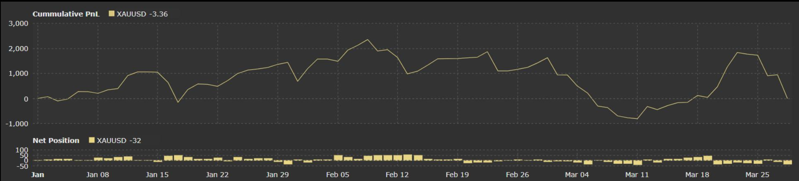  
Equity Drawdown (%):

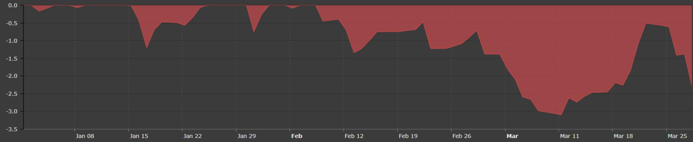

Monthly Return:   

<table><tr><td>Year</td><td>Jan</td><td>Feb</td><td>Mar</td><td>Apr</td><td>May</td><td>Jun</td><td>Jul</td><td>Aug</td><td>Sep</td><td>Oct</td><td>Nov</td><td>Dec</td><td>YTD</td></tr><tr><td>2024</td><td>0.68%</td><td>0.94%</td><td>-1.6%</td><td>-</td><td>-</td><td>-</td><td>-</td><td>-</td><td>-</td><td>-</td><td>-</td><td>-</td><td>-0.0%</td></tr></table>

# Conclusion

- Even rebates can provide stable income, a market maker still need to manage the risks of taking unwanted positions.   
- A key point to implement a market making strategy successfully is to maintain the net position as close to zero as possible over time, while maximizing the number of filled pairs.   
- Some improvements to above strategy:

- Only open a set of pair trades when the market is detected to be ranging   
- Early cut loss if the market is detected to be trending in opposite direction   
- Set a wider spread if the market is less liquid; and tighter spread for liquid market   
- Set a wider spread when market is volatile; and tighter spread for less volatile market

# Key Takeaways

- Reveals order book insights through real-time market depth and liquidity dynamics.   
- Common trading ideas/strategies through order flow analysis   
- Market impact of a large order and strategies to mitigate   
- The basics of Queuing theory for modelling order execution dynamics and waiting times in an order book   
- High frequency trading focuses on rapid execution to capture small price movements.   
- Most arbitrage strategies require high frequency trading to capture price discrepancies   
- Understand the principles for some popular high frequency strategies

- Triangular Arbitrage Strategy   
Market Making Strategy