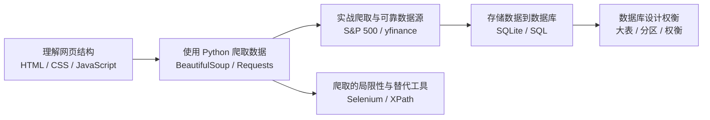

# 数据爬取与数据库管理

## 为什么这一课重要 {#why-this-lesson-matters}

想象一下，你每天需要手动查看几百只股票的价格、新闻和财报。这几乎不可能，而且很容易出错。

现在，让程序替你完成这些重复的工作。这就是 <Term id="web_scraping" en="Web Scraping">网络爬取</Term> 的核心思想。

在 <Term id="algorithmic_trading" en="Algorithmic Trading">算法交易</Term> 中，数据就是燃料。没有数据，策略就是空谈。爬取的数据可以用于：

- **实时数据收集**：自动获取股价、经济指标等。
- **市场情绪分析**：爬取新闻、论坛和社交媒体内容。
- **公司分析**：自动收集公司公告、财报、管理层变动等信息。
- **另类数据**：收集天气、网络流量等非传统金融数据。

<KeyPoint>网络爬取是算法交易数据 pipeline 的第一步，它让你能够自动化地、高效地从互联网获取结构化或非结构化数据，为后续的策略开发、回测和分析提供燃料。</KeyPoint>

<QuestionRef id="q_quiz_web_scraping_use_case_v1" />

## 课程全景与关键问题 {#concept-map}

本课将带你走通一条完整的数据 pipeline：从理解网页结构，到使用 Python 工具爬取数据，再到将数据存入数据库并进行合理的设计。



<Checkpoint title="全景自测">
<QuestionRef id="q_quiz_web_scraping_use_case_v2" />
</Checkpoint>

## 网络爬取基础：从网页结构到数据提取 {#web-scraping-foundations}

### 网页的三层架构

一个网页通常由三种技术共同构成：

1.  <Term id="html" en="HyperText Markup Language">HTML</Term>：定义网页的结构和内容，如标题、段落、表格。它是一种**标记语言**，不是编程语言。
2.  <Term id="css" en="Cascading Style Sheets">CSS</Term>：控制网页的视觉呈现和布局，如颜色、字体、间距。
3.  <Term id="javascript" en="JavaScript">JavaScript</Term>：为网页添加交互和动态行为，如点击按钮后弹出信息。

<KeyPoint>进行网络爬取时，我们最关心的是 HTML。因为目标数据（如股票价格、新闻文本）通常直接包含在 HTML 的标签里。CSS 和 JavaScript 主要控制样式和交互，不直接承载数据。</KeyPoint>

<Definition title="HTML 的本质">
HTML 使用标签（Tags）来创建元素。例如，`<h1>` 定义一级标题，`<p>` 定义段落，`<a>` 定义超链接，`<table>` 定义表格。爬虫的核心任务就是解析这些标签，提取其中的数据。
</Definition>

<Figure src="images/9a0356d3c69aa54d62765a0ef2abff6400803e8e1063976ac685e8e80ce3ccd6.jpg" alt="一个简单的 HTML 页面在浏览器中的渲染效果，展示了标题和段落">
一个简单的 HTML 页面示例。
</Figure>

<QuestionFamily familyId="qf_quiz_web_components_role" />

### 使用 BeautifulSoup 解析 HTML

<Term id="beautifulsoup" en="BeautifulSoup">BeautifulSoup</Term> 是 Python 中最流行的 HTML 解析库之一，它就像一个 HTML 的“瑞士军刀”。

**标准工作流程：**

1.  **下载网页**：使用 <Term id="requests" en="Requests">Requests</Term> 库下载网页的原始 HTML 内容。
2.  **解析 HTML**：将原始内容交给 BeautifulSoup 解析，得到一个可操作的树状结构。

```python
import requests
from bs4 import BeautifulSoup

# 1. 下载网页
url = "https://example.com"
response = requests.get(url)
html_content = response.text

# 2. 解析 HTML
soup = BeautifulSoup(html_content, 'html.parser')
```

**核心方法：**

- `soup.prettify()`：打印出格式清晰的 HTML，方便检查结构。
- `soup.get_text()`：提取网页里所有的纯文本，去掉所有 HTML 标签。
- `soup.find('p')`：找到第一个 `<p>` 标签。
- `soup.find_all('a')`：找到所有 `<a>` 标签，返回一个列表。
- `soup.find('table')`：找到第一个 `<table>` 标签，可配合 pandas 转换为 DataFrame。

<Example title="提取表格数据到 DataFrame">
```python
import pandas as pd

# 假设 soup 已经解析好
table = soup.find('table')

# 提取表头
headers = [th.text for th in table.find_all('th')]

# 提取数据行
rows = []
for tr in table.find_all('tr')[1:]:  # 跳过表头行
    cells = tr.find_all('td')
    row = [cell.text for cell in cells]
    rows.append(row)

# 创建 DataFrame
df = pd.DataFrame(rows, columns=headers)
print(df)
```
</Example>

<QuestionFamily familyId="qf_quiz_bs4_workflow" />
<QuestionFamily familyId="qf_quiz_bs4_methods" />
<QuestionFamily familyId="qf_quiz_bs4_find_vs_findall" />

## 实战爬取与可靠数据源 {#real-world-scraping}

### 实战：爬取 S&P 500 成分股

让我们实战一下：爬取维基百科上的 S&P 500 成分股列表。

**挑战：反爬机制**

直接用 `requests.get(url)` 请求维基百科，可能会返回错误信息。这是因为很多网站会检查请求的 <Term id="user_agent" en="User-Agent">User-Agent</Term>。如果它看起来不像一个真实的浏览器，网站就会拒绝访问。

<KeyPoint>解决方法很简单：在请求头中伪装成浏览器。设置一个常见的 User-Agent 字符串即可。</KeyPoint>

```python
headers = {
    "user-agent": "Mozilla/5.0 (Windows NT 10.0; Win64; x64) AppleWebKit/537.36 (KHTML, like Gecko) Chrome/120.0.0.0 Safari/537.36"
}
response = requests.get(url, headers=headers)
```

**定位目标表格**

成功获取页面后，用 BeautifulSoup 找到目标表格。维基百科页面上有多个表格，可以通过表格的 `id` 属性来精确定位。

```python
table = soup.find('table', id='constituents')
```

<QuestionRef id="q_quiz_user_agent_fail_v1" />
<QuestionRef id="q_quiz_table_id_v1" />

### 使用 yfinance 获取可靠金融数据

直接爬取 Yahoo Finance 会遇到很多反爬措施。好在有一个专门的库：<Term id="yfinance" en="yfinance">yfinance</Term>。它封装了所有复杂的请求，让你几行代码就能获取数据。

```python
import yfinance as yf

# 获取腾讯控股 (0700.HK) 的基本信息
ticker = yf.Ticker("0700.HK")
print(ticker.info)

# 获取最近一个月的股价历史
data = ticker.history(period='1mo')
print(data)

# 同时获取多只股票
data = yf.download("0700.HK AAPL", start="2025-01-01", end="2025-06-30")
```

<KeyPoint>yfinance 返回的数据包含 Open, High, Low, Close, Volume 等字段。其中，`Adj Close`（调整收盘价）是一个非常重要的字段。</KeyPoint>

### 理解调整收盘价

<Term id="adjusted_close" en="Adjusted Close">调整收盘价</Term> 和普通收盘价有什么区别？

当公司分红或拆股时，股价会出现非市场因素的跳变。调整收盘价就是为了消除这些“噪音”，让历史价格具有可比性。

<Example title="拆股对调整收盘价的影响">
假设一只股票进行 **2:1 拆股**，拆股前一天的收盘价是 100 元。拆股后，价格会瞬间变为 50 元。调整收盘价会把拆股前的价格也除以 2，调整为 50 元，保持价格序列的连续性。
</Example>

<KeyPoint>进行长期回测时，应该使用调整收盘价而不是普通收盘价，因为它能更准确地反映股票的真实长期表现。</KeyPoint>

<QuestionRef id="q_quiz_adjusted_close_usage_v1" />

## 数据库管理：存储与查询金融数据 {#database-management}

爬取到的数据不能每次都重新爬，需要存起来。数据库就是最好的选择。

### 为什么使用数据库？

- **高效存储与检索**：快速查询大量历史数据用于策略回测。
- **避免重复爬取**：数据持久化到本地磁盘，无需每次都请求网站。
- **数据完整性**：通过约束和事务保证数据一致性。
- **高级查询能力**：支持复杂的 SQL 查询来筛选和分析数据。

### SQLite 与 SQL 基础

Python 内置了对 <Term id="sqlite" en="SQLite">SQLite</Term> 的支持。它是一个轻量级的数据库，不需要安装服务器，一个文件就是一个数据库。

使用 <Term id="sql" en="Structured Query Language">SQL</Term> 语言来操作数据库。最基本的四个操作（CRUD）：

| 操作 | SQL 命令 | 说明 |
|------|----------|------|
| 查询 | `SELECT` | 从表中检索数据 |
| 插入 | `INSERT` | 向表中添加新数据 |
| 更新 | `UPDATE` | 修改表中已有数据 |
| 删除 | `DELETE` | 从表中移除数据 |

<Example title="Python 操作 SQLite 的基本流程">
```python
import sqlite3

# 1. 连接数据库（或创建）
conn = sqlite3.connect('example.db')
cursor = conn.cursor()

# 2. 创建表
cursor.execute('''
    CREATE TABLE market_candles (
        symbol text,
        timestamp text,
        open_price float,
        close_price float,
        volume float
    )
''')

# 3. 插入数据
cursor.execute(
    "INSERT INTO market_candles (symbol, timestamp, close_price) VALUES (?, ?, ?)",
    ('0700.HK', '2025-06-01', 500.0)
)

# 4. 提交事务并关闭
conn.commit()
conn.close()
```
</Example>

<QuestionFamily familyId="qf_quiz_sqlite_connect" />
<QuestionFamily familyId="qf_quiz_sql_crud" />

## 金融数据存储的数据库设计 {#database-design}

设计数据库时，一个常见的陷阱：把所有数据塞进一张大表。

### 大表问题

把所有股票的所有历史数据都放在一个表里，会导致：
- 表体积非常巨大
- 查询和备份都会很慢

### 分区策略

为了缓解大表问题，可以考虑分区：

| 分区策略 | 优点 | 缺点 |
|----------|------|------|
| **按时间分区**（如每月一表） | 跨资产分析方便 | 跨月分析困难 |
| **按股票分区**（如每只股票一表） | 单只股票回测快 | 跨资产对比分析困难 |

<KeyPoint>没有适用于所有情况的完美数据库设计！关键在于根据你的主要用途来权衡。始终需要在**存储空间**、**运行速度**和**内存消耗**之间找到平衡。</KeyPoint>

<QuestionRef id="q_quiz_big_table_issue_v1" />
<QuestionRef id="q_quiz_tradeoff_factors_v1" />

## 爬取的局限性与替代工具 {#limitations-and-tools}

网络爬取并非万能，它有很多局限性：

1.  **数据质量**：数据可能不完整或过时。
2.  **资源消耗**：消耗大量带宽、存储和时间。
3.  **技术挑战**：
    - 网站结构经常变化，导致爬虫失效。
    - 反爬机制，如 IP 封锁和频率限制。

### 替代工具

| 工具 | 用途 | 适用场景 |
|------|------|----------|
| <Term id="selenium" en="Selenium">Selenium</Term> | 模拟真实浏览器操作 | 动态加载的网页、需要点击交互的页面 |
| <Term id="xpath" en="XPath">XPath</Term> + lxml | 用路径表达式精确定位元素 | 需要更灵活、更精确地定位元素 |

<Example title="XPath 示例">
XPath 表达式 `//table[@id='constituents']//tr` 的含义是：在整个文档中，找到 id 属性等于 'constituents' 的 `<table>` 元素，然后在该元素下找到所有 `<tr>` 元素。这比 BeautifulSoup 的链式查找更灵活。
</Example>

<QuestionRef id="q_quiz_selenium_tool_v1" />

## 易错点 {#pitfalls}

1.  **忘记设置 User-Agent**：直接请求有反爬机制的网站（如维基百科）会失败。始终记得在请求头中伪装成浏览器。
2.  **混淆收盘价与调整收盘价**：进行长期回测时，务必使用调整收盘价，否则结果会被分红、拆股等事件扭曲。
3.  **陷入“大表”陷阱**：将所有数据塞进一张表会导致严重的性能问题。应根据使用场景考虑分区策略。
4.  **追求“完美”设计**：数据库设计没有银弹。不要试图找到一个适用于所有情况的方案，而应根据主要用途进行权衡。

## 复习路线 {#review-path}

1.  **核心概念**：复习 <Term id="web_scraping" en="Web Scraping">网络爬取</Term> 的定义和它在算法交易中的价值。
2.  **网页结构**：回顾 HTML、CSS、JavaScript 三者的角色，以及为什么爬虫关注 HTML。
3.  **爬取工具**：掌握 BeautifulSoup 的标准工作流程（Requests 下载 → BeautifulSoup 解析 → find/find_all 提取）。
4.  **实战与可靠数据**：回顾爬取 S&P 500 时如何处理 User-Agent，以及如何使用 yfinance 获取数据。
5.  **调整收盘价**：理解调整收盘价的概念和重要性。
6.  **数据库管理**：复习为什么需要数据库，以及 SQL 的 CRUD 基本操作。
7.  **数据库设计**：理解大表问题、分区策略，以及存储空间、运行速度、内存消耗之间的权衡。
8.  **局限性与工具**：了解爬取的主要局限性，以及 Selenium 和 XPath 的适用场景。

<Checkpoint title="最终自测">
<QuestionFamily familyId="qf_quiz_web_components_role" />
<QuestionFamily familyId="qf_quiz_bs4_workflow" />
<QuestionFamily familyId="qf_quiz_user_agent_fail" />
<QuestionFamily familyId="qf_quiz_adjusted_close_usage" />
<QuestionFamily familyId="qf_quiz_sql_crud" />
<QuestionFamily familyId="qf_quiz_tradeoff_factors" />
<QuestionFamily familyId="qf_quiz_selenium_tool" />
</Checkpoint>